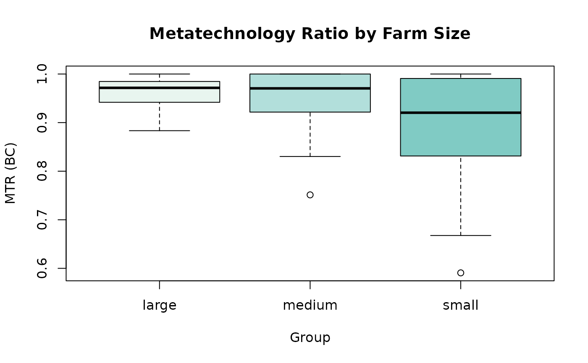
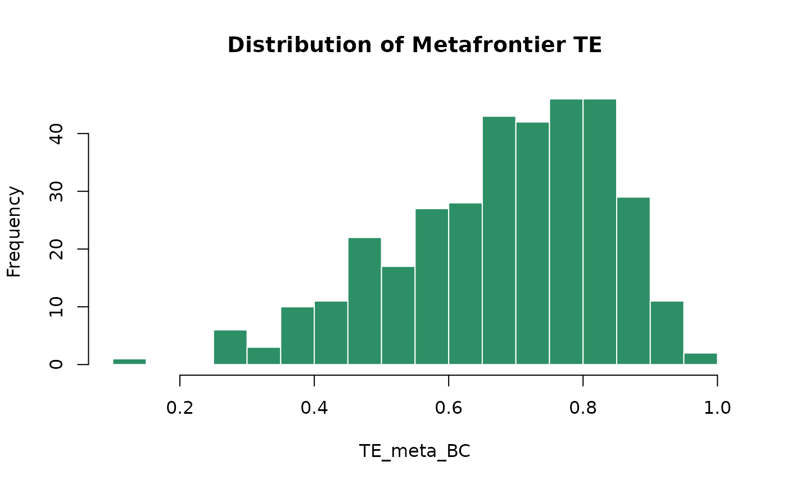

# Extracting Efficiencies and MTRs

## Overview

Once a `metafrontier` model has been fitted, a range of S3 methods are
available to extract and inspect results. This vignette demonstrates all
of them using a simple `sfacross` + LP example.

## Setup: Fit a Model

``` r
library(smfa)
#> Loading required package: sfaR
#>            ****           *******  
#>           /**/           /**////** 
#>   ****** ******  ******  /**   /** 
#>  **//// ///**/  //////** /*******  
#> //*****   /**    ******* /**///**  
#>  /////**  /**   **////** /**  //** 
#>  ******   /**  //********/**   //**
#> //////    //    //////// //     //    version 1.0.1
#> 
#> * Please cite the 'sfaR' package as:
#>   Dakpo KH., Desjeux Y., Henningsen A., and Latruffe L. (2024). sfaR: Stochastic Frontier Analysis Using R. R package version 1.0.1.
#> 
#> See also: citation("sfaR")
#> 
#> * For any questions, suggestions, or comments on the 'sfaR' package, you can contact directly the authors or visit:  https://github.com/hdakpo/sfaR/issues
#>                                 .              .o88o.                      
#>                               .o8              888 `"                      
#> ooo. .oo.  .oo.    .ooooo.  .o888oo  .oooo.   o888oo  oooo d8b  .ooooo.  oo
#> `888P"Y88bP"Y88b  d88' `88b   888   `P  )88b   888    `888""8P d88' `88b `8
#>  888   888   888  888ooo888   888    .oP"888   888     888     888   888  8
#>  888   888   888  888    .o   888 . d8(  888   888     888     888   888  8
#> o888o o888o o888o `Y8bod8P'   "888" `Y888""8o o888o   d888b    `Y8      88 88 88
#>                                                                    version 1.0.0
#> 
#> * Please cite the 'smfa' package as:
#> Owili, SO. (2026). smfa: Metafrontier Analysis in R. R package version 1.0.0.
#> 
#> See also: citation("smfa")
#> 
#> * For any questions, suggestions, or comments on the 'smfa' package, you can contact the authors directly or visit:
#>   https://github.com/SulmanOlieko/smfa/issues
data("ricephil", package = "sfaR")

ricephil$group <- cut(
  ricephil$AREA,
  breaks        = quantile(ricephil$AREA, probs = c(0, 1/3, 2/3, 1), na.rm = TRUE),
  labels        = c("small", "medium", "large"),
  include.lowest = TRUE
)

meta_lp <- smfa(
  formula    = log(PROD) ~ log(AREA) + log(LABOR) + log(NPK),
  data       = ricephil,
  group      = "group",
  S          = 1,
  udist      = "hnormal",
  groupType  = "sfacross",
  metaMethod = "lp"
)
```

## `summary()` — Full Model Summary

Prints the complete model output including group-specific SFA results,
metafrontier coefficients (if available), and efficiency statistics by
group.

``` r
summary(meta_lp)
#> ============================================================ 
#> Stochastic Metafrontier Analysis
#> Metafrontier method: Linear Programming (LP) Metafrontier 
#> Stochastic Production/Profit Frontier, e = v - u 
#> Group approach     : Stochastic Frontier Analysis 
#> Group estimator    : sfacross 
#> Group optim solver : BFGS maximization 
#> Groups ( 3 ): small, medium, large 
#> Total observations : 344 
#> Distribution       : hnormal 
#> ============================================================ 
#> 
#> ------------------------------------------------------------ 
#> Group: small (N = 125)  Log-likelihood: -50.98578
#> ------------------------------------------------------------ 
#> -------------------------------------------------------------------------------- 
#> Normal-Half Normal SF Model 
#> Dependent Variable:                                                    log(PROD) 
#> Log likelihood solver:                                         BFGS maximization 
#> Log likelihood iter:                                                          42 
#> Log likelihood value:                                                  -50.98578 
#> Log likelihood gradient norm:                                        9.40653e-06 
#> Estimation based on:                                         N =  125 and K =  6 
#> Inf. Cr:                                           AIC  =  114.0 AIC/N  =  0.912 
#>                                                    BIC  =  130.9 BIC/N  =  1.048 
#>                                                    HQIC =  120.9 HQIC/N =  0.967 
#> -------------------------------------------------------------------------------- 
#> Variances: Sigma-squared(v)   =                                          0.05318 
#>            Sigma(v)           =                                          0.05318 
#>            Sigma-squared(u)   =                                          0.23435 
#>            Sigma(u)           =                                          0.23435 
#> Sigma = Sqrt[(s^2(u)+s^2(v))] =                                          0.53622 
#> Gamma = sigma(u)^2/sigma^2    =                                          0.81504 
#> Lambda = sigma(u)/sigma(v)    =                                          2.09921 
#> Var[u]/{Var[u]+Var[v]}        =                                          0.61558 
#> -------------------------------------------------------------------------------- 
#> Average inefficiency E[ui]     =                                         0.38626 
#> Average efficiency E[exp(-ui)] =                                         0.70643 
#> -------------------------------------------------------------------------------- 
#> Stochastic Production/Profit Frontier, e = v - u 
#> -----[ Tests vs. No Inefficiency ]-----
#> Likelihood Ratio Test of Inefficiency
#> Deg. freedom for inefficiency model                                            1 
#> Log Likelihood for OLS Log(H0) =                                       -54.80277 
#> LR statistic:  
#> Chisq = 2*[LogL(H0)-LogL(H1)]  =                                         7.63398 
#> Kodde-Palm C*:       95%: 2.70554                                   99%: 5.41189 
#> Coelli (1995) skewness test on OLS residuals
#> M3T: z                         =                                        -3.57676 
#> M3T: p.value                   =                                         0.00035 
#> Final maximum likelihood estimates 
#> -------------------------------------------------------------------------------- 
#>                          Deterministic Component of SFA 
#> -------------------------------------------------------------------------------- 
#>                Coefficient Std. Error z value  Pr(>|z|)    
#> (Intercept)       -1.58745    0.51274 -3.0960  0.001962 ** 
#> log(AREA)          0.24014    0.11834  2.0292  0.042440 *  
#> log(LABOR)         0.43464    0.12292  3.5361  0.000406 ***
#> log(NPK)           0.30516    0.05701  5.3523 8.682e-08 ***
#> -------------------------------------------------------------------------------- 
#>                   Parameter in variance of u (one-sided error) 
#> -------------------------------------------------------------------------------- 
#>                Coefficient Std. Error z value  Pr(>|z|)    
#> Zu_(Intercept)    -1.45093    0.29867  -4.858 1.186e-06 ***
#> -------------------------------------------------------------------------------- 
#>                  Parameters in variance of v (two-sided error) 
#> -------------------------------------------------------------------------------- 
#>                Coefficient Std. Error z value  Pr(>|z|)    
#> Zv_(Intercept)    -2.93406    0.35401  -8.288 < 2.2e-16 ***
#> ---
#> Signif. codes:  0 '***' 0.001 '**' 0.01 '*' 0.05 '.' 0.1 ' ' 1
#> -------------------------------------------------------------------------------- 
#> Model was estimated on : Apr Fri 24, 2026 at 13:50 
#> Log likelihood status: successful convergence  
#> --------------------------------------------------------------------------------  
#> 
#> ------------------------------------------------------------ 
#> Group: medium (N = 104)  Log-likelihood: -15.28164
#> ------------------------------------------------------------ 
#> -------------------------------------------------------------------------------- 
#> Normal-Half Normal SF Model 
#> Dependent Variable:                                                    log(PROD) 
#> Log likelihood solver:                                         BFGS maximization 
#> Log likelihood iter:                                                          41 
#> Log likelihood value:                                                  -15.28164 
#> Log likelihood gradient norm:                                        3.83566e-05 
#> Estimation based on:                                         N =  104 and K =  6 
#> Inf. Cr:                                            AIC  =  42.6 AIC/N  =  0.409 
#>                                                     BIC  =  58.4 BIC/N  =  0.562 
#>                                                     HQIC =  49.0 HQIC/N =  0.471 
#> -------------------------------------------------------------------------------- 
#> Variances: Sigma-squared(v)   =                                          0.01058 
#>            Sigma(v)           =                                          0.01058 
#>            Sigma-squared(u)   =                                          0.22010 
#>            Sigma(u)           =                                          0.22010 
#> Sigma = Sqrt[(s^2(u)+s^2(v))] =                                          0.48030 
#> Gamma = sigma(u)^2/sigma^2    =                                          0.95412 
#> Lambda = sigma(u)/sigma(v)    =                                          4.56034 
#> Var[u]/{Var[u]+Var[v]}        =                                          0.88314 
#> -------------------------------------------------------------------------------- 
#> Average inefficiency E[ui]     =                                         0.37433 
#> Average efficiency E[exp(-ui)] =                                         0.71330 
#> -------------------------------------------------------------------------------- 
#> Stochastic Production/Profit Frontier, e = v - u 
#> -----[ Tests vs. No Inefficiency ]-----
#> Likelihood Ratio Test of Inefficiency
#> Deg. freedom for inefficiency model                                            1 
#> Log Likelihood for OLS Log(H0) =                                       -21.11323 
#> LR statistic:  
#> Chisq = 2*[LogL(H0)-LogL(H1)]  =                                        11.66318 
#> Kodde-Palm C*:       95%: 2.70554                                   99%: 5.41189 
#> Coelli (1995) skewness test on OLS residuals
#> M3T: z                         =                                        -2.91021 
#> M3T: p.value                   =                                         0.00361 
#> Final maximum likelihood estimates 
#> -------------------------------------------------------------------------------- 
#>                          Deterministic Component of SFA 
#> -------------------------------------------------------------------------------- 
#>                Coefficient Std. Error z value  Pr(>|z|)    
#> (Intercept)       -0.08182    0.50668 -0.1615 0.8717190    
#> log(AREA)          0.47410    0.13984  3.3903 0.0006981 ***
#> log(LABOR)         0.17935    0.10201  1.7581 0.0787310 .  
#> log(NPK)           0.20255    0.08130  2.4913 0.0127289 *  
#> -------------------------------------------------------------------------------- 
#>                   Parameter in variance of u (one-sided error) 
#> -------------------------------------------------------------------------------- 
#>                Coefficient Std. Error z value  Pr(>|z|)    
#> Zu_(Intercept)    -1.51367    0.23549 -6.4276 1.296e-10 ***
#> -------------------------------------------------------------------------------- 
#>                  Parameters in variance of v (two-sided error) 
#> -------------------------------------------------------------------------------- 
#>                Coefficient Std. Error z value  Pr(>|z|)    
#> Zv_(Intercept)    -4.54846    0.76429 -5.9512 2.661e-09 ***
#> ---
#> Signif. codes:  0 '***' 0.001 '**' 0.01 '*' 0.05 '.' 0.1 ' ' 1
#> -------------------------------------------------------------------------------- 
#> Model was estimated on : Apr Fri 24, 2026 at 13:50 
#> Log likelihood status: successful convergence  
#> --------------------------------------------------------------------------------  
#> 
#> ------------------------------------------------------------ 
#> Group: large (N = 115)  Log-likelihood: -8.02197
#> ------------------------------------------------------------ 
#> -------------------------------------------------------------------------------- 
#> Normal-Half Normal SF Model 
#> Dependent Variable:                                                    log(PROD) 
#> Log likelihood solver:                                         BFGS maximization 
#> Log likelihood iter:                                                          68 
#> Log likelihood value:                                                   -8.02197 
#> Log likelihood gradient norm:                                        4.01301e-05 
#> Estimation based on:                                         N =  115 and K =  6 
#> Inf. Cr:                                            AIC  =  28.0 AIC/N  =  0.244 
#>                                                     BIC  =  44.5 BIC/N  =  0.387 
#>                                                     HQIC =  34.7 HQIC/N =  0.302 
#> -------------------------------------------------------------------------------- 
#> Variances: Sigma-squared(v)   =                                          0.01399 
#>            Sigma(v)           =                                          0.01399 
#>            Sigma-squared(u)   =                                          0.16751 
#>            Sigma(u)           =                                          0.16751 
#> Sigma = Sqrt[(s^2(u)+s^2(v))] =                                          0.42602 
#> Gamma = sigma(u)^2/sigma^2    =                                          0.92293 
#> Lambda = sigma(u)/sigma(v)    =                                          3.46063 
#> Var[u]/{Var[u]+Var[v]}        =                                          0.81315 
#> -------------------------------------------------------------------------------- 
#> Average inefficiency E[ui]     =                                         0.32656 
#> Average efficiency E[exp(-ui)] =                                         0.74195 
#> -------------------------------------------------------------------------------- 
#> Stochastic Production/Profit Frontier, e = v - u 
#> -----[ Tests vs. No Inefficiency ]-----
#> Likelihood Ratio Test of Inefficiency
#> Deg. freedom for inefficiency model                                            1 
#> Log Likelihood for OLS Log(H0) =                                       -16.96836 
#> LR statistic:  
#> Chisq = 2*[LogL(H0)-LogL(H1)]  =                                        17.89279 
#> Kodde-Palm C*:       95%: 2.70554                                   99%: 5.41189 
#> Coelli (1995) skewness test on OLS residuals
#> M3T: z                         =                                        -4.12175 
#> M3T: p.value                   =                                         0.00004 
#> Final maximum likelihood estimates 
#> -------------------------------------------------------------------------------- 
#>                          Deterministic Component of SFA 
#> -------------------------------------------------------------------------------- 
#>                Coefficient Std. Error z value  Pr(>|z|)    
#> (Intercept)       -1.31194    0.41859 -3.1342 0.0017234 ** 
#> log(AREA)          0.38278    0.14297  2.6772 0.0074236 ** 
#> log(LABOR)         0.42105    0.10992  3.8303 0.0001280 ***
#> log(NPK)           0.23143    0.06065  3.8160 0.0001356 ***
#> -------------------------------------------------------------------------------- 
#>                   Parameter in variance of u (one-sided error) 
#> -------------------------------------------------------------------------------- 
#>                Coefficient Std. Error z value  Pr(>|z|)    
#> Zu_(Intercept)    -1.78673    0.20176 -8.8555 < 2.2e-16 ***
#> -------------------------------------------------------------------------------- 
#>                  Parameters in variance of v (two-sided error) 
#> -------------------------------------------------------------------------------- 
#>                Coefficient Std. Error z value  Pr(>|z|)    
#> Zv_(Intercept)    -4.26963    0.40584 -10.521 < 2.2e-16 ***
#> ---
#> Signif. codes:  0 '***' 0.001 '**' 0.01 '*' 0.05 '.' 0.1 ' ' 1
#> -------------------------------------------------------------------------------- 
#> Model was estimated on : Apr Fri 24, 2026 at 13:50 
#> Log likelihood status: successful convergence  
#> --------------------------------------------------------------------------------  
#> 
#> ------------------------------------------------------------ 
#> Metafrontier Coefficients (lp):
#>   (LP: deterministic envelope - no estimated parameters)
#> 
#> ------------------------------------------------------------ 
#> Efficiency Statistics (group means):
#> ------------------------------------------------------------ 
#>        N_obs N_valid TE_group_BC TE_group_JLMS TE_meta_BC TE_meta_JLMS  MTR_BC
#> small    125     125     0.71065       0.70090    0.64126      0.63244 0.89981
#> medium   104     104     0.71253       0.70965    0.68204      0.67929 0.95597
#> large    115     115     0.74772       0.74406    0.72186      0.71834 0.96521
#>        MTR_JLMS
#> small   0.89981
#> medium  0.95597
#> large   0.96521
#> 
#> Overall:
#> TE_group_BC=0.7236  TE_group_JLMS=0.7182
#> TE_meta_BC=0.6817   TE_meta_JLMS=0.6767
#> MTR_BC=0.9403     MTR_JLMS=0.9403
#> ------------------------------------------------------------ 
#> Total Log-likelihood: -74.28939 
#> AIC: 184.5788   BIC: 253.7103   HQIC: 212.113 
#> ------------------------------------------------------------ 
#> Model was estimated on : Apr Fri 24, 2026 at 13:50
```

## `efficiencies()` — Firm-Level Efficiency and MTR Scores

Returns a data frame with one row per observation containing all
efficiency estimates and metatechnology ratios. All estimators are
available for all `groupType` values, though the exact columns vary
slightly by model type.

``` r
eff <- efficiencies(meta_lp)
head(eff)
#>   id  group       u_g TE_group_JLMS TE_group_BC TE_group_BC_reciprocal
#> 1  1 medium 0.2697165     0.7635959   0.7673345               1.316036
#> 2  2  large 0.3515642     0.7035867   0.7080897               1.430406
#> 3  3  large 0.2774565     0.7577085   0.7623358               1.327899
#> 4  4 medium 0.1710417     0.8427864   0.8461331               1.191355
#> 5  5  large 0.2119629     0.8089947   0.8133556               1.242901
#> 6  6  small 0.1987499     0.8197549   0.8275685               1.232467
#>         uLB_g     uUB_g        m_g TE_group_mode  teBCLB_g  teBCUB_g    u_meta
#> 1 0.077581942 0.4657010 0.26858570     0.7644599 0.6276949 0.9253512 0.3944439
#> 2 0.130356248 0.5739174 0.35118207     0.7038556 0.5633144 0.8777827 0.3779836
#> 3 0.065447909 0.4980807 0.27501606     0.7595599 0.6076959 0.9366478 0.3049531
#> 4 0.018022507 0.3583190 0.15885675     0.8531186 0.6988501 0.9821389 0.1710417
#> 5 0.027125654 0.4268531 0.20231520     0.8168374 0.6525594 0.9732389 0.2379271
#> 6 0.009050601 0.5251973 0.07998025     0.9231346 0.5914386 0.9909902 0.3295263
#>   TE_meta_JLMS TE_meta_BC  MTR_JLMS    MTR_BC
#> 1    0.6740548  0.6773549 0.8827375 0.8827375
#> 2    0.6852418  0.6896274 0.9739266 0.9739266
#> 3    0.7371580  0.7416598 0.9728780 0.9728780
#> 4    0.8427864  0.8461331 1.0000000 1.0000000
#> 5    0.7882601  0.7925093 0.9743700 0.9743700
#> 6    0.7192644  0.7261201 0.8774139 0.8774139
```

### Column Reference

| Column                                  | `sfacross` | `sfalcmcross` | `sfaselectioncross` |
|-----------------------------------------|:----------:|:-------------:|:-------------------:|
| `id`                                    |     ✓      |       ✓       |          ✓          |
| `group` / `Group_c`                     |     ✓      |       ✓       |          ✓          |
| `u_g`                                   |     ✓      |       ✓       |          ✓          |
| `TE_group_JLMS`                         |     ✓      |       ✓       |          ✓          |
| `TE_group_BC`                           |     ✓      |       ✓       |          ✓          |
| `TE_group_BC_reciprocal`                |     ✓      |       ✓       |          ✓          |
| `uLB_g`, `uUB_g`                        |     ✓      |       —       |          —          |
| `m_g`, `TE_group_mode`                  |     ✓      |       —       |          —          |
| `PosteriorProb_c`, `PosteriorProb_c1` … |     —      |       ✓       |          —          |
| `u_meta`                                |     ✓      |       ✓       |          ✓          |
| `TE_meta_JLMS`                          |     ✓      |       ✓       |          ✓          |
| `TE_meta_BC`                            |     ✓      |       ✓       |          ✓          |
| `MTR_JLMS`                              |     ✓      |       ✓       |          ✓          |
| `MTR_BC`                                |     ✓      |       ✓       |          ✓          |

### Subsetting by Group

``` r
# All small farms
eff_small <- eff[eff$group == "small", ]

# Descriptive statistics
summary(eff_small[, c("TE_group_BC", "TE_meta_BC", "MTR_BC")])
#>   TE_group_BC       TE_meta_BC         MTR_BC      
#>  Min.   :0.1737   Min.   :0.1179   Min.   :0.5907  
#>  1st Qu.:0.6217   1st Qu.:0.5678   1st Qu.:0.8313  
#>  Median :0.7427   Median :0.6683   Median :0.9204  
#>  Mean   :0.7107   Mean   :0.6413   Mean   :0.8998  
#>  3rd Qu.:0.8165   3rd Qu.:0.7509   3rd Qu.:0.9908  
#>  Max.   :0.9275   Max.   :0.8774   Max.   :1.0000

# Group-level means
aggregate(cbind(TE_group_BC, TE_meta_BC, MTR_BC) ~ group, data = eff, FUN = mean)
#>    group TE_group_BC TE_meta_BC    MTR_BC
#> 1  large   0.7477151  0.7218649 0.9652091
#> 2 medium   0.7125305  0.6820435 0.9559674
#> 3  small   0.7106507  0.6412620 0.8998140
```

### Visualising the Distribution

``` r
# MTR distribution by group (base R)
boxplot(MTR_BC ~ group, data = eff,
        main = "Metatechnology Ratio by Farm Size",
        xlab = "Group", ylab = "MTR (BC)",
        col  = c("#e8f5ef", "#b2dfdb", "#80cbc4"))
```



``` r

# Histogram of TE_meta_BC
hist(eff$TE_meta_BC, breaks = 30,
     main = "Distribution of Metafrontier TE",
     xlab = "TE_meta_BC", col = "#2d8f65", border = "white")
```



## `coef()` — Estimated Coefficients

Returns the metafrontier coefficient vector (for QP and SFA methods;
`NULL` for LP).

``` r
# First fit a QP model
meta_qp <- smfa(
  formula    = log(PROD) ~ log(AREA) + log(LABOR) + log(NPK),
  data       = ricephil, group = "group", S = 1, udist = "hnormal",
  groupType  = "sfacross", metaMethod = "qp"
)
coef(meta_qp)
#> (Intercept)   log(AREA)  log(LABOR)    log(NPK) 
#>  -0.6117795   0.3937843   0.2791273   0.2409454
```

## `vcov()` — Variance-Covariance Matrix

Returns the variance-covariance matrix of the metafrontier coefficients
(for models that estimate metafrontier parameters).

``` r
vcov(meta_qp)
#>                (Intercept)   `log(AREA)`  `log(LABOR)`    `log(NPK)`
#> (Intercept)   8.514304e-04  1.954064e-04 -1.729963e-04 -3.730091e-05
#> `log(AREA)`   1.954064e-04  5.359537e-05 -3.976453e-05 -9.599635e-06
#> `log(LABOR)` -1.729963e-04 -3.976453e-05  5.962116e-05 -1.454127e-05
#> `log(NPK)`   -3.730091e-05 -9.599635e-06 -1.454127e-05  2.194543e-05
```

## `logLik()` — Log-Likelihood

Returns the total log-likelihood value of the model (sum of group-level
log-likelihoods plus the metafrontier log-likelihood where applicable).

``` r
logLik(meta_lp)
#> 'log Lik.' -74.28939 (df=18)
```

## `ic()` — Information Criteria

Returns all three information criteria: AIC, BIC, and HQIC.

``` r
ic(meta_lp)
#>        AIC      BIC    HQIC
#> 1 184.5788 253.7103 212.113
#>        AIC       BIC      HQIC
#> 1  184.579  253.710   212.113
```

## `nobs()` — Number of Observations

``` r
nobs(meta_lp)  # Total observations across all groups
#> [1] 344
```

## `fitted()` — Fitted Values

Returns the fitted frontier values from the model.

``` r
fv <- fitted(meta_lp)
head(fv)
#> [1] 2.469286 2.743912 2.626060 1.741342 2.413083 0.838672
```

## `residuals()` — Residuals

Returns the composite error residuals from the group-level stochastic
frontier models.

``` r
res <- residuals(meta_lp)
head(res)
#> [1] 5.400714 7.606088 7.353940 3.088658 6.326917 1.001328
```

## Comparing Multiple Models

You can compare information criteria across methods to select the best
model:

``` r
meta_lp    <- smfa(log(PROD) ~ log(AREA) + log(LABOR) + log(NPK),
                               data = ricephil, group = "group", S = 1,
                               udist = "hnormal", groupType = "sfacross",
                               metaMethod = "lp")
meta_qp    <- smfa(log(PROD) ~ log(AREA) + log(LABOR) + log(NPK),
                               data = ricephil, group = "group", S = 1,
                               udist = "hnormal", groupType = "sfacross",
                               metaMethod = "qp")
meta_huang <- smfa(log(PROD) ~ log(AREA) + log(LABOR) + log(NPK),
                               data = ricephil, group = "group", S = 1,
                               udist = "hnormal", groupType = "sfacross",
                               metaMethod = "sfa", sfaApproach = "huang")
#> Warning: The residuals of the OLS are right-skewed. This may indicate the absence of inefficiency or
#>   model misspecification or sample 'bad luck'

# Combined information criteria table
models <- list(LP = meta_lp, QP = meta_qp, Huang = meta_huang)
do.call(rbind, lapply(names(models), function(nm) {
  ic_vals <- ic(models[[nm]])
  data.frame(Model = nm, AIC = ic_vals[["AIC"]],
             BIC = ic_vals[["BIC"]], HQIC = ic_vals[["HQIC"]])
}))
#>   Model       AIC       BIC      HQIC
#> 1    LP  184.5788  253.7103  212.1130
#> 2    QP  192.5788  277.0729  226.2318
#> 3 Huang -910.1260 -817.9506 -873.4137
```
