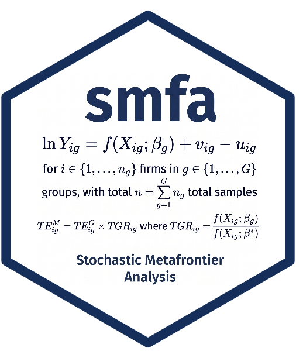

# smfa: Stochastic Metafrontier Analysis

# smfa: Stochastic Metafrontier Analysis



[](https://lifecycle.r-lib.org/articles/stages.html#stable)
[](https://cran.r-project.org/)
[](https://github.com/SulmanOlieko/smfa/commits/main)
[](https://github.com/SulmanOlieko/smfa/issues)
[](https://github.com/SulmanOlieko/smfa/actions/workflows/R-CMD-check.yaml)

[](https://github.com/SulmanOlieko/smfa)
[](https://github.com/SulmanOlieko/smfa)
[](https://github.com/SulmanOlieko/smfa)

[](https://cran.r-project.org/package=smfa)
[](https://cran.r-project.org/package=smfa)
[](https://cran.r-project.org/package=smfa)
[](https://cran.r-project.org/package=smfa)

[](https://github.com/SulmanOlieko/smfa)
[](https://sulmanolieko.r-universe.dev/smfa)
[](https://CRAN.R-project.org/package=smfa)

> **Stochastic Metafrontier Analysis**

An R package for implementing various deterministic and stochastic
metafrontier analyses for efficiency and performance benchmarking,
assessing technical efficiencies (TE), metafrontier technical
efficiencies (MTE), and computing metatechnology ratios (MTRs) for firms
operating under different technologies.

The package is available on CRAN:
[10.32614/CRAN.package.smfa](https://doi.org/10.32614/CRAN.package.smfa)

`smfa` provides routines for:

1.  **Deterministic envelope metafrontier** via **linear programming
    (LP)** and **quadratic programming (QP)**, following [Battese, Rao &
    O’Donnell
    (2004)](https://doi.org/10.1023/B:PROD.0000012454.06094.29) and
    [O’Donnell, Rao & Battese
    (2008)](https://doi.org/10.1007/s00181-007-0119-4).
2.  **Stochastic two-stage metafrontier** following [Huang, Huang & Liu
    (2014)](https://doi.org/10.1007/s11123-014-0402-2).

In addition, the package implements:

- **Latent class stochastic metafrontier analysis** — when technology
  groups are unobserved, the latent class model (LCM) robustly
  identifies classes and routes them to the metafrontier for
  benchmarking following [Greene and Hensher
  (2003)](https://doi.org/10.1016/S0191-2615(02)00046-2), [Orea and
  Kumbhakar (2004)](https://doi.org/10.1007/s00181-003-0184-2), [Greene
  (2005)](https://doi.org/10.1007/s11123-004-8545-1), [Parmeter and
  Kumbhakar (2014)](https://doi.org/10.1561/0800000023).
- **Sample selection correction metafrontier models** — corrects for
  sample selection bias following [Heckman
  (1979)](https://doi.org/10.2307/1912352), [Greene
  (2010)](https://doi.org/10.1007/s11123-009-0159-1), [Greene
  (2003)](https://elibrary.pearson.de/book/99.150005/9781292231150).

> **Dependency:** `smfa` depends on the
> [`sfaR`](https://CRAN.R-project.org/package=sfaR) package by [Dakpo,
> Desjeux & Latruffe (2023)](https://CRAN.R-project.org/package=sfaR),
> which provides the underlying stochastic frontier estimation routines
> for all group-level models.

------------------------------------------------------------------------

## Installation

``` r
install.packages("smfa")
Installing package into '/private/var/folders/9n/3z6s443x6qbclmb32_05hn_r0000gp/T/RtmpnONjWc/temp_libpath155183d37dbb0'
(as 'lib' is unspecified)
```

Toggle to see the output

``` plaintext
The downloaded binary packages are in
    /var/folders/9n/3z6s443x6qbclmb32_05hn_r0000gp/T//Rtmp4OvMIX/downloaded_packages
```

``` r
library("smfa")
Loading required package: sfaR
           ****           *******  
          /**/           /**////** 
  ****** ******  ******  /**   /** 
 **//// ///**/  //////** /*******  
//*****   /**    ******* /**///**  
 /////**  /**   **////** /**  //** 
 ******   /**  //********/**   //**
//////    //    //////// //     //    version 1.0.1

* Please cite the 'sfaR' package as:
  Dakpo KH., Desjeux Y., Henningsen A., and Latruffe L. (2024). sfaR: Stochastic Frontier Analysis Using R. R package version 1.0.1.

See also: citation("sfaR")

* For any questions, suggestions, or comments on the 'sfaR' package, you can contact directly the authors or visit:  https://github.com/hdakpo/sfaR/issues
                        .d888         
                       d88P"          
                       888            
.d8888b  88888b.d88b.  888888 8888b.  
88K      888 "888 "88b 888       "88b 
 Y8888b. 888  888  888 888   .d888888  
     X88 888  888  888 888   888  888 
 88888P' 888  888  888 888   "Y888888 
                          version 1.0.0

* Please cite the 'smfa' package as:
Owili, S. O. (2026). smfa: Stochastic Metafrontier Analysis. R package version 1.0.0.

See also: citation("smfa")

* For any questions, suggestions, or comments on the 'smfa' package, you can contact the authors directly or visit:
  https://github.com/SulmanOlieko/smfa/issues
# Install devtools if not already installed
#if (!require("devtools")) #install.packages("devtools")

# Install smfa from GitHub
#devtools::install_github("SulmanOlieko/smfa")
```

> **Note** You do not need to install `sfaR` manually, `smfa` takes care
> of that automatically.

------------------------------------------------------------------------

## Usage Examples

The following sections provide comprehensive examples covering all three
group-level model types and all four metafrontier methods. Each section
demonstrates the full workflow: data preparation → group frontier
estimation → metafrontier → efficiency and MTR extraction.

------------------------------------------------------------------------

## Section 1: Standard SFA Group Frontier (`groupType = "sfacross"`)

Let’s use the `ricephil` data from `sfaR`. In this data, group
boundaries are observed (a farm-size variable). If we assume that the
production technology varies by farm size, we can try to estimate three
frontiers that correspond to three types of farm sizes, namely small,
medium and large. We can create a group variable `group` that captures
these groups. We can then estimate each group’s frontier separately
using `sfacross` from the `sfaR` package. So, we will specify the option
`groupType = "sfacross"` in the
[`smfa()`](https://SulmanOlieko.github.io/smfa/reference/smfa.md).

### Data Preparation

``` r
library(smfa)
data("ricephil")

# Create three technology groups based on farm area terciles
ricephil$group <- cut(ricephil$AREA,
  breaks = quantile(ricephil$AREA, probs = c(0, 1/3, 2/3, 1), na.rm = TRUE),
  labels = c("small", "medium", "large"),
  include.lowest = TRUE
)
table(ricephil$group)
```

``` plaintext
 small medium  large
   125    104    115 
```

This is the distrubition of the various farm types:

``` plaintext
 small medium  large
   125    104    115 
```

------------------------------------------------------------------------

### 1a. LP Metafrontier (`groupType = "sfacross"`, `metaMethod = "lp"`)

We can begin by estimating a deterministic linear programming envelope
(Battese, Rao & O’Donnell, 2004) over the three group frontiers. The
metafrontier parameter vector minimises the sum of absolute deviations
while staying at or above all group frontier predictions. We will be
using a Cobb-Douglas functional form with rice production `PROD` as the
response variable, and `AREA`, `LABOR` and `NPK` as the inputs.

``` r
meta_sfacross_lp <- smfa(
  formula    = log(PROD) ~ log(AREA) + log(LABOR) + log(NPK),
  data       = ricephil,
  group      = "group",
  S          = 1,
  udist      = "hnormal",
  groupType  = "sfacross",
  metaMethod = "lp"
)
summary(meta_sfacross_lp)
```

``` plaintext
============================================================
Stochastic Metafrontier Analysis
Metafrontier method: Linear Programming (LP) Metafrontier
Stochastic Production/Profit Frontier, e = v - u
Group approach     : Stochastic Frontier Analysis
Group estimator    : sfacross
Group optim solver : BFGS maximization
Groups ( 3 ): small, medium, large
Total observations : 344
Distribution       : hnormal
============================================================

------------------------------------------------------------
Group: small (N = 125)  Log-likelihood: -50.98578
------------------------------------------------------------
--------------------------------------------------------------------------------
Normal-Half Normal SF Model
Dependent Variable:                                                    log(PROD)
Log likelihood solver:                                         BFGS maximization
Log likelihood iter:                                                          42
Log likelihood value:                                                  -50.98578
Log likelihood gradient norm:                                        9.40653e-06
Estimation based on:                                         N =  125 and K =  6
Inf. Cr:                                           AIC  =  114.0 AIC/N  =  0.912
                                                   BIC  =  130.9 BIC/N  =  1.048
                                                   HQIC =  120.9 HQIC/N =  0.967
--------------------------------------------------------------------------------
Variances: Sigma-squared(v)   =                                          0.05318
           Sigma(v)           =                                          0.05318
           Sigma-squared(u)   =                                          0.23435
           Sigma(u)           =                                          0.23435
Sigma = Sqrt[(s^2(u)+s^2(v))] =                                          0.53622
Gamma = sigma(u)^2/sigma^2    =                                          0.81504
Lambda = sigma(u)/sigma(v)    =                                          2.09921
Var[u]/{Var[u]+Var[v]}        =                                          0.61558
--------------------------------------------------------------------------------
Average inefficiency E[ui]     =                                         0.38626
Average efficiency E[exp(-ui)] =                                         0.70643
--------------------------------------------------------------------------------
Stochastic Production/Profit Frontier, e = v - u
-----[ Tests vs. No Inefficiency ]-----
Likelihood Ratio Test of Inefficiency
Deg. freedom for inefficiency model                                            1
Log Likelihood for OLS Log(H0) =                                       -54.80277
LR statistic:
Chisq = 2*[LogL(H0)-LogL(H1)]  =                                         7.63398
Kodde-Palm C*:       95%: 2.70554                                   99%: 5.41189
Coelli (1995) skewness test on OLS residuals
M3T: z                         =                                        -3.57676
M3T: p.value                   =                                         0.00035
Final maximum likelihood estimates
--------------------------------------------------------------------------------
                         Deterministic Component of SFA
--------------------------------------------------------------------------------
               Coefficient Std. Error z value  Pr(>|z|)
(Intercept)       -1.58745    0.51274 -3.0960  0.001962 **
log(AREA)          0.24014    0.11834  2.0292  0.042440 *
log(LABOR)         0.43464    0.12292  3.5361  0.000406 ***
log(NPK)           0.30516    0.05701  5.3523 8.682e-08 ***
--------------------------------------------------------------------------------
                  Parameter in variance of u (one-sided error)
--------------------------------------------------------------------------------
               Coefficient Std. Error z value  Pr(>|z|)
Zu_(Intercept)    -1.45093    0.29867  -4.858 1.186e-06 ***
--------------------------------------------------------------------------------
                 Parameters in variance of v (two-sided error)
--------------------------------------------------------------------------------
               Coefficient Std. Error z value  Pr(>|z|)
Zv_(Intercept)    -2.93406    0.35401  -8.288 < 2.2e-16 ***
---
Signif. codes:  0 '***' 0.001 '**' 0.01 '*' 0.05 '.' 0.1 ' ' 1
--------------------------------------------------------------------------------
Model was estimated on : Jul Tue 14, 2026 at 15:49
Log likelihood status: successful convergence
--------------------------------------------------------------------------------

------------------------------------------------------------
Group: medium (N = 104)  Log-likelihood: -15.28164
------------------------------------------------------------
--------------------------------------------------------------------------------
Normal-Half Normal SF Model
Dependent Variable:                                                    log(PROD)
Log likelihood solver:                                         BFGS maximization
Log likelihood iter:                                                          41
Log likelihood value:                                                  -15.28164
Log likelihood gradient norm:                                        3.83566e-05
Estimation based on:                                         N =  104 and K =  6
Inf. Cr:                                            AIC  =  42.6 AIC/N  =  0.409
                                                    BIC  =  58.4 BIC/N  =  0.562
                                                    HQIC =  49.0 HQIC/N =  0.471
--------------------------------------------------------------------------------
Variances: Sigma-squared(v)   =                                          0.01058
           Sigma(v)           =                                          0.01058
           Sigma-squared(u)   =                                          0.22010
           Sigma(u)           =                                          0.22010
Sigma = Sqrt[(s^2(u)+s^2(v))] =                                          0.48030
Gamma = sigma(u)^2/sigma^2    =                                          0.95412
Lambda = sigma(u)/sigma(v)    =                                          4.56034
Var[u]/{Var[u]+Var[v]}        =                                          0.88314
--------------------------------------------------------------------------------
Average inefficiency E[ui]     =                                         0.37433
Average efficiency E[exp(-ui)] =                                         0.71330
--------------------------------------------------------------------------------
Stochastic Production/Profit Frontier, e = v - u
-----[ Tests vs. No Inefficiency ]-----
Likelihood Ratio Test of Inefficiency
Deg. freedom for inefficiency model                                            1
Log Likelihood for OLS Log(H0) =                                       -21.11323
LR statistic:
Chisq = 2*[LogL(H0)-LogL(H1)]  =                                        11.66318
Kodde-Palm C*:       95%: 2.70554                                   99%: 5.41189
Coelli (1995) skewness test on OLS residuals
M3T: z                         =                                        -2.91021
M3T: p.value                   =                                         0.00361
Final maximum likelihood estimates
--------------------------------------------------------------------------------
                         Deterministic Component of SFA
--------------------------------------------------------------------------------
               Coefficient Std. Error z value  Pr(>|z|)
(Intercept)       -0.08182    0.50668 -0.1615 0.8717190
log(AREA)          0.47410    0.13984  3.3903 0.0006981 ***
log(LABOR)         0.17935    0.10201  1.7581 0.0787310 .
log(NPK)           0.20255    0.08130  2.4913 0.0127289 *
--------------------------------------------------------------------------------
                  Parameter in variance of u (one-sided error)
--------------------------------------------------------------------------------
               Coefficient Std. Error z value  Pr(>|z|)
Zu_(Intercept)    -1.51367    0.23549 -6.4276 1.296e-10 ***
--------------------------------------------------------------------------------
                 Parameters in variance of v (two-sided error)
--------------------------------------------------------------------------------
               Coefficient Std. Error z value  Pr(>|z|)
Zv_(Intercept)    -4.54846    0.76429 -5.9512 2.661e-09 ***
---
Signif. codes:  0 '***' 0.001 '**' 0.01 '*' 0.05 '.' 0.1 ' ' 1
--------------------------------------------------------------------------------
Model was estimated on : Jul Tue 14, 2026 at 15:49
Log likelihood status: successful convergence
--------------------------------------------------------------------------------

------------------------------------------------------------
Group: large (N = 115)  Log-likelihood: -8.02197
------------------------------------------------------------
--------------------------------------------------------------------------------
Normal-Half Normal SF Model
Dependent Variable:                                                    log(PROD)
Log likelihood solver:                                         BFGS maximization
Log likelihood iter:                                                          68
Log likelihood value:                                                   -8.02197
Log likelihood gradient norm:                                        4.01301e-05
Estimation based on:                                         N =  115 and K =  6
Inf. Cr:                                            AIC  =  28.0 AIC/N  =  0.244
                                                    BIC  =  44.5 BIC/N  =  0.387
                                                    HQIC =  34.7 HQIC/N =  0.302
--------------------------------------------------------------------------------
Variances: Sigma-squared(v)   =                                          0.01399
           Sigma(v)           =                                          0.01399
           Sigma-squared(u)   =                                          0.16751
           Sigma(u)           =                                          0.16751
Sigma = Sqrt[(s^2(u)+s^2(v))] =                                          0.42602
Gamma = sigma(u)^2/sigma^2    =                                          0.92293
Lambda = sigma(u)/sigma(v)    =                                          3.46063
Var[u]/{Var[u]+Var[v]}        =                                          0.81315
--------------------------------------------------------------------------------
Average inefficiency E[ui]     =                                         0.32656
Average efficiency E[exp(-ui)] =                                         0.74195
--------------------------------------------------------------------------------
Stochastic Production/Profit Frontier, e = v - u
-----[ Tests vs. No Inefficiency ]-----
Likelihood Ratio Test of Inefficiency
Deg. freedom for inefficiency model                                            1
Log Likelihood for OLS Log(H0) =                                       -16.96836
LR statistic:
Chisq = 2*[LogL(H0)-LogL(H1)]  =                                        17.89279
Kodde-Palm C*:       95%: 2.70554                                   99%: 5.41189
Coelli (1995) skewness test on OLS residuals
M3T: z                         =                                        -4.12175
M3T: p.value                   =                                         0.00004
Final maximum likelihood estimates
--------------------------------------------------------------------------------
                         Deterministic Component of SFA
--------------------------------------------------------------------------------
               Coefficient Std. Error z value  Pr(>|z|)
(Intercept)       -1.31194    0.41859 -3.1342 0.0017234 **
log(AREA)          0.38278    0.14297  2.6772 0.0074236 **
log(LABOR)         0.42105    0.10992  3.8303 0.0001280 ***
log(NPK)           0.23143    0.06065  3.8160 0.0001356 ***
--------------------------------------------------------------------------------
                  Parameter in variance of u (one-sided error)
--------------------------------------------------------------------------------
               Coefficient Std. Error z value  Pr(>|z|)
Zu_(Intercept)    -1.78673    0.20176 -8.8555 < 2.2e-16 ***
--------------------------------------------------------------------------------
                 Parameters in variance of v (two-sided error)
--------------------------------------------------------------------------------
               Coefficient Std. Error z value  Pr(>|z|)
Zv_(Intercept)    -4.26963    0.40584 -10.521 < 2.2e-16 ***
---
Signif. codes:  0 '***' 0.001 '**' 0.01 '*' 0.05 '.' 0.1 ' ' 1
--------------------------------------------------------------------------------
Model was estimated on : Jul Tue 14, 2026 at 15:49
Log likelihood status: successful convergence
--------------------------------------------------------------------------------

------------------------------------------------------------
Metafrontier Coefficients (lp):
  (LP: deterministic envelope - no estimated parameters)

------------------------------------------------------------
Efficiency Statistics (group means):
------------------------------------------------------------
       N_obs N_valid TE_group_BC TE_group_JLMS TE_meta_BC TE_meta_JLMS  MTR_BC
small    125     125     0.71065       0.70090    0.64126      0.63244 0.89981
medium   104     104     0.71253       0.70965    0.68204      0.67929 0.95597
large    115     115     0.74772       0.74406    0.72186      0.71834 0.96521
       MTR_JLMS
small   0.89981
medium  0.95597
large   0.96521

Overall:
TE_group_BC=0.7236  TE_group_JLMS=0.7182
TE_meta_BC=0.6817   TE_meta_JLMS=0.6767
MTR_BC=0.9403     MTR_JLMS=0.9403
------------------------------------------------------------
Total Log-likelihood: -74.28939
AIC: 184.5788   BIC: 253.7103   HQIC: 212.113
------------------------------------------------------------
Model was estimated on : Jul Tue 14, 2026 at 15:49 
```

> **Note:** Since the metafrontier is estimated via linear programming,
> no estimated parameters are returned.

To harvest individual efficiency, metafrontier efficiency and MTR
estimates:

``` r
efficiencies(meta_sfacross_lp)
```

Toggle to see the output

``` plaintext
     id  group        u_g TE_group_JLMS TE_group_BC TE_group_BC_reciprocal
1     1 medium 0.26971650     0.7635959   0.7673345               1.316036
2     2  large 0.35156422     0.7035867   0.7080897               1.430406
3     3  large 0.27745651     0.7577085   0.7623358               1.327899
4     4 medium 0.17104173     0.8427864   0.8461331               1.191355
5     5  large 0.21196294     0.8089947   0.8133556               1.242901
6     6  small 0.19874988     0.8197549   0.8275685               1.232467
7     7 medium 0.13165358     0.8766446   0.8794388               1.144463
8     8 medium 0.15361555     0.8576017   0.8607383               1.170418
9     9  large 0.30257423     0.7389136   0.7435320               1.361845
10   10  large 0.39007628     0.6770052   0.6813703               1.486626
11   11  small 0.92924589     0.3948514   0.4035011               2.588082
12   12  small 0.19404574     0.8236202   0.8312437               1.226330
13   13  small 0.28406465     0.7527180   0.7633015               1.348389
14   14  large 0.33207087     0.7174365   0.7219968               1.402741
15   15  small 0.37604956     0.6865683   0.6987013               1.483309
16   16  small 0.68309402     0.5050519   0.5160333               2.023157
17   17  large 0.48308967     0.6168745   0.6208681               1.631571
18   18  large 0.14598902     0.8641672   0.8676168               1.161971
19   19  large 0.15942841     0.8526310   0.8563290               1.178095
20   20  large 0.23870615     0.7876463   0.7921780               1.277019
21   21  large 0.53509305     0.5856148   0.5894067               1.718664
22   22 medium 0.13321561     0.8752763   0.8780978               1.146294
23   23  large 0.64904573     0.5225442   0.5259279               1.926106
24   24  large 0.30494980     0.7371604   0.7417757               1.365097
25   25  large 0.36231584     0.6960625   0.7005296               1.445889
26   26  small 0.35782089     0.6991983   0.7111323               1.455722
27   27 medium 0.68946140     0.5018463   0.5043865               2.002728
28   28 medium 0.14820764     0.8622521   0.8653125               1.163983
29   29 medium 0.43885427     0.6447747   0.6480379               1.558779
30   30 medium 0.78101223     0.4579422   0.4602602               2.194735
31   31  small 0.11027845     0.8955847   0.8993545               1.121690
32   32  small 0.73726525     0.4784205   0.4888663               2.135906
33   33 medium 0.28891406     0.7490766   0.7527904               1.341617
34   34  small 0.95871703     0.3833844   0.3917835               2.665492
35   35  large 0.13741225     0.8716108   0.8748846               1.151776
36   36  small 0.96866209     0.3795906   0.3879066               2.692133
37   37  small 0.19029853     0.8267123   0.8341817               1.221460
38   38  large 0.10253454     0.9025470   0.9049738               1.111089
39   39  small 0.63054578     0.5323012   0.5437851               1.919362
40   40 medium 0.66058287     0.5165502   0.5191648               1.945719
41   41  small 0.28900704     0.7490069   0.7597103               1.355372
42   42 medium 0.05156756     0.9497395   0.9506433               1.053962
43   43 medium 1.19309253     0.3032819   0.3048170               3.313952
44   44 medium 0.39809366     0.6715991   0.6749962               1.496516
45   45  large 0.21353124     0.8077269   0.8121007               1.244881
46   46  large 0.38104349     0.6831482   0.6875476               1.473249
47   47 medium 0.51706842     0.5962660   0.5992841               1.685593
48   48  large 0.28476023     0.7521946   0.7568241               1.337689
49   49  small 0.37632866     0.6863767   0.6985123               1.483735
50   50 medium 0.08768834     0.9160463   0.9178976               1.093943
51   51 medium 0.21551709     0.8061245   0.8097887               1.246212
52   52  large 0.16517228     0.8477476   0.8515417               1.185043
53   53  large 0.42324534     0.6549179   0.6591518               1.536784
54   54  small 0.95317568     0.3855148   0.3939604               2.650762
55   55  small 0.34332381     0.7094085   0.7211483               1.434089
56   56  small 0.51135451     0.5996828   0.6120410               1.702453
57   57  large 0.42818450     0.6516912   0.6559051               1.544395
58   58  small 0.39520496     0.6735420   0.6858329               1.512769
59   59  small 0.20997321     0.8106060   0.8188583               1.247219
60   60  large 1.06549989     0.3445556   0.3467867               2.921083
61   61  large 0.24996507     0.7788280   0.7834040               1.291622
62   62  large 0.08518681     0.9183407   0.9202802               1.091328
63   63  large 0.16346958     0.8491923   0.8529585               1.182980
64   64  large 0.71818311     0.4876374   0.4907951               2.063983
65   65 medium 0.35067251     0.7042143   0.7077662               1.427189
66   66  large 0.46547169     0.6278389   0.6319026               1.603076
67   67  large 0.37806815     0.6851838   0.6895943               1.468868
68   68  large 0.16780715     0.8455169   0.8493530               1.188241
69   69  small 0.52285816     0.5928237   0.6051259               1.722346
70   70 medium 0.32721034     0.7209321   0.7245549               1.394073
71   71 medium 0.08807987     0.9156877   0.9175488               1.094384
72   72 medium 0.74487271     0.4747947   0.4771980               2.116834
73   73 medium 0.54952972     0.5772212   0.5801429               1.741207
74   74  small 0.47200427     0.6237508   0.6362295               1.635970
75   75  small 0.29451014     0.7448964   0.7557281               1.363182
76   76 medium 0.30540107     0.7368278   0.7405077               1.363962
77   77  small 0.92216588     0.3976568   0.4063679               2.569822
78   78 medium 0.10315484     0.9019873   0.9042066               1.111494
79   79  small 0.51145818     0.5996206   0.6119783               1.702632
80   80  small 0.21306571     0.8081030   0.8164725               1.251310
81   81  large 0.23111098     0.7936514   0.7981445               1.267249
82   82  small 0.80877949     0.4454014   0.4551491               2.294323
83   83 medium 0.79471384     0.4517105   0.4539969               2.225013
84   84  small 0.16143515     0.8509217   0.8571342               1.184527
85   85 medium 0.10754566     0.8980355   0.9003525               1.116521
86   86 medium 1.25923700     0.2838705   0.2853074               3.540564
87   87 medium 0.23574646     0.7899809   0.7937044               1.271874
88   88  large 0.18389141     0.8320262   0.8360918               1.207917
89   89  large 0.40442074     0.6673633   0.6716723               1.508115
90   90 medium 0.04250673     0.9583840   0.9590537               1.044179
91   91  large 0.22202050     0.8008989   0.8053358               1.255640
92   92  small 0.28784656     0.7498766   0.7605523               1.353729
93   93 medium 0.13117685     0.8770627   0.8798484               1.143905
94   94 medium 0.52361332     0.5923762   0.5953747               1.696661
95   95  large 0.18380892     0.8320948   0.8361594               1.207815
96   96  large 0.15458454     0.8567711   0.8603834               1.172263
97   97  small 0.58297518     0.5582350   0.5701315               1.829844
98   98  small 0.34450415     0.7085716   0.7203285               1.435840
99   99  small 0.30123486     0.7399040   0.7508851               1.372776
100 100  large 0.26745807     0.7653224   0.7699395               1.314601
101 101  small 0.55191295     0.5758472   0.5879742               1.773543
102 102  small 0.32564277     0.7220631   0.7335205               1.408063
103 103  large 0.19828894     0.8201328   0.8243660               1.225756
104 104  large 0.17208990     0.8419035   0.8458052               1.193454
105 105  large 0.18406916     0.8318783   0.8359462               1.208136
106 106  large 0.15321665     0.8579438   0.8615312               1.170620
107 107  large 0.11095437     0.8949796   0.8976289               1.120796
108 108 medium 0.10455186     0.9007281   0.9029788               1.113091
109 109  large 0.25275205     0.7766604   0.7812451               1.295259
110 110  large 0.13767911     0.8713783   0.8746577               1.152092
111 111  large 0.17065865     0.8431093   0.8469895               1.191710
112 112  small 0.27205429     0.7618129   0.7720866               1.331542
113 113 medium 0.17764282     0.8372414   0.8406542               1.199366
114 114 medium 0.07735091     0.9255650   0.9271532               1.082351
115 115 medium 0.53654999     0.5847622   0.5877221               1.718753
116 116  small 0.42936131     0.6509247   0.6633797               1.566533
117 117  small 0.16499487     0.8478981   0.8542718               1.189026
118 118  small 0.18357605     0.8322886   0.8394761               1.212766
119 119 medium 0.33274854     0.7169505   0.7205572               1.401821
120 120  small 0.59015184     0.5542431   0.5660812               1.843089
121 121 medium 0.13365201     0.8748945   0.8777234               1.146805
122 122  small 0.40621404     0.6661676   0.6785271               1.529923
123 123  small 0.17263606     0.8414438   0.8481581               1.198737
124 124  large 0.14782818     0.8625793   0.8660649               1.164167
125 125  small 0.35093355     0.7040305   0.7158764               1.445411
126 126 medium 0.56752097     0.5669291   0.5697988               1.772817
127 127  small 0.16877679     0.8446974   0.8512407               1.193823
128 128 medium 0.13506819     0.8736563   0.8765095               1.148467
129 129  small 0.44504953     0.6407925   0.6532776               1.591773
130 130 medium 0.39273080     0.6752105   0.6786253               1.488511
131 131  large 0.09767654     0.9069422   0.9092361               1.105523
132 132  large 0.53056371     0.5882733   0.5920824               1.710897
133 133 medium 0.14522379     0.8648287   0.8678449               1.160444
134 134  large 0.17999850     0.8352715   0.8392858               1.203130
135 135  small 0.46197481     0.6300382   0.6425273               1.619400
136 136 medium 0.07823949     0.9247429   0.9263541               1.083343
137 137 medium 0.23091467     0.7938072   0.7975205               1.265702
138 138  large 0.34534978     0.7079727   0.7124952               1.421530
139 139  large 0.12894860     0.8790191   0.8821063               1.141788
140 140 medium 0.48103124     0.6181456   0.6212744               1.625930
141 141  small 0.11773649     0.8889303   0.8930643               1.130632
142 142  small 0.50645708     0.6026269   0.6150063               1.694048
143 143 medium 0.20748338     0.8126267   0.8162542               1.236147
144 144  small 0.30880101     0.7343269   0.7454667               1.383636
145 145  small 0.22358989     0.7996430   0.8083984               1.265320
146 146  large 0.07234960     0.9302056   0.9317673               1.076921
147 147  large 0.20371424     0.8156954   0.8199828               1.232535
148 148  large 0.91631481     0.3999904   0.4025805               2.516249
149 149  large 0.22053264     0.8020915   0.8065180               1.253749
150 150  large 0.68148964     0.5058629   0.5091385               1.989621
151 151 medium 0.07974173     0.9233548   0.9250048               1.085022
152 152  large 0.79474993     0.4516942   0.4546191               2.228223
153 153  large 0.24061641     0.7861431   0.7906834               1.279487
154 154  large 0.12853914     0.8793791   0.8824569               1.141307
155 155  small 0.49661330     0.6085883   0.6210053               1.677268
156 156  small 0.37695482     0.6859471   0.6980886               1.484691
157 157  small 0.29497587     0.7445496   0.7553918               1.363844
158 158 medium 0.11544390     0.8909706   0.8934553               1.125612
159 159  small 0.31511456     0.7297053   0.7409698               1.392752
160 160  small 0.42183943     0.6558393   0.6682703               1.554555
161 161  small 0.26677319     0.7658468   0.7759759               1.324190
162 162  small 0.29141595     0.7472048   0.7579650               1.358786
163 163  small 0.35786292     0.6991689   0.7111035               1.455786
164 164 medium 0.18990769     0.8270355   0.8305524               1.214370
165 165 medium 0.53645635     0.5848170   0.5877771               1.718592
166 166  small 0.21390204     0.8074275   0.8158283               1.252419
167 167  large 0.11796311     0.8887288   0.8915551               1.128933
168 168  small 0.23927515     0.7871983   0.7964921               1.286445
169 169 medium 0.50509722     0.6034469   0.6065014               1.665535
170 170  small 0.16742642     0.8458389   0.8523218               1.192108
171 171 medium 0.35984536     0.6977842   0.7013069               1.440346
172 172 medium 0.62839799     0.5334457   0.5361459               1.884094
173 173 medium 0.38557500     0.6800595   0.6834980               1.477896
174 174  large 0.09504929     0.9093281   0.9115489               1.102523
175 175  large 0.76321806     0.4661639   0.4691825               2.159059
176 176 medium 0.20974379     0.8107920   0.8144306               1.238971
177 177  large 0.40981596     0.6637724   0.6680600               1.516277
178 178  small 0.34752184     0.7064366   0.7182360               1.440326
179 179 medium 0.21664337     0.8052171   0.8088858               1.247628
180 180 medium 0.26293729     0.7687901   0.7725324               1.307112
181 181  large 0.26522456     0.7670337   0.7716472               1.311647
182 182  large 0.66574949     0.5138882   0.5172158               1.958549
183 183 medium 0.86695664     0.4202285   0.4223556               2.391703
184 184  small 0.44160911     0.6430009   0.6554816               1.586208
185 185  small 0.65924072     0.5172439   0.5284572               1.975381
186 186 medium 0.24201528     0.7850442   0.7887775               1.279921
187 187  small 0.33041455     0.7186258   0.7301644               1.415048
188 188  small 0.18863690     0.8280871   0.8354875               1.219306
189 189  large 0.05330220     0.9480935   0.9490925               1.055909
190 190  large 0.24348518     0.7838911   0.7884435               1.283200
191 191  large 0.20676877     0.8132077   0.8175235               1.236365
192 192  large 0.20225170     0.8168893   0.8211625               1.230705
193 193  large 0.32382733     0.7233751   0.7279557               1.391197
194 194 medium 0.68377484     0.5047082   0.5072629               1.991372
195 195  large 0.32854526     0.7199703   0.7245397               1.397793
196 196  large 0.93573295     0.3922982   0.3948385               2.565587
197 197  large 0.78871134     0.4544300   0.4573726               2.214808
198 198  small 0.22155462     0.8012722   0.8099545               1.262600
199 199  small 0.46176488     0.6301705   0.6426597               1.619055
200 200  small 0.25045891     0.7784435   0.7880938               1.301687
201 201 medium 0.73516393     0.4794269   0.4818536               2.096382
202 202  small 0.33014326     0.7188207   0.7303549               1.414651
203 203  small 0.18123530     0.8342390   0.8413268               1.209752
204 204  small 0.31271670     0.7314571   0.7426751               1.389284
205 205 medium 0.14931823     0.8612950   0.8643715               1.165302
206 206  small 0.73144769     0.4812118   0.4917152               2.123507
207 207 medium 0.50481428     0.6036177   0.6066730               1.665063
208 208 medium 0.52000480     0.5945177   0.5975270               1.690550
209 209  small 0.29340163     0.7457226   0.7565288               1.361605
210 210  large 0.52692648     0.5904168   0.5942398               1.704686
211 211  small 0.16286045     0.8497098   0.8559870               1.186327
212 212 medium 0.46566409     0.6277181   0.6308953               1.601135
213 213  small 0.34921399     0.7052422   0.7170649               1.442846
214 214 medium 0.52477163     0.5916905   0.5946854               1.698627
215 215 medium 0.25196513     0.7772718   0.7810137               1.292787
216 216 medium 0.75345388     0.4707379   0.4731206               2.135077
217 217  large 0.09400786     0.9102756   0.9124671               1.101336
218 218  large 0.15539558     0.8560765   0.8597034               1.173238
219 219 medium 0.34483786     0.7083352   0.7119053               1.418882
220 220  large 0.28710954     0.7504295   0.7550588               1.340852
221 221  small 0.24484526     0.7828257   0.7922999               1.294018
222 222  large 0.31498520     0.7297997   0.7343987               1.378914
223 223 medium 0.51375510     0.5982449   0.6012730               1.680017
224 224  large 0.45762302     0.6327860   0.6368812               1.590542
225 225  large 0.12203744     0.8851152   0.8880406               1.133686
226 226 medium 0.38224719     0.6823264   0.6857758               1.472985
227 227  small 0.14021798     0.8691688   0.8743907               1.158046
228 228  small 0.38393814     0.6811736   0.6933777               1.495382
229 229 medium 0.27137489     0.7623307   0.7660678               1.318228
230 230  small 0.29544272     0.7442020   0.7550549               1.364509
231 231  small 0.16769672     0.8456103   0.8521053               1.192451
232 232  large 0.08077514     0.9224011   0.9242118               1.086355
233 233  large 0.25664172     0.7736453   0.7782408               1.300350
234 234  large 0.12582971     0.8817650   0.8847802               1.138126
235 235  large 0.30866071     0.7344299   0.7390399               1.370191
236 236  large 0.08755236     0.9161709   0.9181787               1.094003
237 237 medium 0.58452852     0.5573686   0.5601898               1.803226
238 238  large 0.31852288     0.7272224   0.7318145               1.383816
239 239  large 0.36568287     0.6937228   0.6981782               1.450771
240 240  large 0.54483361     0.5799383   0.5836935               1.735487
241 241  small 0.23470048     0.7908077   0.7999491               1.280253
242 242  small 0.27735774     0.7577834   0.7681971               1.338960
243 243  small 0.30605962     0.7363427   0.7474262               1.379693
244 244 medium 1.08243900     0.3387683   0.3404830               2.966812
245 245  small 0.34953987     0.7050124   0.7168395               1.443332
246 246  small 0.16336613     0.8492802   0.8555803               1.186966
247 247  small 0.71841455     0.4875246   0.4981571               2.095986
248 248  small 0.24053589     0.7862064   0.7955416               1.288156
249 249  small 0.56709915     0.5671683   0.5791874               1.800862
250 250 medium 0.29364064     0.7455444   0.7492495               1.347987
251 251 medium 0.45068791     0.6371897   0.6404147               1.577335
252 252  small 0.29203957     0.7467390   0.7575137               1.359671
253 253  small 0.19569314     0.8222645   0.8299550               1.228476
254 254  small 0.20941780     0.8110563   0.8192874               1.246485
255 255 medium 0.45207002     0.6363096   0.6395302               1.579516
256 256  small 0.11309466     0.8930661   0.8969735               1.125057
257 257 medium 0.29737033     0.7427689   0.7464666               1.353034
258 258 medium 0.06194103     0.9399383   0.9411184               1.065291
259 259 medium 0.83579891     0.4335280   0.4357224               2.318332
260 260  large 0.27845218     0.7569545   0.7615823               1.329229
261 261  large 0.90210294     0.4057156   0.4083427               2.480741
262 262 medium 0.37714757     0.6858149   0.6892811               1.465491
263 263  large 0.30646524     0.7360441   0.7406573               1.367175
264 264  small 0.49552007     0.6092540   0.6216748               1.675414
265 265  large 0.34762954     0.7063605   0.7108760               1.424780
266 266 medium 0.65750169     0.5181442   0.5207669               1.939734
267 267  large 0.22715688     0.7967958   0.8012658               1.262188
268 268  large 0.40928937     0.6641220   0.6684117               1.515479
269 269 medium 1.04243306     0.3525958   0.3543805               2.850465
270 270  small 0.20423088     0.8152741   0.8233047               1.239653
271 271  small 0.35400226     0.7018734   0.7137594               1.449998
272 272 medium 0.14892700     0.8616320   0.8647029               1.164837
273 273  small 1.01742375     0.3615251   0.3694456               2.826660
274 274  small 0.14753714     0.8628304   0.8683992               1.167116
275 275  large 0.59087223     0.5538440   0.5574303               1.817254
276 276  large 0.31868474     0.7271047   0.7316965               1.384040
277 277  large 1.05323826     0.3488064   0.3510650               2.885484
278 278  large 0.36206496     0.6962371   0.7007051               1.445526
279 279  large 0.11851463     0.8882388   0.8910786               1.129576
280 280 medium 0.56049118     0.5709286   0.5738184               1.760398
281 281  large 0.90082987     0.4062324   0.4088629               2.477585
282 282  large 0.68894756     0.5021042   0.5053555               2.004515
283 283  large 0.40681477     0.6657675   0.6700670               1.511732
284 284  small 0.32825360     0.7201804   0.7316827               1.411882
285 285  small 0.58712316     0.5559243   0.5677872               1.837488
286 286  small 0.26499068     0.7672131   0.7772924               1.321715
287 287 medium 0.55761408     0.5725736   0.5754718               1.755341
288 288  small 0.53914604     0.5832461   0.5954556               1.750876
289 289  small 0.72014046     0.4866839   0.4972993               2.099610
290 290  small 0.44715734     0.6394433   0.6519304               1.595191
291 291  small 0.49780579     0.6078630   0.6202759               1.679293
292 292  small 0.66100224     0.5163336   0.5275299               1.978871
293 293 medium 0.14962157     0.8610338   0.8641147               1.165663
294 294 medium 0.69952325     0.4968221   0.4993369               2.022981
295 295  small 0.35783098     0.6991912   0.7111254               1.455738
296 296  small 0.26213416     0.7694078   0.7794058               1.317758
297 297  small 0.57148927     0.5646838   0.5766699               1.808833
298 298 medium 0.85849748     0.4237984   0.4259435               2.371556
299 299  small 0.26961386     0.7636743   0.7738819               1.328140
300 300 medium 0.48262620     0.6171605   0.6202843               1.628526
301 301 medium 0.43839191     0.6450729   0.6483376               1.558058
302 302 medium 0.19214074     0.8251907   0.8287242               1.217118
303 303  large 0.04633628     0.9547209   0.9555221               1.048342
304 304  large 0.16623744     0.8468451   0.8506563               1.186334
305 305 medium 0.35468269     0.7013960   0.7049352               1.432927
306 306  large 0.18339731     0.8324374   0.8364966               1.207308
307 307  small 0.40384508     0.6677476   0.6800937               1.526218
308 308 medium 0.09255992     0.9115946   0.9135655               1.099444
309 309 medium 0.18483443     0.8312419   0.8347186               1.208145
310 310  large 0.10609289     0.8993411   0.9018632               1.115183
311 311  large 0.14589422     0.8642491   0.8676969               1.161858
312 312 medium 0.41861446     0.6579578   0.6612871               1.527545
313 313  small 0.13859242     0.8705828   0.8757270               1.156041
314 314  small 0.27929584     0.7563161   0.7667798               1.341679
315 315 medium 0.22048841     0.8021269   0.8058099               1.252475
316 316  small 0.53495241     0.5856972   0.5979319               1.743489
317 317  small 0.16536791     0.8475818   0.8539723               1.189498
318 318  large 0.10368213     0.9015118   0.9039695               1.112408
319 319  large 0.09606154     0.9084081   0.9106571               1.103678
320 320  large 0.04783823     0.9532880   0.9541312               1.049968
321 321  large 0.13853364     0.8706340   0.8739315               1.153104
322 322  large 0.30251241     0.7389593   0.7435778               1.361761
323 323 medium 0.33992775     0.7118218   0.7154070               1.411928
324 324  large 0.32328901     0.7237646   0.7283465               1.390446
325 325  large 0.84248670     0.4306383   0.4334269               2.337171
326 326  large 0.07179505     0.9307216   0.9322668               1.076303
327 327  small 0.20451647     0.8150413   0.8230830               1.240028
328 328 medium 0.09623443     0.9082511   0.9103100               1.103610
329 329  small 0.21597733     0.8057536   0.8142318               1.255173
330 330 medium 0.22230257     0.8006731   0.8043621               1.254768
331 331  small 1.77202421     0.1699885   0.1737128               6.011634
332 332  small 0.08729466     0.9164070   0.9190677               1.094637
333 333  small 0.07767033     0.9252694   0.9274824               1.083545
334 334  small 0.16530631     0.8476340   0.8540218               1.189420
335 335  small 0.62939981     0.5329116   0.5444060               1.917157
336 336 medium 0.06048170     0.9413110   0.9424521               1.063689
337 337 medium 0.13407398     0.8745254   0.8773616               1.147300
338 338  small 0.27164171     0.7621273   0.7723899               1.330967
339 339  small 0.10454772     0.9007318   0.9042222               1.114872
340 340  small 0.30967136     0.7336880   0.7448454               1.384890
341 341 medium 0.26074881     0.7704744   0.7742174               1.304243
342 342  small 0.10813117     0.8975099   0.9011749               1.119130
343 343 medium 0.15387524     0.8573790   0.8605191               1.170728
344 344 medium 0.06691412     0.9352755   0.9365885               1.070767
          uLB_g     uUB_g         m_g TE_group_mode  teBCLB_g  teBCUB_g
1   0.077581942 0.4657010 0.268585702     0.7644599 0.6276949 0.9253512
2   0.130356248 0.5739174 0.351182071     0.7038556 0.5633144 0.8777827
3   0.065447909 0.4980807 0.275016061     0.7595599 0.6076959 0.9366478
4   0.018022507 0.3583190 0.158856747     0.8531186 0.6988501 0.9821389
5   0.027125654 0.4268531 0.202315202     0.8168374 0.6525594 0.9732389
6   0.009050601 0.5251973 0.079980247     0.9231346 0.5914386 0.9909902
7   0.008752251 0.3079157 0.104055371     0.9011754 0.7349772 0.9912859
8   0.013162800 0.3369142 0.136034520     0.8728125 0.7139701 0.9869235
9   0.085680505 0.5241016 0.301219525     0.7399153 0.5920871 0.9178874
10  0.167828760 0.6126522 0.389950793     0.6770902 0.5419117 0.8454986
11  0.521202993 1.3372953 0.929241967     0.3948529 0.2625548 0.5938058
12  0.008642986 0.5171656 0.069500977     0.9328592 0.5962080 0.9913943
13  0.020090696 0.6533880 0.232905761     0.7922282 0.5202801 0.9801098
14  0.111995595 0.5541988 0.331426088     0.7178992 0.5745324 0.8940482
15  0.044863312 0.7679191 0.355902815     0.7005407 0.4639775 0.9561282
16  0.276449440 1.0908091 0.682709790     0.5052460 0.3359446 0.7584720
17  0.260417553 0.7057716 0.483084286     0.6168778 0.4937275 0.7707297
18  0.009432911 0.3441592 0.113132519     0.8930323 0.7088160 0.9906114
19  0.011791634 0.3624708 0.133648420     0.8748976 0.6959546 0.9882776
20  0.039974576 0.4567367 0.233063689     0.7921031 0.6333471 0.9608139
21  0.312407891 0.7577792 0.535092362     0.5856152 0.4687062 0.7316830
22  0.009013704 0.3100686 0.106481830     0.8989914 0.7333966 0.9910268
23  0.426358917 0.8717326 0.649045730     0.5225442 0.4182263 0.6528820
24  0.087712464 0.5265410 0.303671028     0.7381036 0.5906445 0.9160242
25  0.140695307 0.5847546 0.362032747     0.6962596 0.5572426 0.8687540
26  0.038458085 0.7464911 0.333459137     0.7164412 0.4740269 0.9622720
27  0.492507972 0.8864148 0.689461398     0.5018463 0.4121307 0.6110919
28  0.011918220 0.3300082 0.128544438     0.8793745 0.7189179 0.9881525
29  0.241908494 0.6358051 0.438851372     0.6447766 0.5295090 0.7851280
30  0.584058808 0.9779657 0.781012234     0.4579422 0.3760754 0.5576305
31  0.003482336 0.3468517 0.000000000     1.0000000 0.7069102 0.9965237
32  0.329746003 1.1451784 0.737107658     0.4784959 0.3181671 0.7191064
33  0.094649581 0.4852999 0.288257791     0.7495683 0.6155126 0.9096917
34  0.550669150 1.3667681 0.958714970     0.3833852 0.2549295 0.5765639
35  0.008164362 0.3319277 0.099075758     0.9056741 0.7175392 0.9918689
36  0.560613143 1.3767136 0.968660439     0.3795912 0.2524067 0.5708589
37  0.008329538 0.5106760 0.060930435     0.9408887 0.6000898 0.9917051
38  0.004438296 0.2763860 0.030178916     0.9702719 0.7585201 0.9955715
39  0.225873860 1.0378517 0.629687722     0.5327581 0.3542148 0.7978187
40  0.463629442 0.8575363 0.660582868     0.5165502 0.4242059 0.6289966
41  0.021006858 0.6600248 0.240283242     0.7864051 0.5168385 0.9792122
42  0.001609375 0.1633501 0.000000000     1.0000000 0.8492938 0.9983919
43  0.996139105 1.3900460 1.193092531     0.3032819 0.2490639 0.3693025
44  0.201186961 0.5950330 0.398077979     0.6716097 0.5515444 0.8177595
45  0.027773455 0.4286464 0.204174672     0.8153199 0.6513902 0.9726087
46  0.158946763 0.6035852 0.380878944     0.6832606 0.5468475 0.8530418
47  0.320115147 0.7140218 0.517068350     0.5962660 0.4896709 0.7260654
48  0.071072796 0.5056953 0.282695589     0.7537492 0.6030861 0.9313941
49  0.044968124 0.7682434 0.356240949     0.7003039 0.4638271 0.9560280
50  0.003689591 0.2391210 0.019494873     0.9806939 0.7873196 0.9963172
51  0.037849713 0.4087433 0.211015955     0.8097611 0.6644848 0.9628576
52  0.012957480 0.3700178 0.141945964     0.8676681 0.6907220 0.9871261
53  0.200699455 0.6458929 0.423201311     0.6549468 0.5241943 0.8181583
54  0.545128502 1.3612265 0.953173347     0.3855157 0.2563462 0.5797673
55  0.033952267 0.7290678 0.315051603     0.7297512 0.4823584 0.9666176
56  0.122155766 0.9157602 0.507042817     0.6022740 0.4002123 0.8850105
57  0.205615831 0.6508379 0.428147102     0.6517155 0.5216085 0.8141458
58  0.052552895 0.7899306 0.378765887     0.6847059 0.4538763 0.9488041
59  0.010090458 0.5438693 0.103833569     0.9013753 0.5804978 0.9899603
60  0.842813067 1.2881867 1.065499891     0.3445556 0.2757704 0.4304978
61  0.046559313 0.4689444 0.245506506     0.7823082 0.6256623 0.9545079
62  0.003206229 0.2440483 0.000000000     1.0000000 0.7834498 0.9967989
63  0.012601214 0.3677966 0.139512577     0.8697821 0.6922579 0.9874778
64  0.495496284 0.9408699 0.718183107     0.4876374 0.3902882 0.6092685
65  0.154032974 0.5475451 0.350581285     0.7042786 0.5783679 0.8572438
66  0.242814282 0.6881492 0.465461408     0.6278453 0.5025052 0.7844172
67  0.156030772 0.6005967 0.377888484     0.6853069 0.5484842 0.8555329
68  0.013527181 0.3734293 0.145670000     0.8644429 0.6883697 0.9865639
69  0.131069580 0.9277430 0.519125251     0.5950408 0.3954452 0.8771567
70  0.131000057 0.5239870 0.327009100     0.7210772 0.5921549 0.8772177
71  0.003719710 0.2398234 0.020452225     0.9797555 0.7867668 0.9962872
72  0.547919285 0.9418261 0.744872711     0.4747947 0.3899151 0.5781515
73  0.352576316 0.7464831 0.549529704     0.5772212 0.4740307 0.7028749
74  0.094201509 0.8742577 0.465063318     0.6280953 0.4171716 0.9100994
75  0.022072437 0.6673362 0.248366459     0.7800740 0.5130735 0.9781694
76  0.110023143 0.5020052 0.305000090     0.7371233 0.6053157 0.8958134
77  0.514124743 1.3302147 0.922161315     0.3976586 0.2644205 0.5980238
78  0.005048633 0.2654447 0.053800315     0.9476213 0.7668648 0.9949641
79  0.122234702 0.9158684 0.507152041     0.6022082 0.4001690 0.8849406
80  0.010394631 0.5488989 0.110145413     0.8957039 0.5775854 0.9896592
81  0.035928588 0.4483881 0.224519377     0.7989001 0.6386568 0.9647092
82  0.400860479 1.2167931 0.808735563     0.4454209 0.2961785 0.6697435
83  0.597760416 0.9916673 0.794713842     0.4517105 0.3709577 0.5500421
84  0.006214525 0.4576563 0.000000000     1.0000000 0.6327649 0.9938047
85  0.005505876 0.2724415 0.062448544     0.9394614 0.7615180 0.9945093
86  1.062283575 1.4561904 1.259237001     0.2838705 0.2331227 0.3456656
87  0.050854925 0.4303856 0.232991434     0.7921604 0.6502583 0.9504165
88  0.017533862 0.3936387 0.167430378     0.8458355 0.6745977 0.9826190
89  0.182005354 0.6270360 0.404340143     0.6674171 0.5341727 0.8335969
90  0.001249378 0.1399248 0.000000000     1.0000000 0.8694236 0.9987514
91  0.031503770 0.4382585 0.214107362     0.8072617 0.6451590 0.9689873
92  0.020788329 0.6584725 0.238561250     0.7877604 0.5176414 0.9794263
93  0.008673865 0.3072556 0.103309411     0.9018479 0.7354626 0.9913636
94  0.326660005 0.7205667 0.523613273     0.5923763 0.4864765 0.7213289
95  0.017510812 0.3935376 0.167322600     0.8459267 0.6746660 0.9826416
96  0.010884822 0.3559817 0.126443767     0.8812237 0.7004855 0.9891742
97  0.181962446 0.9895722 0.581285703     0.5591790 0.3717357 0.8336326
98  0.034300668 0.7305001 0.316570646     0.7286435 0.4816681 0.9662809
99  0.023442491 0.6761635 0.258066843     0.7725436 0.5085644 0.9768301
100 0.058140452 0.4875789 0.264405056     0.7676625 0.6141114 0.9435174
101 0.154855952 0.9577708 0.549346483     0.5773270 0.3837474 0.8565386
102 0.029101642 0.7072981 0.291820564     0.7469025 0.4929744 0.9713177
103 0.021998212 0.4109565 0.185733607     0.8304948 0.6630158 0.9782420
104 0.014502679 0.3789105 0.151620760     0.8593141 0.6846069 0.9856020
105 0.017583620 0.3938566 0.167662493     0.8456392 0.6744507 0.9825701
106 0.010640706 0.3541273 0.124372249     0.8830511 0.7017856 0.9894157
107 0.005163518 0.2908039 0.049042971     0.9521402 0.7476623 0.9948498
108 0.005190325 0.2676916 0.056596344     0.9449754 0.7651437 0.9948231
109 0.048296359 0.4719385 0.248550039     0.7799308 0.6237919 0.9528514
110 0.008201340 0.3323154 0.099526152     0.9052663 0.7172611 0.9918322
111 0.014169696 0.3770873 0.149645713     0.8610130 0.6858562 0.9859302
112 0.018016440 0.6369662 0.214475854     0.8069643 0.5288946 0.9821449
113 0.020245459 0.3661368 0.167068369     0.8461418 0.6934079 0.9799581
114 0.002962792 0.2197907 0.000000000     1.0000000 0.8026868 0.9970416
115 0.339596616 0.7335034 0.536549964     0.5847622 0.4802236 0.7120575
116 0.068892354 0.8281060 0.418046060     0.6583319 0.4368760 0.9334272
117 0.006449148 0.4645101 0.000000000     1.0000000 0.6284429 0.9935716
118 0.007791099 0.4988209 0.045021333     0.9559771 0.6072462 0.9922392
119 0.136404444 0.5295543 0.332580798     0.7170707 0.5888674 0.8724897
120 0.188425720 0.9968843 0.588622031     0.5550917 0.3690274 0.8282620
121 0.009088029 0.3106673 0.107154955     0.8983865 0.7329577 0.9909531
122 0.057442787 0.8023738 0.391616297     0.6759634 0.4482636 0.9441759
123 0.006976359 0.4789080 0.017498218     0.9826540 0.6194595 0.9930479
124 0.009727583 0.3467238 0.116041621     0.8904382 0.7070006 0.9903196
125 0.036255176 0.7382585 0.324780451     0.7226860 0.4779456 0.9643942
126 0.370567549 0.7644744 0.567520961     0.5669291 0.4655786 0.6903424
127 0.006705974 0.4716886 0.007249244     0.9927770 0.6239478 0.9933165
128 0.009333160 0.3126022 0.109325405     0.8964387 0.7315409 0.9907103
129 0.077570164 0.8452548 0.435567198     0.6468976 0.4294479 0.9253621
130 0.195835966 0.5896669 0.392711457     0.6752236 0.5545120 0.8221471
131 0.004060282 0.2677121 0.018406064     0.9817623 0.7651280 0.9959479
132 0.307878907 0.7532498 0.530562872     0.5882738 0.4708340 0.7350043
133 0.011278901 0.3261368 0.124314151     0.8831024 0.7217065 0.9887845
134 0.016475563 0.3888380 0.162304165     0.8501826 0.6778441 0.9836594
135 0.087762636 0.8635284 0.454169485     0.6349751 0.4216716 0.9159783
136 0.003020398 0.2215153 0.000000000     1.0000000 0.8013037 0.9969842
137 0.047527515 0.4252678 0.227809186     0.7962762 0.6535947 0.9535842
138 0.124441905 0.5676422 0.344896976     0.7082933 0.5668604 0.8829896
139 0.007067650 0.3193763 0.084302868     0.9191528 0.7266021 0.9929573
140 0.284078808 0.6779843 0.481030815     0.6181459 0.5076392 0.7527073
141 0.003816557 0.3646377 0.000000000     1.0000000 0.6944482 0.9961907
142 0.118456684 0.9106402 0.501875715     0.6053940 0.4022666 0.8882903
143 0.033381988 0.3999685 0.202052757     0.8170518 0.6703412 0.9671690
144 0.025077755 0.6859610 0.268762734     0.7643246 0.5036060 0.9752341
145 0.011491234 0.5656668 0.130869136     0.8773326 0.5679813 0.9885745
146 0.002477902 0.2173295 0.000000000     1.0000000 0.8046648 0.9975252
147 0.023923309 0.4173221 0.192396048     0.8249801 0.6588087 0.9763606
148 0.693627983 1.1390016 0.916314807     0.3999904 0.3201385 0.4997597
149 0.030822300 0.4365850 0.212381966     0.8086558 0.6462395 0.9696479
150 0.458802815 0.9041765 0.681489637     0.5058629 0.4048752 0.6320399
151 0.003119765 0.2244026 0.000000000     1.0000000 0.7989934 0.9968851
152 0.572063103 1.0174367 0.794749926     0.4516942 0.3615204 0.5643599
153 0.041042514 0.4588214 0.235192620     0.7904186 0.6320281 0.9597883
154 0.007018160 0.3187559 0.083562558     0.9198335 0.7270530 0.9930064
155 0.111203402 0.9003129 0.491444209     0.6117423 0.4064424 0.8947567
156 0.045204034 0.7689705 0.356998998     0.6997732 0.4634900 0.9558024
157 0.022164879 0.6679513 0.249044435     0.7795453 0.5127580 0.9780790
158 0.006422330 0.2845750 0.077065153     0.9258295 0.7523339 0.9935982
159 0.026522135 0.6940334 0.277522520     0.7576585 0.4995571 0.9738265
160 0.064995607 0.8198038 0.409538342     0.6639567 0.4405181 0.9370716
161 0.017168703 0.6296058 0.206128674     0.8137284 0.5328018 0.9829778
162 0.021467294 0.6632352 0.243838163     0.7836144 0.5151819 0.9787615
163 0.038471884 0.7465411 0.333511747     0.7164035 0.4740032 0.9622588
164 0.025005970 0.3803120 0.181822954     0.8337489 0.6836481 0.9753041
165 0.339502979 0.7334098 0.536456327     0.5848170 0.4802686 0.7121242
166 0.010478260 0.5502509 0.111834295     0.8941924 0.5768051 0.9895764
167 0.005842943 0.3022681 0.063495503     0.9384783 0.7391399 0.9941741
168 0.013317828 0.5897331 0.159835828     0.8522837 0.5544753 0.9867705
169 0.308144085 0.7020505 0.505097092     0.6034470 0.4955681 0.7348094
170 0.006613362 0.4691374 0.003590644     0.9964158 0.6255416 0.9934085
171 0.163112785 0.5567402 0.359779360     0.6978303 0.5730742 0.8494954
172 0.431444569 0.8253514 0.628397995     0.5334457 0.4380810 0.6495701
173 0.188700467 0.5825056 0.385549504     0.6800768 0.5584972 0.8280345
174 0.003867128 0.2629037 0.011726238     0.9883422 0.7688159 0.9961403
175 0.540531239 0.9859049 0.763218062     0.4661639 0.3731015 0.5824388
176 0.034598157 0.4024493 0.204590548     0.8149809 0.6686802 0.9659935
177 0.187354704 0.6324424 0.409748001     0.6638175 0.5312926 0.8291496
178 0.035206002 0.7341506 0.320437405     0.7258315 0.4799129 0.9654065
179 0.038508330 0.4099644 0.212260526     0.8087540 0.6636739 0.9622237
180 0.071842034 0.4587293 0.261576890     0.7698367 0.6320863 0.9306779
181 0.056573967 0.4852193 0.262017375     0.7694977 0.6155622 0.9449966
182 0.443062670 0.8884363 0.665749489     0.5138882 0.4112984 0.6420670
183 0.670003217 1.0639101 0.866956643     0.4202285 0.3451038 0.5117069
184 0.075603414 0.8415123 0.431749163     0.6493722 0.4310581 0.9271838
185 0.253300889 1.0668057 0.658683327     0.5175323 0.3441059 0.7762343
186 0.055366328 0.4369843 0.239662459     0.7868934 0.6459816 0.9461385
187 0.030344607 0.7132335 0.298182053     0.7421662 0.4900570 0.9701112
188 0.008193641 0.5077715 0.057063546     0.9445340 0.6018353 0.9918398
189 0.001614052 0.1720648 0.000000000     1.0000000 0.8419246 0.9983872
190 0.042684255 0.4619415 0.238375621     0.7879067 0.6300592 0.9582139
191 0.025069606 0.4208714 0.196097406     0.8219322 0.6564745 0.9752420
192 0.023390540 0.4156140 0.190611402     0.8264537 0.6599349 0.9768809
193 0.104429592 0.5458247 0.323029236     0.7239527 0.5793638 0.9008382
194 0.486821414 0.8807283 0.683774840     0.5047082 0.4144809 0.6145768
195 0.108742879 0.5506204 0.327838496     0.7204794 0.5765920 0.8969610
196 0.713046125 1.1584198 0.935732949     0.3922982 0.3139820 0.4901489
197 0.566024521 1.0113982 0.788711344     0.4544300 0.3637101 0.5677781
198 0.011271497 0.5624648 0.126948108     0.8807794 0.5698029 0.9887918
199 0.087631002 0.8633031 0.453940488     0.6351205 0.4217667 0.9160989
200 0.014776689 0.6062811 0.179283432     0.8358690 0.5453753 0.9853320
201 0.538210504 0.9321174 0.735163930     0.4794269 0.3937192 0.5837920
202 0.030272667 0.7128973 0.297822288     0.7424333 0.4902218 0.9701810
203 0.007610543 0.4946265 0.039310431     0.9614522 0.6097986 0.9924183
204 0.025964779 0.6909783 0.274212656     0.7601704 0.5010856 0.9743694
205 0.012164601 0.3314378 0.130100725     0.8780070 0.7178908 0.9879091
206 0.323988970 1.1393465 0.731273735     0.4812956 0.3200281 0.7232582
207 0.307861143 0.7017676 0.504814144     0.6036178 0.4957083 0.7350174
208 0.323051506 0.7169582 0.520004741     0.5945177 0.4882351 0.7239366
209 0.021853847 0.6658699 0.246749002     0.7813368 0.5138263 0.9783832
210 0.304242028 0.7496124 0.526925513     0.5904174 0.4725497 0.7376823
211 0.006307655 0.4604120 0.000000000     1.0000000 0.6310236 0.9937122
212 0.268712797 0.6626167 0.465663217     0.6277187 0.5155006 0.7643628
213 0.035722944 0.7361905 0.322595219     0.7242670 0.4789349 0.9649076
214 0.327818303 0.7217250 0.524771581     0.5916905 0.4859133 0.7204939
215 0.062947293 0.4473737 0.250144388     0.7786883 0.6393050 0.9389930
216 0.556500455 0.9504073 0.753453881     0.4707379 0.3865835 0.5732115
217 0.003792652 0.2609739 0.009012462     0.9910280 0.7703011 0.9962145
218 0.011032004 0.3570765 0.127664127     0.8801489 0.6997189 0.9890286
219 0.148275327 0.5416926 0.344726260     0.7084142 0.5817627 0.8621937
220 0.072930082 0.5081355 0.285154337     0.7518982 0.6016163 0.9296658
221 0.014027135 0.5980350 0.169636992     0.8439711 0.5498911 0.9860708
222 0.096482270 0.5368129 0.313987005     0.7305285 0.5846085 0.9080260
223 0.316801854 0.7107084 0.513755014     0.5982449 0.4912960 0.7284751
224 0.234975960 0.6802976 0.457609411     0.6327946 0.5064662 0.7905899
225 0.006273041 0.3087292 0.071453156     0.9310399 0.7343796 0.9937466
226 0.185384216 0.5791747 0.382218253     0.6823461 0.5603606 0.8307850
227 0.004947283 0.4146895 0.000000000     1.0000000 0.6605453 0.9950649
228 0.047907012 0.7770426 0.365400999     0.6939183 0.4597637 0.9532224
229 0.079011500 0.4674020 0.270294701     0.7631546 0.6266281 0.9240293
230 0.022257902 0.6685673 0.249723097     0.7790165 0.5124422 0.9779880
231 0.006631818 0.4696491 0.004326057     0.9956833 0.6252216 0.9933901
232 0.002940445 0.2351644 0.000000000     1.0000000 0.7904409 0.9970639
233 0.050790389 0.4761003 0.252775847     0.7766419 0.6212012 0.9504779
234 0.006698494 0.3146183 0.078599132     0.9244104 0.7300675 0.9933239
235 0.090921537 0.5303453 0.307492981     0.7352880 0.5884017 0.9130894
236 0.003356019 0.2486929 0.000000000     1.0000000 0.7798194 0.9966496
237 0.387575098 0.7814819 0.584528519     0.5573686 0.4577272 0.6787007
238 0.099639183 0.5404225 0.317609578     0.7278869 0.5825021 0.9051640
239 0.143956686 0.5881440 0.365425600     0.6939013 0.5553571 0.8659253
240 0.322147869 0.7675200 0.544833153     0.5799385 0.4641628 0.7245910
241 0.012759812 0.5828218 0.151604433     0.8593281 0.5583206 0.9873212
242 0.018906607 0.6442705 0.222705290     0.8003507 0.5250454 0.9812710
243 0.024473466 0.6824271 0.264913059     0.7672727 0.5053889 0.9758236
244 0.885485573 1.2793924 1.082438999     0.3387683 0.2782063 0.4125138
245 0.035823274 0.7365828 0.323009935     0.7239667 0.4787471 0.9648108
246 0.006340956 0.4613860 0.000000000     1.0000000 0.6304093 0.9936791
247 0.311115386 1.1262760 0.718198066     0.4876301 0.3242385 0.7326293
248 0.013475454 0.5916229 0.162075031     0.8503774 0.5534284 0.9866149
249 0.167918642 0.9733518 0.565002287     0.5683588 0.3778145 0.8454226
250 0.099001173 0.4900990 0.293069422     0.7459704 0.6125658 0.9057416
251 0.253738878 0.6476398 0.450686191     0.6371908 0.5232794 0.7758944
252 0.021588006 0.6640638 0.244754211     0.7828969 0.5147552 0.9786433
253 0.008783916 0.5199927 0.073205390     0.9294099 0.5945249 0.9912545
254 0.010036662 0.5429608 0.102688595     0.9024079 0.5810254 0.9900135
255 0.255120707 0.6490220 0.452068403     0.6363106 0.5225566 0.7748230
256 0.003606352 0.3536420 0.000000000     1.0000000 0.7021263 0.9964001
257 0.102468639 0.4938799 0.296859066     0.7431487 0.6102541 0.9026065
258 0.002087529 0.1876893 0.000000000     1.0000000 0.8288722 0.9979146
259 0.638845489 1.0327523 0.835798915     0.4335280 0.3560257 0.5279015
260 0.066200987 0.4991214 0.276066303     0.7587626 0.6070638 0.9359427
261 0.679416118 1.1247898 0.902102941     0.4057156 0.3247207 0.5069129
262 0.180305446 0.5740697 0.377112507     0.6858389 0.5632286 0.8350151
263 0.089017932 0.5280955 0.305232904     0.7369517 0.5897271 0.9148292
264 0.110413268 0.8991629 0.490281757     0.6124538 0.4069101 0.8954640
265 0.126605705 0.5699453 0.347203925     0.7066612 0.5655564 0.8810810
266 0.460548269 0.8544551 0.657501695     0.5181442 0.4255150 0.6309376
267 0.033948388 0.4440014 0.220016870     0.8025053 0.6414645 0.9666214
268 0.186832250 0.6319148 0.409220264     0.6641679 0.5315730 0.8295829
269 0.845479633 1.2393865 1.042433059     0.3525958 0.2895618 0.4293514
270 0.009546203 0.5343999 0.091822032     0.9122675 0.5860209 0.9904992
271 0.037222514 0.7419364 0.328661688     0.7198865 0.4761909 0.9634617
272 0.012077277 0.3309349 0.129553591     0.8784875 0.7182520 0.9879954
273 0.609371998 1.4254762 1.017423205     0.3615253 0.2403940 0.5436922
274 0.005360396 0.4299416 0.000000000     1.0000000 0.6505471 0.9946539
275 0.368185536 0.8135590 0.590872171     0.5538440 0.4432776 0.6919888
276 0.099784378 0.5405875 0.317775170     0.7277664 0.5824060 0.9050325
277 0.830551438 1.2759251 1.053238262     0.3488064 0.2791726 0.4358089
278 0.140452710 0.5845020 0.361779850     0.6964357 0.5573834 0.8689648
279 0.005899588 0.3031511 0.064590634     0.9374511 0.7384875 0.9941178
280 0.363537765 0.7574446 0.560491170     0.5709286 0.4688630 0.6952125
281 0.678143050 1.1235167 0.900829873     0.4062324 0.3251344 0.5075586
282 0.466260741 0.9116344 0.688947563     0.5021042 0.4018669 0.6273437
283 0.184378050 0.6294352 0.406740030     0.6658173 0.5328927 0.8316214
284 0.029775850 0.7105513 0.295310011     0.7443008 0.4913732 0.9706631
285 0.185689960 0.9937999 0.585527696     0.5568120 0.3701674 0.8305311
286 0.016890997 0.6271013 0.203275407     0.8160535 0.5341379 0.9832509
287 0.360660667 0.7545675 0.557614069     0.5725736 0.4702139 0.6972155
288 0.144194091 0.9446147 0.536114528     0.5850169 0.3888294 0.8657197
289 0.312818089 1.1280073 0.719930114     0.4867863 0.3236776 0.7313829
290 0.078792747 0.8475427 0.437899954     0.6453903 0.4284665 0.9242315
291 0.112068841 0.9015667 0.492711288     0.6109676 0.4059332 0.8939827
292 0.255000978 1.0685801 0.660459724     0.5166138 0.3434959 0.7749157
293 0.012232707 0.3318272 0.130524126     0.8776353 0.7176113 0.9878418
294 0.502569824 0.8964767 0.699523250     0.4968221 0.4080047 0.6049740
295 0.038461398 0.7465031 0.333471770     0.7164321 0.4740212 0.9622688
296 0.016454600 0.6230659 0.198663858     0.8198254 0.5362977 0.9836800
297 0.171764880 0.9778437 0.569513029     0.5658009 0.3761212 0.8421772
298 0.661544051 1.0554509 0.858497477     0.4237984 0.3480355 0.5160539
299 0.017619997 0.6335759 0.210637999     0.8100673 0.5306907 0.9825343
300 0.285673698 0.6795793 0.482625812     0.6171607 0.5068302 0.7515078
301 0.241446306 0.6353427 0.438388959     0.6450748 0.5297539 0.7854910
302 0.025965953 0.3828491 0.184447617     0.8315635 0.6819158 0.9743683
303 0.001349246 0.1535016 0.000000000     1.0000000 0.8576994 0.9986517
304 0.013185060 0.3714006 0.143457395     0.8663577 0.6897676 0.9869015
305 0.157998707 0.5515658 0.354603424     0.7014516 0.5760471 0.8538509
306 0.017396212 0.3930324 0.166784281     0.8463822 0.6750069 0.9827542
307 0.056360808 0.7997081 0.388867522     0.6778241 0.4494601 0.9451980
308 0.004079152 0.2477191 0.031042971     0.9694339 0.7805791 0.9959292
309 0.022933554 0.3744999 0.175792519     0.8387920 0.6876331 0.9773274
310 0.004733439 0.2825704 0.038371905     0.9623550 0.7538435 0.9952777
311 0.009417948 0.3440265 0.112981623     0.8931671 0.7089101 0.9906263
312 0.221680206 0.6155617 0.418607626     0.6579623 0.5403373 0.8011715
313 0.004858731 0.4112366 0.000000000     1.0000000 0.6628301 0.9951531
314 0.019241951 0.6469186 0.225676057     0.7979766 0.5236569 0.9809420
315 0.040816146 0.4141175 0.216488873     0.8053415 0.6609233 0.9600056
316 0.140761519 0.9402806 0.531752546     0.5875743 0.3905182 0.8686965
317 0.006474131 0.4652228 0.000000000     1.0000000 0.6279952 0.9935468
318 0.004531738 0.2783957 0.032858803     0.9676752 0.7569972 0.9954785
319 0.003940644 0.2647664 0.014327535     0.9857746 0.7673852 0.9960671
320 0.001404370 0.1576044 0.000000000     1.0000000 0.8541876 0.9985966
321 0.008320788 0.3335536 0.100962472     0.9039670 0.7163735 0.9917137
322 0.085627867 0.5240381 0.301155675     0.7399626 0.5921247 0.9179358
323 0.143443259 0.5367648 0.339795839     0.7119157 0.5846366 0.8663700
324 0.103940491 0.5452770 0.322479852     0.7243505 0.5796812 0.9012789
325 0.619799875 1.0651735 0.842486698     0.4306383 0.3446680 0.5380521
326 0.002449379 0.2161128 0.000000000     1.0000000 0.8056444 0.9975536
327 0.009572656 0.5348749 0.092428712     0.9117142 0.5857426 0.9904730
328 0.004395404 0.2540105 0.039271278     0.9614898 0.7756837 0.9956142
329 0.010688342 0.5535909 0.115992772     0.8904817 0.5748817 0.9893686
330 0.041936683 0.4160690 0.218473318     0.8037449 0.6596348 0.9589305
331 1.363971221 2.1800772 1.772024207     0.1699885 0.1130328 0.2556435
332 0.002559892 0.2878059 0.000000000     1.0000000 0.7499071 0.9974434
333 0.002215568 0.2610088 0.000000000     1.0000000 0.7702741 0.9977869
334 0.006470000 0.4651052 0.000000000     1.0000000 0.6280690 0.9935509
335 0.224790515 1.0366932 0.628527163     0.5333768 0.3546254 0.7986835
336 0.002015454 0.1844108 0.000000000     1.0000000 0.8315941 0.9979866
337 0.009160439 0.3112451 0.107803902     0.8978036 0.7325343 0.9908814
338 0.017948842 0.6363943 0.213829323     0.8074862 0.5291971 0.9822113
339 0.003237818 0.3327463 0.000000000     1.0000000 0.7169520 0.9967674
340 0.025272467 0.6870793 0.269979005     0.7633955 0.5030432 0.9750442
341 0.070026998 0.4564718 0.259305895     0.7715870 0.6335149 0.9323686
342 0.003389504 0.3416122 0.000000000     1.0000000 0.7106237 0.9966162
343 0.013225467 0.3372424 0.136388779     0.8725034 0.7137358 0.9868616
344 0.002346241 0.1985332 0.000000000     1.0000000 0.8199326 0.9976565
        u_meta TE_meta_JLMS TE_meta_BC  MTR_JLMS    MTR_BC
1   0.39444390    0.6740548  0.6773549 0.8827375 0.8827375
2   0.37798358    0.6852418  0.6896274 0.9739266 0.9739266
3   0.30495307    0.7371580  0.7416598 0.9728780 0.9728780
4   0.17104173    0.8427864  0.8461331 1.0000000 1.0000000
5   0.23792711    0.7882601  0.7925093 0.9743700 0.9743700
6   0.32952629    0.7192644  0.7261201 0.8774139 0.8774139
7   0.21037952    0.8102767  0.8128593 0.9242932 0.9242932
8   0.25024492    0.7786101  0.7814578 0.9078924 0.9078924
9   0.32025822    0.7259616  0.7304990 0.9824715 0.9824715
10  0.41975249    0.6572095  0.6614469 0.9707598 0.9707598
11  1.00109439    0.3674771  0.3755272 0.9306719 0.9306719
12  0.37878552    0.6846924  0.6910300 0.8313206 0.8313206
13  0.29326068    0.7458277  0.7563143 0.9908461 0.9908461
14  0.33207087    0.7174365  0.7219968 1.0000000 1.0000000
15  0.55461328    0.5742943  0.5844432 0.8364708 0.8364708
16  0.78062329    0.4581204  0.4680813 0.9070758 0.9070758
17  0.50185661    0.6054056  0.6093249 0.9814081 0.9814081
18  0.15756846    0.8542183  0.8576283 0.9884873 0.9884873
19  0.15942841    0.8526310  0.8563290 1.0000000 1.0000000
20  0.26903223    0.7641186  0.7685150 0.9701291 0.9701291
21  0.60171509    0.5478712  0.5514187 0.9355487 0.9355487
22  0.16248573    0.8500282  0.8527683 0.9711541 0.9711541
23  0.64904573    0.5225442  0.5259279 1.0000000 1.0000000
24  0.34018613    0.7116379  0.7160934 0.9653772 0.9653772
25  0.40073531    0.6698273  0.6741261 0.9623092 0.9623092
26  0.38544339    0.6801490  0.6917579 0.9727555 0.9727555
27  0.76140601    0.4670093  0.4693732 0.9305824 0.9305824
28  0.17464481    0.8397552  0.8427359 0.9739092 0.9739092
29  0.43885427    0.6447747  0.6480379 1.0000000 1.0000000
30  0.78101223    0.4579422  0.4602602 1.0000000 1.0000000
31  0.22498830    0.7985256  0.8018868 0.8916248 0.8916248
32  0.94035513    0.3904891  0.3990150 0.8162049 0.8162049
33  0.33687022    0.7140015  0.7175415 0.9531756 0.9531756
34  1.29227182    0.2746461  0.2806630 0.7163727 0.7163727
35  0.19878240    0.8197282  0.8228071 0.9404751 0.9404751
36  0.96866209    0.3795906  0.3879066 1.0000000 1.0000000
37  0.19029853    0.8267123  0.8341817 1.0000000 1.0000000
38  0.10253454    0.9025470  0.9049738 1.0000000 1.0000000
39  0.74618972    0.4741698  0.4843996 0.8907923 0.8907923
40  0.75640502    0.4693507  0.4717264 0.9086256 0.9086256
41  0.28900704    0.7490069  0.7597103 1.0000000 1.0000000
42  0.05156756    0.9497395  0.9506433 1.0000000 1.0000000
43  1.19948894    0.3013482  0.3028735 0.9936240 0.9936240
44  0.51974684    0.5946711  0.5976790 0.8854554 0.8854554
45  0.21353124    0.8077269  0.8121007 1.0000000 1.0000000
46  0.41483089    0.6604520  0.6647052 0.9667770 0.9667770
47  0.51706842    0.5962660  0.5992841 1.0000000 1.0000000
48  0.28700071    0.7505112  0.7551303 0.9977620 0.9977620
49  0.68406107    0.5045638  0.5134848 0.7351120 0.7351120
50  0.14671525    0.8635398  0.8652850 0.9426814 0.9426814
51  0.23045956    0.7941685  0.7977784 0.9851686 0.9851686
52  0.18426984    0.8317113  0.8354336 0.9810836 0.9810836
53  0.46648877    0.6272007  0.6312553 0.9576782 0.9576782
54  0.95317568    0.3855148  0.3939604 1.0000000 1.0000000
55  0.35110760    0.7039080  0.7155568 0.9922464 0.9922464
56  0.51378204    0.5982288  0.6105570 0.9975754 0.9975754
57  0.44957542    0.6378989  0.6420237 0.9788362 0.9788362
58  0.55729241    0.5727578  0.5832096 0.8503668 0.8503668
59  0.36184307    0.6963916  0.7034812 0.8591001 0.8591001
60  1.09626055    0.3341182  0.3362817 0.9697076 0.9697076
61  0.26733337    0.7654179  0.7699151 0.9827817 0.9827817
62  0.08518681    0.9183407  0.9202802 1.0000000 1.0000000
63  0.20566339    0.8141071  0.8177177 0.9586840 0.9586840
64  0.75354044    0.4706971  0.4737451 0.9652604 0.9652604
65  0.40535189    0.6667422  0.6701051 0.9467887 0.9467887
66  0.49074842    0.6121681  0.6161304 0.9750400 0.9750400
67  0.45408166    0.6350309  0.6391185 0.9268037 0.9268037
68  0.19207913    0.8252416  0.8289857 0.9760202 0.9760202
69  0.53469257    0.5858494  0.5980068 0.9882353 0.9882353
70  0.32721034    0.7209321  0.7245549 1.0000000 1.0000000
71  0.12482115    0.8826548  0.8844487 0.9639255 0.9639255
72  0.74487271    0.4747947  0.4771980 1.0000000 1.0000000
73  0.54952972    0.5772212  0.5801429 1.0000000 1.0000000
74  0.55018140    0.5768452  0.5883855 0.9248006 0.9248006
75  0.44268347    0.6423105  0.6516504 0.8622816 0.8622816
76  0.36224749    0.6961101  0.6995866 0.9447391 0.9447391
77  1.32624636    0.2654719  0.2712873 0.6675904 0.6675904
78  0.10315484    0.9019873  0.9042066 1.0000000 1.0000000
79  0.51145818    0.5996206  0.6119783 1.0000000 1.0000000
80  0.21306571    0.8081030  0.8164725 1.0000000 1.0000000
81  0.23111098    0.7936514  0.7981445 1.0000000 1.0000000
82  1.03354713    0.3557429  0.3635284 0.7987018 0.7987018
83  0.85676884    0.4245316  0.4266805 0.9398312 0.9398312
84  0.21235388    0.8086785  0.8145825 0.9503559 0.9503559
85  0.10754566    0.8980355  0.9003525 1.0000000 1.0000000
86  1.29488076    0.2739305  0.2753171 0.9649840 0.9649840
87  0.38204365    0.6824653  0.6856820 0.8639009 0.8639009
88  0.22588475    0.7978100  0.8017085 0.9588762 0.9588762
89  0.40917872    0.6641955  0.6684841 0.9952533 0.9952533
90  0.04250673    0.9583840  0.9590537 1.0000000 1.0000000
91  0.22235705    0.8006295  0.8050648 0.9996635 0.9996635
92  0.41336393    0.6614215  0.6708378 0.8820404 0.8820404
93  0.20797359    0.8122285  0.8148083 0.9260781 0.9260781
94  0.61397327    0.5411963  0.5439356 0.9136023 0.9136023
95  0.22690705    0.7969949  0.8008880 0.9578174 0.9578174
96  0.19103008    0.8261077  0.8295908 0.9642106 0.9642106
97  0.66429840    0.5146345  0.5256017 0.9218957 0.9218957
98  0.41168997    0.6625297  0.6735226 0.9350214 0.9350214
99  0.30123486    0.7399040  0.7508851 1.0000000 1.0000000
100 0.35609786    0.7004041  0.7046295 0.9151752 0.9151752
101 0.64856316    0.5227964  0.5338062 0.9078735 0.9078735
102 0.36928538    0.6912281  0.7021963 0.9572960 0.9572960
103 0.26179509    0.7696687  0.7736414 0.9384684 0.9384684
104 0.19762269    0.8206794  0.8244828 0.9747904 0.9747904
105 0.25098227    0.7780362  0.7818408 0.9352765 0.9352765
106 0.23206267    0.7928964  0.7962118 0.9241822 0.9241822
107 0.11327896    0.8929015  0.8955447 0.9976781 0.9976781
108 0.18478190    0.8312856  0.8333628 0.9229040 0.9229040
109 0.28030021    0.7555569  0.7600170 0.9728278 0.9728278
110 0.19014512    0.8268391  0.8299510 0.9488866 0.9488866
111 0.19820918    0.8201983  0.8239730 0.9728255 0.9728255
112 0.27205429    0.7618129  0.7720866 1.0000000 1.0000000
113 0.24163198    0.7853451  0.7885464 0.9380152 0.9380152
114 0.14711027    0.8631988  0.8646799 0.9326182 0.9326182
115 0.53654999    0.5847622  0.5877221 1.0000000 1.0000000
116 0.61966844    0.5381228  0.5484194 0.8267052 0.8267052
117 0.31210476    0.7319049  0.7374067 0.8631991 0.8631991
118 0.34483403    0.7083379  0.7144550 0.8510725 0.8510725
119 0.33274854    0.7169505  0.7205572 1.0000000 1.0000000
120 0.89734536    0.4076504  0.4163574 0.7355082 0.7355082
121 0.16987168    0.8437731  0.8465014 0.9644284 0.9644284
122 0.42172180    0.6559165  0.6680859 0.9846119 0.9846119
123 0.17263606    0.8414438  0.8481581 1.0000000 1.0000000
124 0.16506081    0.8478421  0.8512682 0.9829150 0.9829150
125 0.65052421    0.5217722  0.5305514 0.7411215 0.7411215
126 0.56752097    0.5669291  0.5697988 1.0000000 1.0000000
127 0.20671025    0.8132553  0.8195550 0.9627770 0.9627770
128 0.13506819    0.8736563  0.8765095 1.0000000 1.0000000
129 0.44504953    0.6407925  0.6532776 1.0000000 1.0000000
130 0.50696718    0.6023195  0.6053657 0.8920471 0.8920471
131 0.15303209    0.8581022  0.8602725 0.9461487 0.9461487
132 0.53559387    0.5853216  0.5891116 0.9949825 0.9949825
133 0.14522379    0.8648287  0.8678449 1.0000000 1.0000000
134 0.18808338    0.8285456  0.8325276 0.9919477 0.9919477
135 0.58473830    0.5572517  0.5682979 0.8844728 0.8844728
136 0.10458820    0.9006954  0.9022647 0.9739954 0.9739954
137 0.35136778    0.7037249  0.7070168 0.8865187 0.8865187
138 0.37004555    0.6907029  0.6951151 0.9756067 0.9756067
139 0.16565412    0.8473393  0.8503152 0.9639600 0.9639600
140 0.48103124    0.6181456  0.6212744 1.0000000 1.0000000
141 0.30515784    0.7370070  0.7404346 0.8290943 0.8290943
142 0.50645708    0.6026269  0.6150063 1.0000000 1.0000000
143 0.25674124    0.7735684  0.7770215 0.9519356 0.9519356
144 0.46053631    0.6309452  0.6405166 0.8592157 0.8592157
145 0.41590758    0.6597412  0.6669648 0.8250447 0.8250447
146 0.14138654    0.8681537  0.8696112 0.9332922 0.9332922
147 0.23064280    0.7940230  0.7981965 0.9734308 0.9734308
148 0.94788510    0.3875598  0.3900694 0.9689228 0.9689228
149 0.28493182    0.7520655  0.7562160 0.9376306 0.9376306
150 0.75089131    0.4719457  0.4750017 0.9329519 0.9329519
151 0.19303528    0.8244529  0.8259262 0.8928885 0.8928885
152 0.80936469    0.4451408  0.4480232 0.9854915 0.9854915
153 0.25957775    0.7713772  0.7758323 0.9812173 0.9812173
154 0.13980979    0.8695236  0.8725669 0.9887926 0.9887926
155 0.49661330    0.6085883  0.6210053 1.0000000 1.0000000
156 0.40403547    0.6676204  0.6794376 0.9732827 0.9732827
157 0.29497587    0.7445496  0.7553918 1.0000000 1.0000000
158 0.11544390    0.8909706  0.8934553 1.0000000 1.0000000
159 0.46717667    0.6267693  0.6364449 0.8589349 0.8589349
160 0.42183943    0.6558393  0.6682703 1.0000000 1.0000000
161 0.26677319    0.7658468  0.7759759 1.0000000 1.0000000
162 0.29267926    0.7462615  0.7570081 0.9987375 0.9987375
163 0.56948748    0.5658154  0.5754736 0.8092685 0.8092685
164 0.22972866    0.7947492  0.7981289 0.9609615 0.9609615
165 0.56689043    0.5672867  0.5701582 0.9700244 0.9700244
166 0.21390204    0.8074275  0.8158283 1.0000000 1.0000000
167 0.14281593    0.8669136  0.8696705 0.9754535 0.9754535
168 0.48502138    0.6156840  0.6229529 0.7821207 0.7821207
169 0.55684957    0.5730115  0.5759119 0.9495640 0.9495640
170 0.33178121    0.7176443  0.7231447 0.8484410 0.8484410
171 0.35984536    0.6977842  0.7013069 1.0000000 1.0000000
172 0.62839799    0.5334457  0.5361459 1.0000000 1.0000000
173 0.53349777    0.5865498  0.5895154 0.8624977 0.8624977
174 0.17043379    0.8432989  0.8453584 0.9273868 0.9273868
175 0.77177777    0.4621907  0.4651835 0.9914768 0.9914768
176 0.20974379    0.8107920  0.8144306 1.0000000 1.0000000
177 0.41741748    0.6587458  0.6630010 0.9924273 0.9924273
178 0.42537352    0.6535256  0.6644413 0.9251016 0.9251016
179 0.29964461    0.7410815  0.7444580 0.9203500 0.9203500
180 0.33735846    0.7136530  0.7171269 0.9282806 0.9282806
181 0.29409585    0.7452051  0.7496873 0.9715415 0.9715415
182 0.73236497    0.4807706  0.4838838 0.9355549 0.9355549
183 0.86695664    0.4202285  0.4223556 1.0000000 1.0000000
184 0.49688866    0.6084207  0.6202302 0.9462206 0.9462206
185 0.65924072    0.5172439  0.5284572 1.0000000 1.0000000
186 0.24201528    0.7850442  0.7887775 1.0000000 1.0000000
187 0.46468726    0.6283316  0.6384204 0.8743516 0.8743516
188 0.34979118    0.7048353  0.7111342 0.8511607 0.8511607
189 0.11450304    0.8918092  0.8927489 0.9406343 0.9406343
190 0.27187405    0.7619502  0.7663752 0.9720103 0.9720103
191 0.22754237    0.7964887  0.8007158 0.9794407 0.9794407
192 0.24883443    0.7797091  0.7837878 0.9544856 0.9544856
193 0.32382733    0.7233751  0.7279557 1.0000000 1.0000000
194 0.74047763    0.4768861  0.4792999 0.9448749 0.9448749
195 0.34738626    0.7065324  0.7110164 0.9813354 0.9813354
196 0.97742507    0.3762787  0.3787153 0.9591650 0.9591650
197 0.84088104    0.4313303  0.4341234 0.9491678 0.9491678
198 0.27949430    0.7561660  0.7643596 0.9437069 0.9437069
199 0.55212962    0.5757224  0.5871325 0.9135979 0.9135979
200 0.25045891    0.7784435  0.7880938 1.0000000 1.0000000
201 0.73516393    0.4794269  0.4818536 1.0000000 1.0000000
202 0.54417850    0.5803183  0.5896301 0.8073199 0.8073199
203 0.38074407    0.6833528  0.6891586 0.8191330 0.8191330
204 0.42240969    0.6554654  0.6655180 0.8961092 0.8961092
205 0.14931823    0.8612950  0.8643715 1.0000000 1.0000000
206 1.25788778    0.2842538  0.2904582 0.5907041 0.5907041
207 0.66032361    0.5166841  0.5192994 0.8559791 0.8559791
208 0.56523250    0.5682280  0.5711042 0.9557798 0.9557798
209 0.32860771    0.7199254  0.7303578 0.9654064 0.9654064
210 0.54322191    0.5808737  0.5846349 0.9838366 0.9838366
211 0.35256362    0.7028839  0.7080764 0.8272046 0.8272046
212 0.57387767    0.5633368  0.5661881 0.8974359 0.8974359
213 0.56347855    0.5692255  0.5787680 0.8071348 0.8071348
214 0.52477163    0.5916905  0.5946854 1.0000000 1.0000000
215 0.25196513    0.7772718  0.7810137 1.0000000 1.0000000
216 0.80930268    0.4451684  0.4474217 0.9456821 0.9456821
217 0.09400786    0.9102756  0.9124671 1.0000000 1.0000000
218 0.23240384    0.7926260  0.7959841 0.9258822 0.9258822
219 0.37989456    0.6839335  0.6873807 0.9655507 0.9655507
220 0.28710954    0.7504295  0.7550588 1.0000000 1.0000000
221 0.48353326    0.6166009  0.6240634 0.7876606 0.7876606
222 0.38966238    0.6772855  0.6815536 0.9280430 0.9280430
223 0.61504229    0.5406180  0.5433545 0.9036735 0.9036735
224 0.48396957    0.6163320  0.6203207 0.9739975 0.9739975
225 0.18935689    0.8274911  0.8302261 0.9348965 0.9348965
226 0.38224719    0.6823264  0.6857758 1.0000000 1.0000000
227 0.34668601    0.7070273  0.7112751 0.8134523 0.8134523
228 0.38393814    0.6811736  0.6933777 1.0000000 1.0000000
229 0.30120267    0.7399278  0.7435552 0.9706127 0.9706127
230 0.49297466    0.6108067  0.6197143 0.8207539 0.8207539
231 0.29989023    0.7408995  0.7465903 0.8761714 0.8761714
232 0.17144298    0.8424483  0.8441021 0.9133210 0.9133210
233 0.28319722    0.7533712  0.7578462 0.9737940 0.9737940
234 0.16347906    0.8491843  0.8520881 0.9630506 0.9630506
235 0.37484885    0.6873932  0.6917079 0.9359548 0.9359548
236 0.11399593    0.8922616  0.8942170 0.9739030 0.9739030
237 0.71101709    0.4911444  0.4936304 0.8811842 0.8811842
238 0.36383332    0.6950070  0.6993957 0.9557007 0.9557007
239 0.43242580    0.6489330  0.6531007 0.9354356 0.9354356
240 0.61284425    0.5418076  0.5453160 0.9342505 0.9342505
241 0.27373668    0.7605323  0.7693237 0.9617159 0.9617159
242 0.27735774    0.7577834  0.7681971 1.0000000 1.0000000
243 0.30605962    0.7363427  0.7474262 1.0000000 1.0000000
244 1.36845484    0.2544999  0.2557881 0.7512507 0.7512507
245 0.61437852    0.5409770  0.5500523 0.7673298 0.7673298
246 0.28933216    0.7487635  0.7543180 0.8816448 0.8816448
247 0.71841455    0.4875246  0.4981571 1.0000000 1.0000000
248 0.30376589    0.7380336  0.7467968 0.9387275 0.9387275
249 0.65487883    0.5195050  0.5305140 0.9159627 0.9159627
250 0.43478797    0.6474019  0.6506193 0.8683614 0.8683614
251 0.45068791    0.6371897  0.6404147 1.0000000 1.0000000
252 0.29203957    0.7467390  0.7575137 1.0000000 1.0000000
253 0.22442988    0.7989716  0.8064442 0.9716722 0.9716722
254 0.38054996    0.6834854  0.6904219 0.8427102 0.8427102
255 0.62145825    0.5371605  0.5398793 0.8441811 0.8441811
256 0.26436696    0.7676918  0.7710506 0.8596136 0.8596136
257 0.39266862    0.6752525  0.6786140 0.9091017 0.9091017
258 0.09230253    0.9118293  0.9129741 0.9700948 0.9700948
259 0.97068626    0.3788230  0.3807405 0.8738143 0.8738143
260 0.32065506    0.7256735  0.7301102 0.9586753 0.9586753
261 0.90210294    0.4057156  0.4083427 1.0000000 1.0000000
262 0.37714757    0.6858149  0.6892811 1.0000000 1.0000000
263 0.33517162    0.7152153  0.7196980 0.9717017 0.9717017
264 0.74097705    0.4766480  0.4863654 0.7823469 0.7823469
265 0.39539081    0.6734168  0.6777217 0.9533614 0.9533614
266 0.84351863    0.4301942  0.4323717 0.8302595 0.8302595
267 0.29463580    0.7448028  0.7489811 0.9347474 0.9347474
268 0.49047591    0.6123349  0.6162901 0.9220217 0.9220217
269 1.04243306    0.3525958  0.3543805 1.0000000 1.0000000
270 0.22190773    0.8009893  0.8088791 0.9824785 0.9824785
271 0.38972436    0.6772435  0.6887125 0.9649084 0.9649084
272 0.14892700    0.8616320  0.8647029 1.0000000 1.0000000
273 1.24497404    0.2879484  0.2942569 0.7964824 0.7964824
274 0.46429150    0.6285803  0.6326372 0.7285097 0.7285097
275 0.71488163    0.4892500  0.4924181 0.8833715 0.8833715
276 0.33281230    0.7169047  0.7214321 0.9859718 0.9859718
277 1.11104946    0.3292133  0.3313451 0.9438281 0.9438281
278 0.42956697    0.6507908  0.6549672 0.9347258 0.9347258
279 0.12783560    0.8799980  0.8828115 0.9907223 0.9907223
280 0.70191382    0.4956358  0.4981446 0.8681223 0.8681223
281 0.97090888    0.3787387  0.3811911 0.9323202 0.9323202
282 0.72107398    0.4862298  0.4893783 0.9683842 0.9683842
283 0.41579460    0.6598158  0.6640769 0.9910604 0.9910604
284 0.40451450    0.6673007  0.6779585 0.9265744 0.9265744
285 0.58712316    0.5559243  0.5677872 1.0000000 1.0000000
286 0.26499068    0.7672131  0.7772924 1.0000000 1.0000000
287 0.55761408    0.5725736  0.5754718 1.0000000 1.0000000
288 0.62211428    0.5368083  0.5480456 0.9203804 0.9203804
289 0.92922040    0.3948614  0.4034740 0.8113304 0.8113304
290 0.50650286    0.6025993  0.6143669 0.9423811 0.9423811
291 0.66748218    0.5129986  0.5234743 0.8439379 0.8439379
292 0.72377619    0.4849177  0.4954327 0.9391557 0.9391557
293 0.26719593    0.7655231  0.7682622 0.8890744 0.8890744
294 0.69952325    0.4968221  0.4993369 1.0000000 1.0000000
295 0.51492106    0.5975478  0.6077470 0.8546271 0.8546271
296 0.32231167    0.7244724  0.7338865 0.9415974 0.9415974
297 0.62822186    0.5335397  0.5448647 0.9448467 0.9448467
298 0.88865128    0.4112100  0.4132914 0.9702963 0.9702963
299 0.46876020    0.6257776  0.6341420 0.8194300 0.8194300
300 0.48262620    0.6171605  0.6202843 1.0000000 1.0000000
301 0.43839191    0.6450729  0.6483376 1.0000000 1.0000000
302 0.20232336    0.8168308  0.8203284 0.9898690 0.9898690
303 0.06686091    0.9353253  0.9361102 0.9796846 0.9796846
304 0.18397220    0.8319589  0.8357031 0.9824216 0.9824216
305 0.35468269    0.7013960  0.7049352 1.0000000 1.0000000
306 0.19634133    0.8217317  0.8257388 0.9871394 0.9871394
307 0.40384508    0.6677476  0.6800937 1.0000000 1.0000000
308 0.18479876    0.8312715  0.8330688 0.9118873 0.9118873
309 0.27721884    0.7578886  0.7610585 0.9117546 0.9117546
310 0.19762206    0.8206800  0.8229814 0.9125347 0.9125347
311 0.22681075    0.7970716  0.8002514 0.9222707 0.9222707
312 0.41861446    0.6579578  0.6612871 1.0000000 1.0000000
313 0.20403108    0.8154370  0.8202554 0.9366565 0.9366565
314 0.27929584    0.7563161  0.7667798 1.0000000 1.0000000
315 0.22048841    0.8021269  0.8058099 1.0000000 1.0000000
316 0.73065997    0.4815910  0.4916511 0.8222527 0.8222527
317 0.38787128    0.6784997  0.6836154 0.8005123 0.8005123
318 0.16469390    0.8481533  0.8504655 0.9408122 0.9408122
319 0.09939144    0.9053882  0.9076298 0.9966756 0.9966756
320 0.10658262    0.8989008  0.8996958 0.9429478 0.9429478
321 0.19742076    0.8208452  0.8239541 0.9428132 0.9428132
322 0.30911985    0.7340928  0.7386808 0.9934143 0.9934143
323 0.36046341    0.6973531  0.7008654 0.9796738 0.9796738
324 0.36264124    0.6958360  0.7002410 0.9614120 0.9614120
325 0.90853075    0.4031161  0.4057264 0.9360896 0.9360896
326 0.07179505    0.9307216  0.9322668 1.0000000 1.0000000
327 0.27135686    0.7623444  0.7698662 0.9353445 0.9353445
328 0.14034729    0.8690564  0.8710265 0.9568460 0.9568460
329 0.21597733    0.8057536  0.8142318 1.0000000 1.0000000
330 0.22230257    0.8006731  0.8043621 1.0000000 1.0000000
331 2.15923253    0.1154137  0.1179423 0.6789496 0.6789496
332 0.33902242    0.7124665  0.7145351 0.7774564 0.7774564
333 0.13322630    0.8752670  0.8773604 0.9459591 0.9459591
334 0.23995782    0.7866610  0.7925893 0.9280669 0.9280669
335 0.75712881    0.4690111  0.4791273 0.8800919 0.8800919
336 0.15594150    0.8556092  0.8566464 0.9089549 0.9089549
337 0.13796519    0.8711290  0.8739542 0.9961164 0.9961164
338 0.32666571    0.7213248  0.7310380 0.9464624 0.9464624
339 0.21804969    0.8040855  0.8072014 0.8927024 0.8927024
340 0.60349789    0.5468953  0.5552121 0.7454058 0.7454058
341 0.26074881    0.7704744  0.7742174 1.0000000 1.0000000
342 0.26164992    0.7697805  0.7729239 0.8576847 0.8576847
343 0.15387524    0.8573790  0.8605191 1.0000000 1.0000000
344 0.06691412    0.9352755  0.9365885 1.0000000 1.0000000
```

``` r
head(efficiencies(meta_sfacross_lp))
```

Toggle to see the output

``` plaintext
  id  group       u_g TE_group_JLMS TE_group_BC TE_group_BC_reciprocal
1  1 medium 0.2697165     0.7635959   0.7673345               1.316036
2  2  large 0.3515642     0.7035867   0.7080897               1.430406
3  3  large 0.2774565     0.7577085   0.7623358               1.327899
4  4 medium 0.1710417     0.8427864   0.8461331               1.191355
5  5  large 0.2119629     0.8089947   0.8133556               1.242901
6  6  small 0.1987499     0.8197549   0.8275685               1.232467
        uLB_g     uUB_g        m_g TE_group_mode  teBCLB_g  teBCUB_g    u_meta
1 0.077581942 0.4657010 0.26858570     0.7644599 0.6276949 0.9253512 0.3944439
2 0.130356248 0.5739174 0.35118207     0.7038556 0.5633144 0.8777827 0.3779836
3 0.065447909 0.4980807 0.27501606     0.7595599 0.6076959 0.9366478 0.3049531
4 0.018022507 0.3583190 0.15885675     0.8531186 0.6988501 0.9821389 0.1710417
5 0.027125654 0.4268531 0.20231520     0.8168374 0.6525594 0.9732389 0.2379271
6 0.009050601 0.5251973 0.07998025     0.9231346 0.5914386 0.9909902 0.3295263
  TE_meta_JLMS TE_meta_BC  MTR_JLMS    MTR_BC
1    0.6740548  0.6773549 0.8827375 0.8827375
2    0.6852418  0.6896274 0.9739266 0.9739266
3    0.7371580  0.7416598 0.9728780 0.9728780
4    0.8427864  0.8461331 1.0000000 1.0000000
5    0.7882601  0.7925093 0.9743700 0.9743700
6    0.7192644  0.7261201 0.8774139 0.8774139
```

``` r

#To subset only for small farms
#head(efficiencies(meta_sfacross_lp)[efficiencies(meta_sfacross_lp)$group == "small", ])
```

------------------------------------------------------------------------

### 1b. QP Metafrontier (`groupType = "sfacross"`, `metaMethod = "qp"`)

We can also estimate a quadratic programming envelope that minimises the
sum of squared deviations from group frontier predictions subject to the
envelope constraint. We now switch to `metaMethod = "qp"`.

``` r
meta_sfacross_qp <- smfa(
  formula    = log(PROD) ~ log(AREA) + log(LABOR) + log(NPK),
  data       = ricephil,
  group      = "group",
  S          = 1,
  udist      = "hnormal",
  groupType  = "sfacross",
  metaMethod = "qp"
)
summary(meta_sfacross_qp)
```

Toggle to see the output

``` plaintext
============================================================
Stochastic Metafrontier Analysis
Metafrontier method: Quadratic Programming (QP) Metafrontier
Stochastic Production/Profit Frontier, e = v - u
Group approach     : Stochastic Frontier Analysis
Group estimator    : sfacross
Group optim solver : BFGS maximization
Groups ( 3 ): small, medium, large
Total observations : 344
Distribution       : hnormal
============================================================

------------------------------------------------------------
Group: small (N = 125)  Log-likelihood: -50.98578
------------------------------------------------------------
--------------------------------------------------------------------------------
Normal-Half Normal SF Model
Dependent Variable:                                                    log(PROD)
Log likelihood solver:                                         BFGS maximization
Log likelihood iter:                                                          42
Log likelihood value:                                                  -50.98578
Log likelihood gradient norm:                                        9.40653e-06
Estimation based on:                                         N =  125 and K =  6
Inf. Cr:                                           AIC  =  114.0 AIC/N  =  0.912
                                                   BIC  =  130.9 BIC/N  =  1.048
                                                   HQIC =  120.9 HQIC/N =  0.967
--------------------------------------------------------------------------------
Variances: Sigma-squared(v)   =                                          0.05318
           Sigma(v)           =                                          0.05318
           Sigma-squared(u)   =                                          0.23435
           Sigma(u)           =                                          0.23435
Sigma = Sqrt[(s^2(u)+s^2(v))] =                                          0.53622
Gamma = sigma(u)^2/sigma^2    =                                          0.81504
Lambda = sigma(u)/sigma(v)    =                                          2.09921
Var[u]/{Var[u]+Var[v]}        =                                          0.61558
--------------------------------------------------------------------------------
Average inefficiency E[ui]     =                                         0.38626
Average efficiency E[exp(-ui)] =                                         0.70643
--------------------------------------------------------------------------------
Stochastic Production/Profit Frontier, e = v - u
-----[ Tests vs. No Inefficiency ]-----
Likelihood Ratio Test of Inefficiency
Deg. freedom for inefficiency model                                            1
Log Likelihood for OLS Log(H0) =                                       -54.80277
LR statistic:
Chisq = 2*[LogL(H0)-LogL(H1)]  =                                         7.63398
Kodde-Palm C*:       95%: 2.70554                                   99%: 5.41189
Coelli (1995) skewness test on OLS residuals
M3T: z                         =                                        -3.57676
M3T: p.value                   =                                         0.00035
Final maximum likelihood estimates
--------------------------------------------------------------------------------
                         Deterministic Component of SFA
--------------------------------------------------------------------------------
               Coefficient Std. Error z value  Pr(>|z|)
(Intercept)       -1.58745    0.51274 -3.0960  0.001962 **
log(AREA)          0.24014    0.11834  2.0292  0.042440 *
log(LABOR)         0.43464    0.12292  3.5361  0.000406 ***
log(NPK)           0.30516    0.05701  5.3523 8.682e-08 ***
--------------------------------------------------------------------------------
                  Parameter in variance of u (one-sided error)
--------------------------------------------------------------------------------
               Coefficient Std. Error z value  Pr(>|z|)
Zu_(Intercept)    -1.45093    0.29867  -4.858 1.186e-06 ***
--------------------------------------------------------------------------------
                 Parameters in variance of v (two-sided error)
--------------------------------------------------------------------------------
               Coefficient Std. Error z value  Pr(>|z|)
Zv_(Intercept)    -2.93406    0.35401  -8.288 < 2.2e-16 ***
---
Signif. codes:  0 '***' 0.001 '**' 0.01 '*' 0.05 '.' 0.1 ' ' 1
--------------------------------------------------------------------------------
Model was estimated on : Jul Tue 14, 2026 at 15:49
Log likelihood status: successful convergence
--------------------------------------------------------------------------------

------------------------------------------------------------
Group: medium (N = 104)  Log-likelihood: -15.28164
------------------------------------------------------------
--------------------------------------------------------------------------------
Normal-Half Normal SF Model
Dependent Variable:                                                    log(PROD)
Log likelihood solver:                                         BFGS maximization
Log likelihood iter:                                                          41
Log likelihood value:                                                  -15.28164
Log likelihood gradient norm:                                        3.83566e-05
Estimation based on:                                         N =  104 and K =  6
Inf. Cr:                                            AIC  =  42.6 AIC/N  =  0.409
                                                    BIC  =  58.4 BIC/N  =  0.562
                                                    HQIC =  49.0 HQIC/N =  0.471
--------------------------------------------------------------------------------
Variances: Sigma-squared(v)   =                                          0.01058
           Sigma(v)           =                                          0.01058
           Sigma-squared(u)   =                                          0.22010
           Sigma(u)           =                                          0.22010
Sigma = Sqrt[(s^2(u)+s^2(v))] =                                          0.48030
Gamma = sigma(u)^2/sigma^2    =                                          0.95412
Lambda = sigma(u)/sigma(v)    =                                          4.56034
Var[u]/{Var[u]+Var[v]}        =                                          0.88314
--------------------------------------------------------------------------------
Average inefficiency E[ui]     =                                         0.37433
Average efficiency E[exp(-ui)] =                                         0.71330
--------------------------------------------------------------------------------
Stochastic Production/Profit Frontier, e = v - u
-----[ Tests vs. No Inefficiency ]-----
Likelihood Ratio Test of Inefficiency
Deg. freedom for inefficiency model                                            1
Log Likelihood for OLS Log(H0) =                                       -21.11323
LR statistic:
Chisq = 2*[LogL(H0)-LogL(H1)]  =                                        11.66318
Kodde-Palm C*:       95%: 2.70554                                   99%: 5.41189
Coelli (1995) skewness test on OLS residuals
M3T: z                         =                                        -2.91021
M3T: p.value                   =                                         0.00361
Final maximum likelihood estimates
--------------------------------------------------------------------------------
                         Deterministic Component of SFA
--------------------------------------------------------------------------------
               Coefficient Std. Error z value  Pr(>|z|)
(Intercept)       -0.08182    0.50668 -0.1615 0.8717190
log(AREA)          0.47410    0.13984  3.3903 0.0006981 ***
log(LABOR)         0.17935    0.10201  1.7581 0.0787310 .
log(NPK)           0.20255    0.08130  2.4913 0.0127289 *
--------------------------------------------------------------------------------
                  Parameter in variance of u (one-sided error)
--------------------------------------------------------------------------------
               Coefficient Std. Error z value  Pr(>|z|)
Zu_(Intercept)    -1.51367    0.23549 -6.4276 1.296e-10 ***
--------------------------------------------------------------------------------
                 Parameters in variance of v (two-sided error)
--------------------------------------------------------------------------------
               Coefficient Std. Error z value  Pr(>|z|)
Zv_(Intercept)    -4.54846    0.76429 -5.9512 2.661e-09 ***
---
Signif. codes:  0 '***' 0.001 '**' 0.01 '*' 0.05 '.' 0.1 ' ' 1
--------------------------------------------------------------------------------
Model was estimated on : Jul Tue 14, 2026 at 15:49
Log likelihood status: successful convergence
--------------------------------------------------------------------------------

------------------------------------------------------------
Group: large (N = 115)  Log-likelihood: -8.02197
------------------------------------------------------------
--------------------------------------------------------------------------------
Normal-Half Normal SF Model
Dependent Variable:                                                    log(PROD)
Log likelihood solver:                                         BFGS maximization
Log likelihood iter:                                                          68
Log likelihood value:                                                   -8.02197
Log likelihood gradient norm:                                        4.01301e-05
Estimation based on:                                         N =  115 and K =  6
Inf. Cr:                                            AIC  =  28.0 AIC/N  =  0.244
                                                    BIC  =  44.5 BIC/N  =  0.387
                                                    HQIC =  34.7 HQIC/N =  0.302
--------------------------------------------------------------------------------
Variances: Sigma-squared(v)   =                                          0.01399
           Sigma(v)           =                                          0.01399
           Sigma-squared(u)   =                                          0.16751
           Sigma(u)           =                                          0.16751
Sigma = Sqrt[(s^2(u)+s^2(v))] =                                          0.42602
Gamma = sigma(u)^2/sigma^2    =                                          0.92293
Lambda = sigma(u)/sigma(v)    =                                          3.46063
Var[u]/{Var[u]+Var[v]}        =                                          0.81315
--------------------------------------------------------------------------------
Average inefficiency E[ui]     =                                         0.32656
Average efficiency E[exp(-ui)] =                                         0.74195
--------------------------------------------------------------------------------
Stochastic Production/Profit Frontier, e = v - u
-----[ Tests vs. No Inefficiency ]-----
Likelihood Ratio Test of Inefficiency
Deg. freedom for inefficiency model                                            1
Log Likelihood for OLS Log(H0) =                                       -16.96836
LR statistic:
Chisq = 2*[LogL(H0)-LogL(H1)]  =                                        17.89279
Kodde-Palm C*:       95%: 2.70554                                   99%: 5.41189
Coelli (1995) skewness test on OLS residuals
M3T: z                         =                                        -4.12175
M3T: p.value                   =                                         0.00004
Final maximum likelihood estimates
--------------------------------------------------------------------------------
                         Deterministic Component of SFA
--------------------------------------------------------------------------------
               Coefficient Std. Error z value  Pr(>|z|)
(Intercept)       -1.31194    0.41859 -3.1342 0.0017234 **
log(AREA)          0.38278    0.14297  2.6772 0.0074236 **
log(LABOR)         0.42105    0.10992  3.8303 0.0001280 ***
log(NPK)           0.23143    0.06065  3.8160 0.0001356 ***
--------------------------------------------------------------------------------
                  Parameter in variance of u (one-sided error)
--------------------------------------------------------------------------------
               Coefficient Std. Error z value  Pr(>|z|)
Zu_(Intercept)    -1.78673    0.20176 -8.8555 < 2.2e-16 ***
--------------------------------------------------------------------------------
                 Parameters in variance of v (two-sided error)
--------------------------------------------------------------------------------
               Coefficient Std. Error z value  Pr(>|z|)
Zv_(Intercept)    -4.26963    0.40584 -10.521 < 2.2e-16 ***
---
Signif. codes:  0 '***' 0.001 '**' 0.01 '*' 0.05 '.' 0.1 ' ' 1
--------------------------------------------------------------------------------
Model was estimated on : Jul Tue 14, 2026 at 15:49
Log likelihood status: successful convergence
--------------------------------------------------------------------------------

------------------------------------------------------------
Metafrontier Coefficients (qp):
              Estimate Std. Error z value  Pr(>|z|)
(Intercept) -0.6117795  0.0291793 -20.966 < 2.2e-16 ***
log(AREA)    0.3937843  0.0073209  53.789 < 2.2e-16 ***
log(LABOR)   0.2791273  0.0077215  36.150 < 2.2e-16 ***
log(NPK)     0.2409454  0.0046846  51.434 < 2.2e-16 ***
---
Signif. codes:  0 '***' 0.001 '**' 0.01 '*' 0.05 '.' 0.1 ' ' 1

------------------------------------------------------------
Efficiency Statistics (group means):
------------------------------------------------------------
       N_obs N_valid TE_group_BC TE_group_JLMS TE_meta_BC TE_meta_JLMS  MTR_BC
small    125     125     0.71065       0.70090    0.64037      0.63156 0.89972
medium   104     104     0.71253       0.70965    0.66998      0.66727 0.94053
large    115     115     0.74772       0.74406    0.72290      0.71937 0.96676
       MTR_JLMS
small   0.89972
medium  0.94053
large   0.96676

Overall:
TE_group_BC=0.7236  TE_group_JLMS=0.7182
TE_meta_BC=0.6777   TE_meta_JLMS=0.6727
MTR_BC=0.9357     MTR_JLMS=0.9357
------------------------------------------------------------
Total Log-likelihood: -74.28939
AIC: 192.5788   BIC: 277.0729   HQIC: 226.2318
------------------------------------------------------------
Model was estimated on : Jul Tue 14, 2026 at 15:49 
```

As expected, the two approaches produce almost identical outputs.

> **Note:** The estimation of the group frontiers use the same method,
> `sfacross`, and the only difference is in how we compute the
> metafrontier. QP estimates a deterministic frontier, no stochastic
> variance parameters are returned.

------------------------------------------------------------------------

### 1c. Two-stage SFA Metafrontier — Huang et al. (2014) (`sfaApproach = "huang"`)

In this approach, the group-specific fitted frontier values are pooled
together and serve as the dependent variable in a second-stage pooled
SFA. The technology gap `U` and noise `V` are estimated stochastically.

``` r
meta_sfacross_huang <- smfa(
  formula     = log(PROD) ~ log(AREA) + log(LABOR) + log(NPK),
  data        = ricephil,
  group       = "group",
  S           = 1,
  udist       = "hnormal",
  groupType   = "sfacross",
  metaMethod  = "sfa",
  sfaApproach = "huang"
)
Warning: The residuals of the OLS are right-skewed. This may indicate the absence of inefficiency or
  model misspecification or sample 'bad luck'
summary(meta_sfacross_huang)
```

Toggle to see the output

``` plaintext
============================================================
Stochastic Metafrontier Analysis
Metafrontier method: SFA Metafrontier [Huang et al. (2014), two-stage]
Stochastic Production/Profit Frontier, e = v - u
SFA approach       : huang
Group approach     : Stochastic Frontier Analysis
Group estimator    : sfacross
Group optim solver : BFGS maximization
Groups ( 3 ): small, medium, large
Total observations : 344
Distribution       : hnormal
============================================================

------------------------------------------------------------
Group: small (N = 125)  Log-likelihood: -50.98578
------------------------------------------------------------
--------------------------------------------------------------------------------
Normal-Half Normal SF Model
Dependent Variable:                                                    log(PROD)
Log likelihood solver:                                         BFGS maximization
Log likelihood iter:                                                          42
Log likelihood value:                                                  -50.98578
Log likelihood gradient norm:                                        9.40653e-06
Estimation based on:                                         N =  125 and K =  6
Inf. Cr:                                           AIC  =  114.0 AIC/N  =  0.912
                                                   BIC  =  130.9 BIC/N  =  1.048
                                                   HQIC =  120.9 HQIC/N =  0.967
--------------------------------------------------------------------------------
Variances: Sigma-squared(v)   =                                          0.05318
           Sigma(v)           =                                          0.05318
           Sigma-squared(u)   =                                          0.23435
           Sigma(u)           =                                          0.23435
Sigma = Sqrt[(s^2(u)+s^2(v))] =                                          0.53622
Gamma = sigma(u)^2/sigma^2    =                                          0.81504
Lambda = sigma(u)/sigma(v)    =                                          2.09921
Var[u]/{Var[u]+Var[v]}        =                                          0.61558
--------------------------------------------------------------------------------
Average inefficiency E[ui]     =                                         0.38626
Average efficiency E[exp(-ui)] =                                         0.70643
--------------------------------------------------------------------------------
Stochastic Production/Profit Frontier, e = v - u
-----[ Tests vs. No Inefficiency ]-----
Likelihood Ratio Test of Inefficiency
Deg. freedom for inefficiency model                                            1
Log Likelihood for OLS Log(H0) =                                       -54.80277
LR statistic:
Chisq = 2*[LogL(H0)-LogL(H1)]  =                                         7.63398
Kodde-Palm C*:       95%: 2.70554                                   99%: 5.41189
Coelli (1995) skewness test on OLS residuals
M3T: z                         =                                        -3.57676
M3T: p.value                   =                                         0.00035
Final maximum likelihood estimates
--------------------------------------------------------------------------------
                         Deterministic Component of SFA
--------------------------------------------------------------------------------
               Coefficient Std. Error z value  Pr(>|z|)
(Intercept)       -1.58745    0.51274 -3.0960  0.001962 **
log(AREA)          0.24014    0.11834  2.0292  0.042440 *
log(LABOR)         0.43464    0.12292  3.5361  0.000406 ***
log(NPK)           0.30516    0.05701  5.3523 8.682e-08 ***
--------------------------------------------------------------------------------
                  Parameter in variance of u (one-sided error)
--------------------------------------------------------------------------------
               Coefficient Std. Error z value  Pr(>|z|)
Zu_(Intercept)    -1.45093    0.29867  -4.858 1.186e-06 ***
--------------------------------------------------------------------------------
                 Parameters in variance of v (two-sided error)
--------------------------------------------------------------------------------
               Coefficient Std. Error z value  Pr(>|z|)
Zv_(Intercept)    -2.93406    0.35401  -8.288 < 2.2e-16 ***
---
Signif. codes:  0 '***' 0.001 '**' 0.01 '*' 0.05 '.' 0.1 ' ' 1
--------------------------------------------------------------------------------
Model was estimated on : Jul Tue 14, 2026 at 15:49
Log likelihood status: successful convergence
--------------------------------------------------------------------------------

------------------------------------------------------------
Group: medium (N = 104)  Log-likelihood: -15.28164
------------------------------------------------------------
--------------------------------------------------------------------------------
Normal-Half Normal SF Model
Dependent Variable:                                                    log(PROD)
Log likelihood solver:                                         BFGS maximization
Log likelihood iter:                                                          41
Log likelihood value:                                                  -15.28164
Log likelihood gradient norm:                                        3.83566e-05
Estimation based on:                                         N =  104 and K =  6
Inf. Cr:                                            AIC  =  42.6 AIC/N  =  0.409
                                                    BIC  =  58.4 BIC/N  =  0.562
                                                    HQIC =  49.0 HQIC/N =  0.471
--------------------------------------------------------------------------------
Variances: Sigma-squared(v)   =                                          0.01058
           Sigma(v)           =                                          0.01058
           Sigma-squared(u)   =                                          0.22010
           Sigma(u)           =                                          0.22010
Sigma = Sqrt[(s^2(u)+s^2(v))] =                                          0.48030
Gamma = sigma(u)^2/sigma^2    =                                          0.95412
Lambda = sigma(u)/sigma(v)    =                                          4.56034
Var[u]/{Var[u]+Var[v]}        =                                          0.88314
--------------------------------------------------------------------------------
Average inefficiency E[ui]     =                                         0.37433
Average efficiency E[exp(-ui)] =                                         0.71330
--------------------------------------------------------------------------------
Stochastic Production/Profit Frontier, e = v - u
-----[ Tests vs. No Inefficiency ]-----
Likelihood Ratio Test of Inefficiency
Deg. freedom for inefficiency model                                            1
Log Likelihood for OLS Log(H0) =                                       -21.11323
LR statistic:
Chisq = 2*[LogL(H0)-LogL(H1)]  =                                        11.66318
Kodde-Palm C*:       95%: 2.70554                                   99%: 5.41189
Coelli (1995) skewness test on OLS residuals
M3T: z                         =                                        -2.91021
M3T: p.value                   =                                         0.00361
Final maximum likelihood estimates
--------------------------------------------------------------------------------
                         Deterministic Component of SFA
--------------------------------------------------------------------------------
               Coefficient Std. Error z value  Pr(>|z|)
(Intercept)       -0.08182    0.50668 -0.1615 0.8717190
log(AREA)          0.47410    0.13984  3.3903 0.0006981 ***
log(LABOR)         0.17935    0.10201  1.7581 0.0787310 .
log(NPK)           0.20255    0.08130  2.4913 0.0127289 *
--------------------------------------------------------------------------------
                  Parameter in variance of u (one-sided error)
--------------------------------------------------------------------------------
               Coefficient Std. Error z value  Pr(>|z|)
Zu_(Intercept)    -1.51367    0.23549 -6.4276 1.296e-10 ***
--------------------------------------------------------------------------------
                 Parameters in variance of v (two-sided error)
--------------------------------------------------------------------------------
               Coefficient Std. Error z value  Pr(>|z|)
Zv_(Intercept)    -4.54846    0.76429 -5.9512 2.661e-09 ***
---
Signif. codes:  0 '***' 0.001 '**' 0.01 '*' 0.05 '.' 0.1 ' ' 1
--------------------------------------------------------------------------------
Model was estimated on : Jul Tue 14, 2026 at 15:49
Log likelihood status: successful convergence
--------------------------------------------------------------------------------

------------------------------------------------------------
Group: large (N = 115)  Log-likelihood: -8.02197
------------------------------------------------------------
--------------------------------------------------------------------------------
Normal-Half Normal SF Model
Dependent Variable:                                                    log(PROD)
Log likelihood solver:                                         BFGS maximization
Log likelihood iter:                                                          68
Log likelihood value:                                                   -8.02197
Log likelihood gradient norm:                                        4.01301e-05
Estimation based on:                                         N =  115 and K =  6
Inf. Cr:                                            AIC  =  28.0 AIC/N  =  0.244
                                                    BIC  =  44.5 BIC/N  =  0.387
                                                    HQIC =  34.7 HQIC/N =  0.302
--------------------------------------------------------------------------------
Variances: Sigma-squared(v)   =                                          0.01399
           Sigma(v)           =                                          0.01399
           Sigma-squared(u)   =                                          0.16751
           Sigma(u)           =                                          0.16751
Sigma = Sqrt[(s^2(u)+s^2(v))] =                                          0.42602
Gamma = sigma(u)^2/sigma^2    =                                          0.92293
Lambda = sigma(u)/sigma(v)    =                                          3.46063
Var[u]/{Var[u]+Var[v]}        =                                          0.81315
--------------------------------------------------------------------------------
Average inefficiency E[ui]     =                                         0.32656
Average efficiency E[exp(-ui)] =                                         0.74195
--------------------------------------------------------------------------------
Stochastic Production/Profit Frontier, e = v - u
-----[ Tests vs. No Inefficiency ]-----
Likelihood Ratio Test of Inefficiency
Deg. freedom for inefficiency model                                            1
Log Likelihood for OLS Log(H0) =                                       -16.96836
LR statistic:
Chisq = 2*[LogL(H0)-LogL(H1)]  =                                        17.89279
Kodde-Palm C*:       95%: 2.70554                                   99%: 5.41189
Coelli (1995) skewness test on OLS residuals
M3T: z                         =                                        -4.12175
M3T: p.value                   =                                         0.00004
Final maximum likelihood estimates
--------------------------------------------------------------------------------
                         Deterministic Component of SFA
--------------------------------------------------------------------------------
               Coefficient Std. Error z value  Pr(>|z|)
(Intercept)       -1.31194    0.41859 -3.1342 0.0017234 **
log(AREA)          0.38278    0.14297  2.6772 0.0074236 **
log(LABOR)         0.42105    0.10992  3.8303 0.0001280 ***
log(NPK)           0.23143    0.06065  3.8160 0.0001356 ***
--------------------------------------------------------------------------------
                  Parameter in variance of u (one-sided error)
--------------------------------------------------------------------------------
               Coefficient Std. Error z value  Pr(>|z|)
Zu_(Intercept)    -1.78673    0.20176 -8.8555 < 2.2e-16 ***
--------------------------------------------------------------------------------
                 Parameters in variance of v (two-sided error)
--------------------------------------------------------------------------------
               Coefficient Std. Error z value  Pr(>|z|)
Zv_(Intercept)    -4.26963    0.40584 -10.521 < 2.2e-16 ***
---
Signif. codes:  0 '***' 0.001 '**' 0.01 '*' 0.05 '.' 0.1 ' ' 1
--------------------------------------------------------------------------------
Model was estimated on : Jul Tue 14, 2026 at 15:49
Log likelihood status: successful convergence
--------------------------------------------------------------------------------

------------------------------------------------------------
Metafrontier Coefficients (sfa):
Meta-optim solver  : BFGS maximization
              Estimate Std. Error z value  Pr(>|z|)
(Intercept) -1.0031443  0.0568874 -17.634 < 2.2e-16 ***
log(AREA)    0.3670206  0.0091533  40.097 < 2.2e-16 ***
log(LABOR)   0.3297853  0.0096542  34.160 < 2.2e-16 ***
log(NPK)     0.2648079  0.0058572  45.211 < 2.2e-16 ***
---
Signif. codes:  0 '***' 0.001 '**' 0.01 '*' 0.05 '.' 0.1 ' ' 1

  Meta-frontier model details:
--------------------------------------------------------------------------------
Normal-Half Normal SF Model
Dependent Variable:                                          group_fitted_values
Log likelihood solver:                                         BFGS maximization
Log likelihood iter:                                                         582
Log likelihood value:                                                  553.35240
Log likelihood gradient norm:                                        5.34979e-04
Estimation based on:                                         N =  344 and K =  6
Inf. Cr:                                        AIC  =  -1094.7 AIC/N  =  -3.182
                                                BIC  =  -1071.7 BIC/N  =  -3.115
                                                HQIC =  -1085.5 HQIC/N =  -3.156
--------------------------------------------------------------------------------
Variances: Sigma-squared(v)   =                                          0.00235
           Sigma(v)           =                                          0.00235
           Sigma-squared(u)   =                                          0.00000
           Sigma(u)           =                                          0.00000
Sigma = Sqrt[(s^2(u)+s^2(v))] =                                          0.04844
Gamma = sigma(u)^2/sigma^2    =                                          0.00017
Lambda = sigma(u)/sigma(v)    =                                          0.01294
Var[u]/{Var[u]+Var[v]}        =                                          0.00006
--------------------------------------------------------------------------------
Average inefficiency E[ui]     =                                         0.00050
Average efficiency E[exp(-ui)] =                                         0.99950
--------------------------------------------------------------------------------
Stochastic Production/Profit Frontier, e = v - u
-----[ Tests vs. No Inefficiency ]-----
Likelihood Ratio Test of Inefficiency
Deg. freedom for inefficiency model                                            1
Log Likelihood for OLS Log(H0) =                                       553.35242
LR statistic:
Chisq = 2*[LogL(H0)-LogL(H1)]  =                                        -0.00003
Kodde-Palm C*:       95%: 2.70554                                   99%: 5.41189
Coelli (1995) skewness test on OLS residuals
M3T: z                         =                                         4.16139
M3T: p.value                   =                                         0.00003
Final maximum likelihood estimates
--------------------------------------------------------------------------------
                         Deterministic Component of SFA
--------------------------------------------------------------------------------
               Coefficient Std. Error z value  Pr(>|z|)
(Intercept)       -1.00314    0.05689 -17.634 < 2.2e-16 ***
.X2                0.36702    0.00915  40.097 < 2.2e-16 ***
.X3                0.32979    0.00965  34.160 < 2.2e-16 ***
.X4                0.26481    0.00586  45.211 < 2.2e-16 ***
--------------------------------------------------------------------------------
                  Parameter in variance of u (one-sided error)
--------------------------------------------------------------------------------
               Coefficient Std. Error z value Pr(>|z|)
Zu_(Intercept)     -14.749    174.352 -0.0846   0.9326
--------------------------------------------------------------------------------
                 Parameters in variance of v (two-sided error)
--------------------------------------------------------------------------------
               Coefficient Std. Error z value  Pr(>|z|)
Zv_(Intercept)    -6.05510    0.07698 -78.658 < 2.2e-16 ***
---
Signif. codes:  0 '***' 0.001 '**' 0.01 '*' 0.05 '.' 0.1 ' ' 1
--------------------------------------------------------------------------------
Model was estimated on : Jul Tue 14, 2026 at 15:49
Log likelihood status: successful convergence
--------------------------------------------------------------------------------
Log likelihood status: successful convergence

------------------------------------------------------------
Efficiency Statistics (group means):
------------------------------------------------------------
       N_obs N_valid TE_group_BC TE_group_JLMS TE_meta_BC TE_meta_JLMS  MTR_BC
small    125     125     0.71065       0.70090    0.71030      0.70055 0.99950
medium   104     104     0.71253       0.70965    0.71217      0.70930 0.99950
large    115     115     0.74772       0.74406    0.74734      0.74369 0.99950
       MTR_JLMS
small   0.99950
medium  0.99950
large   0.99950

Overall:
TE_group_BC=0.7236  TE_group_JLMS=0.7182
TE_meta_BC=0.7233   TE_meta_JLMS=0.7178
MTR_BC=0.9995     MTR_JLMS=0.9995
------------------------------------------------------------
Total Log-likelihood: 479.063
AIC: -910.126   BIC: -817.9506   HQIC: -873.4137
------------------------------------------------------------
Model was estimated on : Jul Tue 14, 2026 at 15:49 
```

------------------------------------------------------------------------

### 1d. Two-stage SFA Metafrontier — O’Donnell et al. (2008) (`sfaApproach = "ordonnell"`)

In this approach, the LP deterministic envelope is used as the response
variable in the second stage and the SFA quantifies the stochastic
variation around this envelope.

``` r
meta_sfacross_odonnell <- smfa(
  formula     = log(PROD) ~ log(AREA) + log(LABOR) + log(NPK),
  data        = ricephil,
  group       = "group",
  S           = 1,
  udist       = "hnormal",
  groupType   = "sfacross",
  metaMethod  = "sfa",
  sfaApproach = "ordonnell"
)
Warning: The residuals of the OLS are right-skewed. This may indicate the absence of inefficiency or
  model misspecification or sample 'bad luck'
summary(meta_sfacross_odonnell)
Warning: 344 MTR value(s) > 1 detected in O'Donnell SFA approach. This
typically occurs when the second-stage SFA estimates near-zero inefficiency
(sigma_u -> 0), causing TE_meta ~= 1 and MTR = TE_meta/TE_group > 1. Consider
using metaMethod='lp' or sfaApproach='huang' instead.
```

Toggle to see the output

``` plaintext
============================================================
Stochastic Metafrontier Analysis
Metafrontier method: SFA Metafrontier [O'Donnell et al. (2008), envelope]
Stochastic Production/Profit Frontier, e = v - u
SFA approach       : ordonnell
Group approach     : Stochastic Frontier Analysis
Group estimator    : sfacross
Group optim solver : BFGS maximization
Groups ( 3 ): small, medium, large
Total observations : 344
Distribution       : hnormal
============================================================

------------------------------------------------------------
Group: small (N = 125)  Log-likelihood: -50.98578
------------------------------------------------------------
--------------------------------------------------------------------------------
Normal-Half Normal SF Model
Dependent Variable:                                                    log(PROD)
Log likelihood solver:                                         BFGS maximization
Log likelihood iter:                                                          42
Log likelihood value:                                                  -50.98578
Log likelihood gradient norm:                                        9.40653e-06
Estimation based on:                                         N =  125 and K =  6
Inf. Cr:                                           AIC  =  114.0 AIC/N  =  0.912
                                                   BIC  =  130.9 BIC/N  =  1.048
                                                   HQIC =  120.9 HQIC/N =  0.967
--------------------------------------------------------------------------------
Variances: Sigma-squared(v)   =                                          0.05318
           Sigma(v)           =                                          0.05318
           Sigma-squared(u)   =                                          0.23435
           Sigma(u)           =                                          0.23435
Sigma = Sqrt[(s^2(u)+s^2(v))] =                                          0.53622
Gamma = sigma(u)^2/sigma^2    =                                          0.81504
Lambda = sigma(u)/sigma(v)    =                                          2.09921
Var[u]/{Var[u]+Var[v]}        =                                          0.61558
--------------------------------------------------------------------------------
Average inefficiency E[ui]     =                                         0.38626
Average efficiency E[exp(-ui)] =                                         0.70643
--------------------------------------------------------------------------------
Stochastic Production/Profit Frontier, e = v - u
-----[ Tests vs. No Inefficiency ]-----
Likelihood Ratio Test of Inefficiency
Deg. freedom for inefficiency model                                            1
Log Likelihood for OLS Log(H0) =                                       -54.80277
LR statistic:
Chisq = 2*[LogL(H0)-LogL(H1)]  =                                         7.63398
Kodde-Palm C*:       95%: 2.70554                                   99%: 5.41189
Coelli (1995) skewness test on OLS residuals
M3T: z                         =                                        -3.57676
M3T: p.value                   =                                         0.00035
Final maximum likelihood estimates
--------------------------------------------------------------------------------
                         Deterministic Component of SFA
--------------------------------------------------------------------------------
               Coefficient Std. Error z value  Pr(>|z|)
(Intercept)       -1.58745    0.51274 -3.0960  0.001962 **
log(AREA)          0.24014    0.11834  2.0292  0.042440 *
log(LABOR)         0.43464    0.12292  3.5361  0.000406 ***
log(NPK)           0.30516    0.05701  5.3523 8.682e-08 ***
--------------------------------------------------------------------------------
                  Parameter in variance of u (one-sided error)
--------------------------------------------------------------------------------
               Coefficient Std. Error z value  Pr(>|z|)
Zu_(Intercept)    -1.45093    0.29867  -4.858 1.186e-06 ***
--------------------------------------------------------------------------------
                 Parameters in variance of v (two-sided error)
--------------------------------------------------------------------------------
               Coefficient Std. Error z value  Pr(>|z|)
Zv_(Intercept)    -2.93406    0.35401  -8.288 < 2.2e-16 ***
---
Signif. codes:  0 '***' 0.001 '**' 0.01 '*' 0.05 '.' 0.1 ' ' 1
--------------------------------------------------------------------------------
Model was estimated on : Jul Tue 14, 2026 at 15:49
Log likelihood status: successful convergence
--------------------------------------------------------------------------------

------------------------------------------------------------
Group: medium (N = 104)  Log-likelihood: -15.28164
------------------------------------------------------------
--------------------------------------------------------------------------------
Normal-Half Normal SF Model
Dependent Variable:                                                    log(PROD)
Log likelihood solver:                                         BFGS maximization
Log likelihood iter:                                                          41
Log likelihood value:                                                  -15.28164
Log likelihood gradient norm:                                        3.83566e-05
Estimation based on:                                         N =  104 and K =  6
Inf. Cr:                                            AIC  =  42.6 AIC/N  =  0.409
                                                    BIC  =  58.4 BIC/N  =  0.562
                                                    HQIC =  49.0 HQIC/N =  0.471
--------------------------------------------------------------------------------
Variances: Sigma-squared(v)   =                                          0.01058
           Sigma(v)           =                                          0.01058
           Sigma-squared(u)   =                                          0.22010
           Sigma(u)           =                                          0.22010
Sigma = Sqrt[(s^2(u)+s^2(v))] =                                          0.48030
Gamma = sigma(u)^2/sigma^2    =                                          0.95412
Lambda = sigma(u)/sigma(v)    =                                          4.56034
Var[u]/{Var[u]+Var[v]}        =                                          0.88314
--------------------------------------------------------------------------------
Average inefficiency E[ui]     =                                         0.37433
Average efficiency E[exp(-ui)] =                                         0.71330
--------------------------------------------------------------------------------
Stochastic Production/Profit Frontier, e = v - u
-----[ Tests vs. No Inefficiency ]-----
Likelihood Ratio Test of Inefficiency
Deg. freedom for inefficiency model                                            1
Log Likelihood for OLS Log(H0) =                                       -21.11323
LR statistic:
Chisq = 2*[LogL(H0)-LogL(H1)]  =                                        11.66318
Kodde-Palm C*:       95%: 2.70554                                   99%: 5.41189
Coelli (1995) skewness test on OLS residuals
M3T: z                         =                                        -2.91021
M3T: p.value                   =                                         0.00361
Final maximum likelihood estimates
--------------------------------------------------------------------------------
                         Deterministic Component of SFA
--------------------------------------------------------------------------------
               Coefficient Std. Error z value  Pr(>|z|)
(Intercept)       -0.08182    0.50668 -0.1615 0.8717190
log(AREA)          0.47410    0.13984  3.3903 0.0006981 ***
log(LABOR)         0.17935    0.10201  1.7581 0.0787310 .
log(NPK)           0.20255    0.08130  2.4913 0.0127289 *
--------------------------------------------------------------------------------
                  Parameter in variance of u (one-sided error)
--------------------------------------------------------------------------------
               Coefficient Std. Error z value  Pr(>|z|)
Zu_(Intercept)    -1.51367    0.23549 -6.4276 1.296e-10 ***
--------------------------------------------------------------------------------
                 Parameters in variance of v (two-sided error)
--------------------------------------------------------------------------------
               Coefficient Std. Error z value  Pr(>|z|)
Zv_(Intercept)    -4.54846    0.76429 -5.9512 2.661e-09 ***
---
Signif. codes:  0 '***' 0.001 '**' 0.01 '*' 0.05 '.' 0.1 ' ' 1
--------------------------------------------------------------------------------
Model was estimated on : Jul Tue 14, 2026 at 15:49
Log likelihood status: successful convergence
--------------------------------------------------------------------------------

------------------------------------------------------------
Group: large (N = 115)  Log-likelihood: -8.02197
------------------------------------------------------------
--------------------------------------------------------------------------------
Normal-Half Normal SF Model
Dependent Variable:                                                    log(PROD)
Log likelihood solver:                                         BFGS maximization
Log likelihood iter:                                                          68
Log likelihood value:                                                   -8.02197
Log likelihood gradient norm:                                        4.01301e-05
Estimation based on:                                         N =  115 and K =  6
Inf. Cr:                                            AIC  =  28.0 AIC/N  =  0.244
                                                    BIC  =  44.5 BIC/N  =  0.387
                                                    HQIC =  34.7 HQIC/N =  0.302
--------------------------------------------------------------------------------
Variances: Sigma-squared(v)   =                                          0.01399
           Sigma(v)           =                                          0.01399
           Sigma-squared(u)   =                                          0.16751
           Sigma(u)           =                                          0.16751
Sigma = Sqrt[(s^2(u)+s^2(v))] =                                          0.42602
Gamma = sigma(u)^2/sigma^2    =                                          0.92293
Lambda = sigma(u)/sigma(v)    =                                          3.46063
Var[u]/{Var[u]+Var[v]}        =                                          0.81315
--------------------------------------------------------------------------------
Average inefficiency E[ui]     =                                         0.32656
Average efficiency E[exp(-ui)] =                                         0.74195
--------------------------------------------------------------------------------
Stochastic Production/Profit Frontier, e = v - u
-----[ Tests vs. No Inefficiency ]-----
Likelihood Ratio Test of Inefficiency
Deg. freedom for inefficiency model                                            1
Log Likelihood for OLS Log(H0) =                                       -16.96836
LR statistic:
Chisq = 2*[LogL(H0)-LogL(H1)]  =                                        17.89279
Kodde-Palm C*:       95%: 2.70554                                   99%: 5.41189
Coelli (1995) skewness test on OLS residuals
M3T: z                         =                                        -4.12175
M3T: p.value                   =                                         0.00004
Final maximum likelihood estimates
--------------------------------------------------------------------------------
                         Deterministic Component of SFA
--------------------------------------------------------------------------------
               Coefficient Std. Error z value  Pr(>|z|)
(Intercept)       -1.31194    0.41859 -3.1342 0.0017234 **
log(AREA)          0.38278    0.14297  2.6772 0.0074236 **
log(LABOR)         0.42105    0.10992  3.8303 0.0001280 ***
log(NPK)           0.23143    0.06065  3.8160 0.0001356 ***
--------------------------------------------------------------------------------
                  Parameter in variance of u (one-sided error)
--------------------------------------------------------------------------------
               Coefficient Std. Error z value  Pr(>|z|)
Zu_(Intercept)    -1.78673    0.20176 -8.8555 < 2.2e-16 ***
--------------------------------------------------------------------------------
                 Parameters in variance of v (two-sided error)
--------------------------------------------------------------------------------
               Coefficient Std. Error z value  Pr(>|z|)
Zv_(Intercept)    -4.26963    0.40584 -10.521 < 2.2e-16 ***
---
Signif. codes:  0 '***' 0.001 '**' 0.01 '*' 0.05 '.' 0.1 ' ' 1
--------------------------------------------------------------------------------
Model was estimated on : Jul Tue 14, 2026 at 15:49
Log likelihood status: successful convergence
--------------------------------------------------------------------------------

------------------------------------------------------------
Metafrontier Coefficients (sfa):
Meta-optim solver  : BFGS maximization
              Estimate Std. Error z value  Pr(>|z|)
(Intercept) -0.6114342  0.0414990 -14.734 < 2.2e-16 ***
log(AREA)    0.3937848  0.0072782  54.105 < 2.2e-16 ***
log(LABOR)   0.2791270  0.0076764  36.361 < 2.2e-16 ***
log(NPK)     0.2409454  0.0046573  51.735 < 2.2e-16 ***
---
Signif. codes:  0 '***' 0.001 '**' 0.01 '*' 0.05 '.' 0.1 ' ' 1

  Meta-frontier model details:
--------------------------------------------------------------------------------
Normal-Half Normal SF Model
Dependent Variable:                                                  lp_envelope
Log likelihood solver:                                         BFGS maximization
Log likelihood iter:                                                         436
Log likelihood value:                                                  632.20951
Log likelihood gradient norm:                                        5.34711e-02
Estimation based on:                                         N =  344 and K =  6
Inf. Cr:                                        AIC  =  -1252.4 AIC/N  =  -3.641
                                                BIC  =  -1229.4 BIC/N  =  -3.574
                                                HQIC =  -1243.2 HQIC/N =  -3.614
--------------------------------------------------------------------------------
Variances: Sigma-squared(v)   =                                          0.00148
           Sigma(v)           =                                          0.00148
           Sigma-squared(u)   =                                          0.00000
           Sigma(u)           =                                          0.00000
Sigma = Sqrt[(s^2(u)+s^2(v))] =                                          0.03851
Gamma = sigma(u)^2/sigma^2    =                                          0.00013
Lambda = sigma(u)/sigma(v)    =                                          0.01121
Var[u]/{Var[u]+Var[v]}        =                                          0.00005
--------------------------------------------------------------------------------
Average inefficiency E[ui]     =                                         0.00034
Average efficiency E[exp(-ui)] =                                         0.99966
--------------------------------------------------------------------------------
Stochastic Production/Profit Frontier, e = v - u
-----[ Tests vs. No Inefficiency ]-----
Likelihood Ratio Test of Inefficiency
Deg. freedom for inefficiency model                                            1
Log Likelihood for OLS Log(H0) =                                       632.20952
LR statistic:
Chisq = 2*[LogL(H0)-LogL(H1)]  =                                        -0.00003
Kodde-Palm C*:       95%: 2.70554                                   99%: 5.41189
Coelli (1995) skewness test on OLS residuals
M3T: z                         =                                         6.24028
M3T: p.value                   =                                         0.00000
Final maximum likelihood estimates
--------------------------------------------------------------------------------
                         Deterministic Component of SFA
--------------------------------------------------------------------------------
               Coefficient Std. Error z value  Pr(>|z|)
(Intercept)       -0.61143    0.04150 -14.734 < 2.2e-16 ***
.X2                0.39378    0.00728  54.105 < 2.2e-16 ***
.X3                0.27913    0.00768  36.361 < 2.2e-16 ***
.X4                0.24095    0.00466  51.735 < 2.2e-16 ***
--------------------------------------------------------------------------------
                  Parameter in variance of u (one-sided error)
--------------------------------------------------------------------------------
               Coefficient Std. Error z value Pr(>|z|)
Zu_(Intercept)     -15.496    172.306 -0.0899   0.9283
--------------------------------------------------------------------------------
                 Parameters in variance of v (two-sided error)
--------------------------------------------------------------------------------
               Coefficient Std. Error z value  Pr(>|z|)
Zv_(Intercept)    -6.51356    0.07665 -84.978 < 2.2e-16 ***
---
Signif. codes:  0 '***' 0.001 '**' 0.01 '*' 0.05 '.' 0.1 ' ' 1
--------------------------------------------------------------------------------
Model was estimated on : Jul Tue 14, 2026 at 15:49
Log likelihood status: successful convergence
--------------------------------------------------------------------------------
Log likelihood status: successful convergence

------------------------------------------------------------
Efficiency Statistics (group means):
------------------------------------------------------------
       N_obs N_valid TE_group_BC TE_group_JLMS TE_meta_BC TE_meta_JLMS  MTR_BC
small    125     125     0.71065       0.70090    0.99966      0.99966 1.49276
medium   104     104     0.71253       0.70965    0.99966      0.99966 1.50575
large    115     115     0.74772       0.74406    0.99966      0.99966 1.41180
       MTR_JLMS
small   1.51673
medium  1.51248
large   1.41943

Overall:
TE_group_BC=0.7236  TE_group_JLMS=0.7182
TE_meta_BC=0.9997   TE_meta_JLMS=0.9997
MTR_BC=1.4701     MTR_JLMS=1.4829
------------------------------------------------------------
Total Log-likelihood: 557.9201
AIC: -1067.84   BIC: -975.6648   HQIC: -1031.128
------------------------------------------------------------
Model was estimated on : Jul Tue 14, 2026 at 15:49 
```

O’Donnell et al. (2008) approach involves taking the deterministic
envelope (the maximum) of all group frontier values at each data point
(yMeta = apply(groupFrontierMat, 1, max)). Because this new yMeta
surface is the maximum of several hyperplanes, its shape is purely
convex and completely lacks statistical noise. When the second-stage
sfacross tries to fit a single straight line (hyperplane) through this
convex envelope, the residuals predominantly curve upward away from the
line. In production frontiers, this results in right-skewed OLS
residuals. SFA models naturally interpret right-skewed residuals as
having near-zero inefficiency (sigma_u -\> 0). Because the
meta-inefficiency is estimated as near zero (u_meta -\> 0), the
meta-efficiency approaches 1 (TE_meta ~= 1). Because TE_meta = TE_group
\* MTR, we get MTR = TE_meta / TE_group. Since TE_meta is ~1 and
TE_group \< 1, this mathematically forces MTR \> 1. Why does this
happen? Because fitting a stochastic frontier via Maximum Likelihood
onto a purely mathematical LP envelope does not strictly enforce the
bounding constraint MTR \<= 1 at every individual data point. The SFA
line will inevitably cut through the LP envelope rather than sitting
strictly above it for all points. This is a well-known theoretical and
computational limitation of the producing MTR value(s) \> 1, which is
partly why Huang et al. (2014) proposed their alternative method.

How to solve it? This is exactly why the warning message was added to
the code. If you require MTR \<= 1 bounds: (1) Use metaMethod = “lp” or
“qp” (which explicitly enforce the mathematical envelope constraints).
(2) Use sfaApproach = “huang”, which avoids this “wrong skewness”
problem by using the actual observations’ own-group fitted values
(yhat_group) as the SFA dependent variable, and directly estimating the
technology gap U_i, inherently bounding MTR = exp(-U_i) \<= 1.

------------------------------------------------------------------------

## Section 2: Latent Class SFA Group Frontier (`groupType = "sfalcmcross"`)

When technology groups are unobserved, a pooled latent class model
(`sfalcmcross`) is fitted on all data. The resulting class assignments
(by maximum posterior probability) serve as the technology groups for
the metafrontier.

### Data Preparation

``` r
data("utility", package = "sfaR")
# No group variable needed for pooled LCM (groupType = "sfalcmcross" with no group argument)
```

------------------------------------------------------------------------

### 2a. LCM + LP Metafrontier

``` r
meta_lcm_lp <- smfa(
  formula    = log(tc/wf) ~ log(y) + log(wl/wf) + log(wk/wf),
  data       = utility,
  S          = -1,
  groupType  = "sfalcmcross",
  lcmClasses = 2,
  metaMethod = "lp"
)
```

Toggle to see the output

``` plaintext
Initialization: SFA + halfnormal - normal distributions...
LCM 2 Classes Estimation...
```

``` R
Warning: hessian is singular for 'qr.solve' switching to 'ginv'
summary(meta_lcm_lp)
```

Toggle to see the output

``` plaintext
============================================================
Stochastic Metafrontier Analysis
Metafrontier method: Linear Programming (LP) Metafrontier
Stochastic Cost Frontier, e = v + u
Group approach     : Latent Class Stochastic Frontier Analysis
Group estimator    : sfalcmcross
Group optim solver : BFGS maximization
  (Pooled LCM - latent classes used as groups)
Groups ( 2 ): Class_1, Class_2
Total observations : 791
Distribution       : hnormal
============================================================

------------------------------------------------------------
Pooled LCM (2 classes) on all data (N = 791)  Log-likelihood: 61.35325
------------------------------------------------------------

  -- Latent Class 1 --
  Frontier:
            Coefficient  Std. Error z value  Pr(>|z|)
(Intercept) -1.4472e+00  3.9123e-05  -36992 < 2.2e-16 ***
log(y)       8.4541e-01  2.3364e-06  361846 < 2.2e-16 ***
log(wl/wf)   3.5408e-01  4.4754e-06   79118 < 2.2e-16 ***
log(wk/wf)   4.2883e-01  1.3682e-05   31343 < 2.2e-16 ***
  Var(u):
               Coefficient  Std. Error   z value  Pr(>|z|)
Zu_(Intercept) -1.7658e+00  5.8803e-08 -30029863 < 2.2e-16 ***
  Var(v):
               Coefficient  Std. Error    z value  Pr(>|z|)
Zv_(Intercept) -3.8759e+01  3.2680e-13 -1.186e+14 < 2.2e-16 ***
  Sigma_u=0.4136  Sigma_v=0.0000  Sigma=0.4136  Gamma=1.0000  Lambda=107911523.6712

  -- Latent Class 2 --
  Frontier:
            Coefficient  Std. Error   z value  Pr(>|z|)
(Intercept) -2.0490e+00  2.5608e-05 -80011.07 < 2.2e-16 ***
log(y)       1.0079e+00  4.1082e-04   2453.37 < 2.2e-16 ***
log(wl/wf)  -2.5916e-02  6.3375e-05   -408.93 < 2.2e-16 ***
log(wk/wf)   8.8450e-01  6.9315e-05  12760.74 < 2.2e-16 ***
  Var(u):
               Coefficient  Std. Error  z value  Pr(>|z|)
Zu_(Intercept) -3.0117e+00  1.1348e-06 -2653956 < 2.2e-16 ***
  Var(v):
               Coefficient  Std. Error  z value  Pr(>|z|)
Zv_(Intercept) -4.9663e+00  5.3865e-07 -9219998 < 2.2e-16 ***
  Sigma_u=0.2218  Sigma_v=0.0835  Sigma=0.2370  Gamma=0.8759  Lambda=2.6573

  -- Class Membership (logit) --
                Coefficient  Std. Error  z value  Pr(>|z|)
Cl1_(Intercept) -6.0163e-01  5.0453e-07 -1192458 < 2.2e-16 ***
---
Signif. codes:  0 '***' 0.001 '**' 0.01 '*' 0.05 '.' 0.1 ' ' 1
Log likelihood status: successful convergence

------------------------------------------------------------
Metafrontier Coefficients (lp):
  (LP: deterministic envelope - no estimated parameters)

------------------------------------------------------------
Efficiency Statistics (group means):
------------------------------------------------------------
        N_obs N_valid TE_group_BC TE_group_JLMS TE_meta_BC TE_meta_JLMS  MTR_BC
Class_1   202     202     0.68291       0.68291    0.68291      0.68291 1.00000
Class_2   589     589     0.85142       0.84951    0.85142      0.84951 1.00000
        MTR_JLMS
Class_1  1.00000
Class_2  1.00000

Overall:
TE_group_BC=0.7672  TE_group_JLMS=0.7662
TE_meta_BC=0.7672   TE_meta_JLMS=0.7662
MTR_BC=1.0000     MTR_JLMS=1.0000

------------------------------------------------------------
Posterior Class Membership (pooled LCM):
------------------------------------------------------------
        % assigned Mean post. prob.
Class 1       25.5            0.354
Class 2       74.5            0.646
------------------------------------------------------------
Total Log-likelihood: 61.35325
AIC: -96.70649   BIC: -35.95362   HQIC: -73.35552
------------------------------------------------------------
Model was estimated on : Jul Tue 14, 2026 at 15:49 
```

Retrieve efficiencies including per-class posterior probabilities

``` r
# Retrieve efficiencies including per-class posterior probabilities
head(efficiencies(meta_lcm_lp))
```

``` plaintext
  id Group_c        u_g TE_group_JLMS TE_group_BC TE_group_BC_reciprocal
1  1       2 0.15842759     0.8534848   0.8557686               1.174838
2  2       2 0.11418774     0.8920905   0.8939942               1.123406
3  3       2 0.08540291     0.9181423   0.9196136               1.090950
4  4       2 0.08020641     0.9229258   0.9243036               1.085175
5  5       2 0.05774132     0.9438941   0.9448245               1.060519
6  6       2 0.08181796     0.9214397   0.9228469               1.086964
  PosteriorProb_c PosteriorProb_c1 PriorProb_c1       u_c1   teBC_c1
1       0.7249992        0.2750008    0.3539715 0.19428008 0.8234272
2       0.7334016        0.2665984    0.3539715 0.16086081 0.8514106
3       0.7039780        0.2960220    0.3539715 0.10301513 0.9021133
4       0.6909119        0.3090881    0.3539715 0.07745685 0.9254670
5       0.5808752        0.4191248    0.3539715 0.05410185 0.9473356
6       0.6927818        0.3072182    0.3539715 0.05781993 0.9438199
  teBC_reciprocal_c1 PosteriorProb_c2 PriorProb_c2       u_c2   teBC_c2
1           1.214436        0.7249992    0.6460285 0.15842759 0.8557686
2           1.174521        0.7334016    0.6460285 0.11418774 0.8939942
3           1.108508        0.7039780    0.6460285 0.08540291 0.9196136
4           1.080536        0.6909119    0.6460285 0.08020641 0.9243036
5           1.055592        0.5808752    0.6460285 0.05774132 0.9448245
6           1.059524        0.6927818    0.6460285 0.08181796 0.9228469
  teBC_reciprocal_c2 ineff_c1   ineff_c2 effBC_c1  effBC_c2 ReffBC_c1 ReffBC_c2
1           1.174838       NA 0.15842759       NA 0.8557686        NA  1.174838
2           1.123406       NA 0.11418774       NA 0.8939942        NA  1.123406
3           1.090950       NA 0.08540291       NA 0.9196136        NA  1.090950
4           1.085175       NA 0.08020641       NA 0.9243036        NA  1.085175
5           1.060519       NA 0.05774132       NA 0.9448245        NA  1.060519
6           1.086964       NA 0.08181796       NA 0.9228469        NA  1.086964
      u_meta TE_meta_JLMS TE_meta_BC MTR_JLMS MTR_BC
1 0.15842759    0.8534848  0.8557686        1      1
2 0.11418774    0.8920905  0.8939942        1      1
3 0.08540291    0.9181423  0.9196136        1      1
4 0.08020641    0.9229258  0.9243036        1      1
5 0.05774132    0.9438941  0.9448245        1      1
6 0.08181796    0.9214397  0.9228469        1      1
# Columns include: Group_c, u_g, TE_group_JLMS, TE_group_BC, TE_group_BC_reciprocal,
#                  PosteriorProb_c, PosteriorProb_c1, PosteriorProb_c2,
#                  PriorProb_c1, PriorProb_c2, u_c1, u_c2,
#                  teBC_c1, teBC_c2, u_meta, TE_meta_JLMS, TE_meta_BC, MTR_JLMS, MTR_BC
```

------------------------------------------------------------------------

### 2b. LCM + QP Metafrontier

``` r
meta_lcm_qp <- smfa(
  formula    = log(tc/wf) ~ log(y) + log(wl/wf) + log(wk/wf),
  data       = utility,
  S          = -1,
  groupType  = "sfalcmcross",
  lcmClasses = 2,
  metaMethod = "qp"
)
```

Toggle to see the output

``` plaintext
Initialization: SFA + halfnormal - normal distributions...
LCM 2 Classes Estimation...
```

``` R
Warning: hessian is singular for 'qr.solve' switching to 'ginv'
summary(meta_lcm_qp)
```

Toggle to see the output

``` plaintext
============================================================
Stochastic Metafrontier Analysis
Metafrontier method: Quadratic Programming (QP) Metafrontier
Stochastic Cost Frontier, e = v + u
Group approach     : Latent Class Stochastic Frontier Analysis
Group estimator    : sfalcmcross
Group optim solver : BFGS maximization
  (Pooled LCM - latent classes used as groups)
Groups ( 2 ): Class_1, Class_2
Total observations : 791
Distribution       : hnormal
============================================================

------------------------------------------------------------
Pooled LCM (2 classes) on all data (N = 791)  Log-likelihood: 61.35325
------------------------------------------------------------

  -- Latent Class 1 --
  Frontier:
            Coefficient  Std. Error z value  Pr(>|z|)
(Intercept) -1.4472e+00  3.9123e-05  -36992 < 2.2e-16 ***
log(y)       8.4541e-01  2.3364e-06  361846 < 2.2e-16 ***
log(wl/wf)   3.5408e-01  4.4754e-06   79118 < 2.2e-16 ***
log(wk/wf)   4.2883e-01  1.3682e-05   31343 < 2.2e-16 ***
  Var(u):
               Coefficient  Std. Error   z value  Pr(>|z|)
Zu_(Intercept) -1.7658e+00  5.8803e-08 -30029863 < 2.2e-16 ***
  Var(v):
               Coefficient  Std. Error    z value  Pr(>|z|)
Zv_(Intercept) -3.8759e+01  3.2680e-13 -1.186e+14 < 2.2e-16 ***
  Sigma_u=0.4136  Sigma_v=0.0000  Sigma=0.4136  Gamma=1.0000  Lambda=107911523.6712

  -- Latent Class 2 --
  Frontier:
            Coefficient  Std. Error   z value  Pr(>|z|)
(Intercept) -2.0490e+00  2.5608e-05 -80011.07 < 2.2e-16 ***
log(y)       1.0079e+00  4.1082e-04   2453.37 < 2.2e-16 ***
log(wl/wf)  -2.5916e-02  6.3375e-05   -408.93 < 2.2e-16 ***
log(wk/wf)   8.8450e-01  6.9315e-05  12760.74 < 2.2e-16 ***
  Var(u):
               Coefficient  Std. Error  z value  Pr(>|z|)
Zu_(Intercept) -3.0117e+00  1.1348e-06 -2653956 < 2.2e-16 ***
  Var(v):
               Coefficient  Std. Error  z value  Pr(>|z|)
Zv_(Intercept) -4.9663e+00  5.3865e-07 -9219998 < 2.2e-16 ***
  Sigma_u=0.2218  Sigma_v=0.0835  Sigma=0.2370  Gamma=0.8759  Lambda=2.6573

  -- Class Membership (logit) --
                Coefficient  Std. Error  z value  Pr(>|z|)
Cl1_(Intercept) -6.0163e-01  5.0453e-07 -1192458 < 2.2e-16 ***
---
Signif. codes:  0 '***' 0.001 '**' 0.01 '*' 0.05 '.' 0.1 ' ' 1
Log likelihood status: successful convergence

------------------------------------------------------------
Metafrontier Coefficients (qp):
              Estimate Std. Error z value  Pr(>|z|)
(Intercept) -1.3923607  0.0310122 -44.897 < 2.2e-16 ***
log(y)       0.8649986  0.0012419 696.519 < 2.2e-16 ***
log(wl/wf)   0.2909728  0.0047965  60.664 < 2.2e-16 ***
log(wk/wf)   0.5028978  0.0069500  72.359 < 2.2e-16 ***
---
Signif. codes:  0 '***' 0.001 '**' 0.01 '*' 0.05 '.' 0.1 ' ' 1

------------------------------------------------------------
Efficiency Statistics (group means):
------------------------------------------------------------
        N_obs N_valid TE_group_BC TE_group_JLMS TE_meta_BC TE_meta_JLMS  MTR_BC
Class_1   202     202     0.68291       0.68291    0.67786      0.67786 0.99326
Class_2   589     589     0.85142       0.84951    0.84548      0.84359 0.99285
        MTR_JLMS
Class_1  0.99326
Class_2  0.99285

Overall:
TE_group_BC=0.7672  TE_group_JLMS=0.7662
TE_meta_BC=0.7617   TE_meta_JLMS=0.7607
MTR_BC=0.9931     MTR_JLMS=0.9931

------------------------------------------------------------
Posterior Class Membership (pooled LCM):
------------------------------------------------------------
        % assigned Mean post. prob.
Class 1       25.5            0.354
Class 2       74.5            0.646
------------------------------------------------------------
Total Log-likelihood: 61.35325
AIC: -88.70649   BIC: -9.26042   HQIC: -58.17061
------------------------------------------------------------
Model was estimated on : Jul Tue 14, 2026 at 15:49 
```

------------------------------------------------------------------------

### 2c. LCM + Two-stage SFA Metafrontier — Huang et al. (2014)

``` r
meta_lcm_huang <- smfa(
  formula     = log(tc/wf) ~ log(y) + log(wl/wf) + log(wk/wf),
  data        = utility,
  S           = -1,
  groupType   = "sfalcmcross",
  lcmClasses  = 2,
  metaMethod  = "sfa",
  sfaApproach = "huang"
)
```

Toggle to see the output

``` plaintext
Initialization: SFA + halfnormal - normal distributions...
LCM 2 Classes Estimation...
```

``` R
Warning: hessian is singular for 'qr.solve' switching to 'ginv'
summary(meta_lcm_huang)
```

Toggle to see the output

``` plaintext
============================================================
Stochastic Metafrontier Analysis
Metafrontier method: SFA Metafrontier [Huang et al. (2014), two-stage]
Stochastic Cost Frontier, e = v + u
SFA approach       : huang
Group approach     : Latent Class Stochastic Frontier Analysis
Group estimator    : sfalcmcross
Group optim solver : BFGS maximization
  (Pooled LCM - latent classes used as groups)
Groups ( 2 ): Class_1, Class_2
Total observations : 791
Distribution       : hnormal
============================================================

------------------------------------------------------------
Pooled LCM (2 classes) on all data (N = 791)  Log-likelihood: 61.35325
------------------------------------------------------------

  -- Latent Class 1 --
  Frontier:
            Coefficient  Std. Error z value  Pr(>|z|)
(Intercept) -1.4472e+00  3.9123e-05  -36992 < 2.2e-16 ***
log(y)       8.4541e-01  2.3364e-06  361846 < 2.2e-16 ***
log(wl/wf)   3.5408e-01  4.4754e-06   79118 < 2.2e-16 ***
log(wk/wf)   4.2883e-01  1.3682e-05   31343 < 2.2e-16 ***
  Var(u):
               Coefficient  Std. Error   z value  Pr(>|z|)
Zu_(Intercept) -1.7658e+00  5.8803e-08 -30029863 < 2.2e-16 ***
  Var(v):
               Coefficient  Std. Error    z value  Pr(>|z|)
Zv_(Intercept) -3.8759e+01  3.2680e-13 -1.186e+14 < 2.2e-16 ***
  Sigma_u=0.4136  Sigma_v=0.0000  Sigma=0.4136  Gamma=1.0000  Lambda=107911523.6712

  -- Latent Class 2 --
  Frontier:
            Coefficient  Std. Error   z value  Pr(>|z|)
(Intercept) -2.0490e+00  2.5608e-05 -80011.07 < 2.2e-16 ***
log(y)       1.0079e+00  4.1082e-04   2453.37 < 2.2e-16 ***
log(wl/wf)  -2.5916e-02  6.3375e-05   -408.93 < 2.2e-16 ***
log(wk/wf)   8.8450e-01  6.9315e-05  12760.74 < 2.2e-16 ***
  Var(u):
               Coefficient  Std. Error  z value  Pr(>|z|)
Zu_(Intercept) -3.0117e+00  1.1348e-06 -2653956 < 2.2e-16 ***
  Var(v):
               Coefficient  Std. Error  z value  Pr(>|z|)
Zv_(Intercept) -4.9663e+00  5.3865e-07 -9219998 < 2.2e-16 ***
  Sigma_u=0.2218  Sigma_v=0.0835  Sigma=0.2370  Gamma=0.8759  Lambda=2.6573

  -- Class Membership (logit) --
                Coefficient  Std. Error  z value  Pr(>|z|)
Cl1_(Intercept) -6.0163e-01  5.0453e-07 -1192458 < 2.2e-16 ***
---
Signif. codes:  0 '***' 0.001 '**' 0.01 '*' 0.05 '.' 0.1 ' ' 1
Log likelihood status: successful convergence

------------------------------------------------------------
Metafrontier Coefficients (sfa):
Meta-optim solver  : BFGS maximization
              Estimate Std. Error  z value  Pr(>|z|)
(Intercept) -2.2495079  0.0686629 -32.7616 < 2.2e-16 ***
log(y)       0.9909918  0.0024687 401.4291 < 2.2e-16 ***
log(wl/wf)   0.0399586  0.0106166   3.7638 0.0001674 ***
log(wk/wf)   0.7890986  0.0143801  54.8745 < 2.2e-16 ***
---
Signif. codes:  0 '***' 0.001 '**' 0.01 '*' 0.05 '.' 0.1 ' ' 1

  Meta-frontier model details:
--------------------------------------------------------------------------------
Normal-Half Normal SF Model
Dependent Variable:                                          group_fitted_values
Log likelihood solver:                                         BFGS maximization
Log likelihood iter:                                                          58
Log likelihood value:                                                  759.62892
Log likelihood gradient norm:                                        2.06059e-03
Estimation based on:                                         N =  791 and K =  6
Inf. Cr:                                        AIC  =  -1507.3 AIC/N  =  -1.906
                                                BIC  =  -1479.2 BIC/N  =  -1.870
                                                HQIC =  -1496.5 HQIC/N =  -1.892
--------------------------------------------------------------------------------
Variances: Sigma-squared(v)   =                                          0.00068
           Sigma(v)           =                                          0.00068
           Sigma-squared(u)   =                                          0.02713
           Sigma(u)           =                                          0.02713
Sigma = Sqrt[(s^2(u)+s^2(v))] =                                          0.16676
Gamma = sigma(u)^2/sigma^2    =                                          0.97554
Lambda = sigma(u)/sigma(v)    =                                          6.31586
Var[u]/{Var[u]+Var[v]}        =                                          0.93546
--------------------------------------------------------------------------------
Average inefficiency E[ui]     =                                         0.13141
Average efficiency E[exp(-ui)] =                                         0.88105
--------------------------------------------------------------------------------
Stochastic Cost Frontier, e = v + u
-----[ Tests vs. No Inefficiency ]-----
Likelihood Ratio Test of Inefficiency
Deg. freedom for inefficiency model                                            1
Log Likelihood for OLS Log(H0) =                                       588.58962
LR statistic:
Chisq = 2*[LogL(H0)-LogL(H1)]  =                                       342.07861
Kodde-Palm C*:       95%: 2.70554                                   99%: 5.41189
Coelli (1995) skewness test on OLS residuals
M3T: z                         =                                        10.23625
M3T: p.value                   =                                         0.00000
Final maximum likelihood estimates
--------------------------------------------------------------------------------
                         Deterministic Component of SFA
--------------------------------------------------------------------------------
               Coefficient Std. Error  z value  Pr(>|z|)
(Intercept)       -2.24951    0.06866 -32.7616 < 2.2e-16 ***
.X2                0.99099    0.00247 401.4291 < 2.2e-16 ***
.X3                0.03996    0.01062   3.7638 0.0001674 ***
.X4                0.78910    0.01438  54.8745 < 2.2e-16 ***
--------------------------------------------------------------------------------
                  Parameter in variance of u (one-sided error)
--------------------------------------------------------------------------------
               Coefficient Std. Error z value  Pr(>|z|)
Zu_(Intercept)    -3.60721    0.05642 -63.932 < 2.2e-16 ***
--------------------------------------------------------------------------------
                 Parameters in variance of v (two-sided error)
--------------------------------------------------------------------------------
               Coefficient Std. Error z value  Pr(>|z|)
Zv_(Intercept)    -7.29334    0.12966  -56.25 < 2.2e-16 ***
---
Signif. codes:  0 '***' 0.001 '**' 0.01 '*' 0.05 '.' 0.1 ' ' 1
--------------------------------------------------------------------------------
Model was estimated on : Jul Tue 14, 2026 at 15:49
Log likelihood status: successful convergence
--------------------------------------------------------------------------------
Log likelihood status: successful convergence

------------------------------------------------------------
Efficiency Statistics (group means):
------------------------------------------------------------
        N_obs N_valid TE_group_BC TE_group_JLMS TE_meta_BC TE_meta_JLMS  MTR_BC
Class_1   202     202     0.68291       0.68291    0.51861      0.51845 0.76693
Class_2   589     589     0.85142       0.84951    0.80511      0.80308 0.94559
        MTR_JLMS
Class_1  0.76669
Class_2  0.94532

Overall:
TE_group_BC=0.7672  TE_group_JLMS=0.7662
TE_meta_BC=0.6619   TE_meta_JLMS=0.6608
MTR_BC=0.8563     MTR_JLMS=0.8560

------------------------------------------------------------
Posterior Class Membership (pooled LCM):
------------------------------------------------------------
        % assigned Mean post. prob.
Class 1       25.5            0.354
Class 2       74.5            0.646
------------------------------------------------------------
Total Log-likelihood: 820.9822
AIC: -1603.964   BIC: -1515.172   HQIC: -1569.836
------------------------------------------------------------
Model was estimated on : Jul Tue 14, 2026 at 15:49 
```

------------------------------------------------------------------------

### 2d. LCM + O’Donnell et al. (2008) Stochastic Metafrontier

``` r
meta_lcm_odonnell <- smfa(
  formula     = log(tc/wf) ~ log(y) + log(wl/wf) + log(wk/wf),
  data        = utility,
  S           = -1,
  groupType   = "sfalcmcross",
  lcmClasses  = 2,
  metaMethod  = "sfa",
  sfaApproach = "ordonnell"
)
```

Toggle to see the output

``` plaintext
Initialization: SFA + halfnormal - normal distributions...
LCM 2 Classes Estimation...
```

``` R
Warning: hessian is singular for 'qr.solve' switching to 'ginv'
Warning: hessian is singular for 'qr.solve' switching to 'ginv'
summary(meta_lcm_odonnell)
Warning: 761 MTR value(s) > 1 detected in O'Donnell SFA approach. This
typically occurs when the second-stage SFA estimates near-zero inefficiency
(sigma_u -> 0), causing TE_meta ~= 1 and MTR = TE_meta/TE_group > 1. Consider
using metaMethod='lp' or sfaApproach='huang' instead.
```

Toggle to see the output

``` plaintext
============================================================
Stochastic Metafrontier Analysis
Metafrontier method: SFA Metafrontier [O'Donnell et al. (2008), envelope]
Stochastic Cost Frontier, e = v + u
SFA approach       : ordonnell
Group approach     : Latent Class Stochastic Frontier Analysis
Group estimator    : sfalcmcross
Group optim solver : BFGS maximization
  (Pooled LCM - latent classes used as groups)
Groups ( 2 ): Class_1, Class_2
Total observations : 791
Distribution       : hnormal
============================================================

------------------------------------------------------------
Pooled LCM (2 classes) on all data (N = 791)  Log-likelihood: 61.35325
------------------------------------------------------------

  -- Latent Class 1 --
  Frontier:
            Coefficient  Std. Error z value  Pr(>|z|)
(Intercept) -1.4472e+00  3.9123e-05  -36992 < 2.2e-16 ***
log(y)       8.4541e-01  2.3364e-06  361846 < 2.2e-16 ***
log(wl/wf)   3.5408e-01  4.4754e-06   79118 < 2.2e-16 ***
log(wk/wf)   4.2883e-01  1.3682e-05   31343 < 2.2e-16 ***
  Var(u):
               Coefficient  Std. Error   z value  Pr(>|z|)
Zu_(Intercept) -1.7658e+00  5.8803e-08 -30029863 < 2.2e-16 ***
  Var(v):
               Coefficient  Std. Error    z value  Pr(>|z|)
Zv_(Intercept) -3.8759e+01  3.2680e-13 -1.186e+14 < 2.2e-16 ***
  Sigma_u=0.4136  Sigma_v=0.0000  Sigma=0.4136  Gamma=1.0000  Lambda=107911523.6712

  -- Latent Class 2 --
  Frontier:
            Coefficient  Std. Error   z value  Pr(>|z|)
(Intercept) -2.0490e+00  2.5608e-05 -80011.07 < 2.2e-16 ***
log(y)       1.0079e+00  4.1082e-04   2453.37 < 2.2e-16 ***
log(wl/wf)  -2.5916e-02  6.3375e-05   -408.93 < 2.2e-16 ***
log(wk/wf)   8.8450e-01  6.9315e-05  12760.74 < 2.2e-16 ***
  Var(u):
               Coefficient  Std. Error  z value  Pr(>|z|)
Zu_(Intercept) -3.0117e+00  1.1348e-06 -2653956 < 2.2e-16 ***
  Var(v):
               Coefficient  Std. Error  z value  Pr(>|z|)
Zv_(Intercept) -4.9663e+00  5.3865e-07 -9219998 < 2.2e-16 ***
  Sigma_u=0.2218  Sigma_v=0.0835  Sigma=0.2370  Gamma=0.8759  Lambda=2.6573

  -- Class Membership (logit) --
                Coefficient  Std. Error  z value  Pr(>|z|)
Cl1_(Intercept) -6.0163e-01  5.0453e-07 -1192458 < 2.2e-16 ***
---
Signif. codes:  0 '***' 0.001 '**' 0.01 '*' 0.05 '.' 0.1 ' ' 1
Log likelihood status: successful convergence

------------------------------------------------------------
Metafrontier Coefficients (sfa):
Meta-optim solver  : BFGS maximization
               Estimate  Std. Error z value  Pr(>|z|)
(Intercept) -1.4655e+00  1.4682e-05  -99822 < 2.2e-16 ***
log(y)       8.5052e-01  2.0413e-06  416655 < 2.2e-16 ***
log(wl/wf)   3.4196e-01  8.2433e-06   41483 < 2.2e-16 ***
log(wk/wf)   4.4325e-01  1.1455e-05   38693 < 2.2e-16 ***
---
Signif. codes:  0 '***' 0.001 '**' 0.01 '*' 0.05 '.' 0.1 ' ' 1

  Meta-frontier model details:
--------------------------------------------------------------------------------
Normal-Half Normal SF Model
Dependent Variable:                                                  lp_envelope
Log likelihood solver:                                         BFGS maximization
Log likelihood iter:                                                        1139
Log likelihood value:                                                 1949.16740
Log likelihood gradient norm:                                        3.76958e+02
Estimation based on:                                         N =  791 and K =  6
Inf. Cr:                                        AIC  =  -3886.3 AIC/N  =  -4.913
                                                BIC  =  -3858.3 BIC/N  =  -4.878
                                                HQIC =  -3875.6 HQIC/N =  -4.900
--------------------------------------------------------------------------------
Variances: Sigma-squared(v)   =                                          0.00000
           Sigma(v)           =                                          0.00000
           Sigma-squared(u)   =                                          0.00170
           Sigma(u)           =                                          0.00170
Sigma = Sqrt[(s^2(u)+s^2(v))] =                                          0.04117
Gamma = sigma(u)^2/sigma^2    =                                          1.00000
Lambda = sigma(u)/sigma(v)    =                                    5005571.02335
Var[u]/{Var[u]+Var[v]}        =                                          1.00000
--------------------------------------------------------------------------------
Average inefficiency E[ui]     =                                         0.03285
Average efficiency E[exp(-ui)] =                                         0.96798
--------------------------------------------------------------------------------
Stochastic Cost Frontier, e = v + u
-----[ Tests vs. No Inefficiency ]-----
Likelihood Ratio Test of Inefficiency
Deg. freedom for inefficiency model                                            1
Log Likelihood for OLS Log(H0) =                                      1595.35974
LR statistic:
Chisq = 2*[LogL(H0)-LogL(H1)]  =                                       707.61532
Kodde-Palm C*:       95%: 2.70554                                   99%: 5.41189
Coelli (1995) skewness test on OLS residuals
M3T: z                         =                                        30.29500
M3T: p.value                   =                                         0.00000
Final maximum likelihood estimates
--------------------------------------------------------------------------------
                         Deterministic Component of SFA
--------------------------------------------------------------------------------
               Coefficient Std. Error z value  Pr(>|z|)
(Intercept)       -1.46554    0.00001  -99822 < 2.2e-16 ***
.X2                0.85052    0.00000  416655 < 2.2e-16 ***
.X3                0.34196    0.00001   41483 < 2.2e-16 ***
.X4                0.44325    0.00001   38693 < 2.2e-16 ***
--------------------------------------------------------------------------------
                  Parameter in variance of u (one-sided error)
--------------------------------------------------------------------------------
               Coefficient Std. Error     z value  Pr(>|z|)
Zu_(Intercept)     -6.3799     0.0000 -1.8575e+13 < 2.2e-16 ***
--------------------------------------------------------------------------------
                 Parameters in variance of v (two-sided error)
--------------------------------------------------------------------------------
               Coefficient Std. Error     z value  Pr(>|z|)
Zv_(Intercept)     -37.232      0.000 -4.2838e+13 < 2.2e-16 ***
---
Signif. codes:  0 '***' 0.001 '**' 0.01 '*' 0.05 '.' 0.1 ' ' 1
--------------------------------------------------------------------------------
Model was estimated on : Jul Tue 14, 2026 at 15:49
Log likelihood status: successful convergence
--------------------------------------------------------------------------------
Log likelihood status: successful convergence

------------------------------------------------------------
Efficiency Statistics (group means):
------------------------------------------------------------
        N_obs N_valid TE_group_BC TE_group_JLMS TE_meta_BC TE_meta_JLMS  MTR_BC
Class_1   202     202     0.68291       0.68291    0.98665      0.98665 1.53705
Class_2   589     589     0.85142       0.84951    0.98091      0.98091 1.16150
        MTR_JLMS
Class_1  1.53705
Class_2  1.16424

Overall:
TE_group_BC=0.7672  TE_group_JLMS=0.7662
TE_meta_BC=0.9838   TE_meta_JLMS=0.9838
MTR_BC=1.3493     MTR_JLMS=1.3506

------------------------------------------------------------
Posterior Class Membership (pooled LCM):
------------------------------------------------------------
        % assigned Mean post. prob.
Class 1       25.5            0.354
Class 2       74.5            0.646
------------------------------------------------------------
Total Log-likelihood: 2010.521
AIC: -3983.041   BIC: -3894.249   HQIC: -3948.913
------------------------------------------------------------
Model was estimated on : Jul Tue 14, 2026 at 15:49 
```

------------------------------------------------------------------------

## Section 3: Sample Selection SFA Group Frontier (`groupType = "sfaselectioncross"`)

When the observed sample is not random (e.g., only firms above a revenue
threshold are surveyed), sample selection bias can distort frontier
estimates. `sfaselectioncross` corrects for this using the two-step
approach of Greene (2010). Only selected observations (`d == 1`)
participate in the frontier and metafrontier; efficiency estimates for
non-selected observations are `NA`. Here is a simulated example (adapted
from `sfaR`):

### Data Preparation (Simulated)

``` r
N <- 2000; set.seed(12345)
z1 <- rnorm(N); z2 <- rnorm(N)
v1 <- rnorm(N); v2 <- rnorm(N)
g  <- rnorm(N)
e1 <- v1
e2 <- 0.7071 * (v1 + v2)
ds <- z1 + z2 + e1
d  <- ifelse(ds > 0, 1, 0)        # binary selection indicator: 1 = selected
group <- ifelse(g > 0, 1, 0)      # two technology groups
u  <- abs(rnorm(N))
x1 <- abs(rnorm(N)); x2 <- abs(rnorm(N))
y  <- abs(x1 + x2 + e2 - u)
dat <- as.data.frame(cbind(y=y, x1=x1, x2=x2, z1=z1, z2=z2, d=d, group=group))
# About 50% of observations are selected:
table(dat$d)
```

Toggle to see the output

``` plaintext
   0    1
1013  987 
```

``` plaintext
     0    1
  1013  987
```

------------------------------------------------------------------------

### 3a. sfaselectioncross + LP Metafrontier

``` r
meta_sel_lp <- smfa(
  formula    = log(y) ~ log(x1) + log(x2),
  selectionF = d ~ z1 + z2,
  data       = dat,
  group      = "group",
  S          = 1L,
  udist      = "hnormal",
  groupType  = "sfaselectioncross",
  modelType  = "greene10",
  lType      = "kronrod",
  Nsub       = 100,
  uBound     = Inf,
  method     = "bfgs",
  itermax    = 2000,
  metaMethod = "lp"
)
```

``` plaintext
First step probit model...
Second step Frontier model...
First step probit model...
Second step Frontier model...
summary(meta_sel_lp)
```

``` plaintext
============================================================
Stochastic Metafrontier Analysis
Metafrontier method: Linear Programming (LP) Metafrontier
Stochastic Production/Profit Frontier, e = v - u
Group approach     : Sample Selection Stochastic Frontier Analysis
Group estimator    : sfaselectioncross
Group optim solver : BFGS maximization
Groups ( 2 ): 0, 1
Total observations : 2000
Distribution       : hnormal
============================================================

------------------------------------------------------------
Group: 0 (N = 994)  Log-likelihood: -799.94522
------------------------------------------------------------
--------------------------------------------------------------------------------
Sample Selection Correction Stochastic Frontier Model
Dependent Variable:                                                       log(y)
Log likelihood solver:                                         BFGS maximization
Log likelihood iter:                                                         349
Log likelihood value:                                                 -799.94522
Log likelihood gradient norm:                                        3.41571e+01
Estimation based on:                             N =  489 of 994 obs. and K =  6
Inf. Cr:                                          AIC  =  1611.9 AIC/N  =  3.296
                                                  BIC  =  1637.0 BIC/N  =  3.348
                                                  HQIC =  1621.8 HQIC/N =  3.317
--------------------------------------------------------------------------------
Variances: Sigma-squared(v)   =                                          0.05814
           Sigma(v)           =                                          0.05814
           Sigma-squared(u)   =                                          2.29587
           Sigma(u)           =                                          2.29587
Sigma = Sqrt[(s^2(u)+s^2(v))] =                                          1.53428
Gamma = sigma(u)^2/sigma^2    =                                          0.97530
Lambda = sigma(u)/sigma(v)    =                                          6.28402
Var[u]/{Var[u]+Var[v]}        =                                          0.93485
--------------------------------------------------------------------------------
Average inefficiency E[ui]     =                                         1.20897
Average efficiency E[exp(-ui)] =                                         0.40883
--------------------------------------------------------------------------------
Stochastic Production/Profit Frontier, e = v - u
Estimator is 2 step Maximum Likelihood
Final maximum likelihood estimates
--------------------------------------------------------------------------------
                         Deterministic Component of SFA
--------------------------------------------------------------------------------
               Coefficient Std. Error z value  Pr(>|z|)
(Intercept)        1.27249    0.05191 24.5133 < 2.2e-16 ***
log(x1)            0.13811    0.02289  6.0339 1.601e-09 ***
log(x2)            0.18668    0.02252  8.2892 < 2.2e-16 ***
--------------------------------------------------------------------------------
                  Parameter in variance of u (one-sided error)
--------------------------------------------------------------------------------
               Coefficient Std. Error z value  Pr(>|z|)
Zu_(Intercept)     0.83111    0.06438   12.91 < 2.2e-16 ***
--------------------------------------------------------------------------------
                 Parameters in variance of v (two-sided error)
--------------------------------------------------------------------------------
               Coefficient Std. Error z value  Pr(>|z|)
Zv_(Intercept)    -2.84491    0.33126 -8.5882 < 2.2e-16 ***
--------------------------------------------------------------------------------
                            Selection bias parameter
--------------------------------------------------------------------------------
               Coefficient Std. Error z value Pr(>|z|)
rho                0.89550    0.28696  3.1207 0.001804 **
---
Signif. codes:  0 '***' 0.001 '**' 0.01 '*' 0.05 '.' 0.1 ' ' 1
--------------------------------------------------------------------------------
Model was estimated on : Jul Tue 14, 2026 at 15:52
Log likelihood status: successful convergence
--------------------------------------------------------------------------------

------------------------------------------------------------
Group: 1 (N = 1006)  Log-likelihood: -851.19119
------------------------------------------------------------
--------------------------------------------------------------------------------
Sample Selection Correction Stochastic Frontier Model
Dependent Variable:                                                       log(y)
Log likelihood solver:                                         BFGS maximization
Log likelihood iter:                                                          75
Log likelihood value:                                                 -851.19119
Log likelihood gradient norm:                                        7.36354e-06
Estimation based on:                            N =  498 of 1006 obs. and K =  6
Inf. Cr:                                          AIC  =  1714.4 AIC/N  =  3.443
                                                  BIC  =  1739.6 BIC/N  =  3.493
                                                  HQIC =  1724.3 HQIC/N =  3.462
--------------------------------------------------------------------------------
Variances: Sigma-squared(v)   =                                          0.06106
           Sigma(v)           =                                          0.06106
           Sigma-squared(u)   =                                          2.36720
           Sigma(u)           =                                          2.36720
Sigma = Sqrt[(s^2(u)+s^2(v))] =                                          1.55829
Gamma = sigma(u)^2/sigma^2    =                                          0.97485
Lambda = sigma(u)/sigma(v)    =                                          6.22643
Var[u]/{Var[u]+Var[v]}        =                                          0.93372
--------------------------------------------------------------------------------
Average inefficiency E[ui]     =                                         1.22760
Average efficiency E[exp(-ui)] =                                         0.40470
--------------------------------------------------------------------------------
Stochastic Production/Profit Frontier, e = v - u
Estimator is 2 step Maximum Likelihood
Final maximum likelihood estimates
--------------------------------------------------------------------------------
                         Deterministic Component of SFA
--------------------------------------------------------------------------------
               Coefficient Std. Error z value  Pr(>|z|)
(Intercept)        1.33000    0.06335 20.9937 < 2.2e-16 ***
log(x1)            0.18342    0.02349  7.8098 5.727e-15 ***
log(x2)            0.09987    0.01918  5.2061 1.928e-07 ***
--------------------------------------------------------------------------------
                  Parameter in variance of u (one-sided error)
--------------------------------------------------------------------------------
               Coefficient Std. Error z value  Pr(>|z|)
Zu_(Intercept)     0.86171    0.06328  13.618 < 2.2e-16 ***
--------------------------------------------------------------------------------
                 Parameters in variance of v (two-sided error)
--------------------------------------------------------------------------------
               Coefficient Std. Error z value  Pr(>|z|)
Zv_(Intercept)    -2.79590    0.33567 -8.3292 < 2.2e-16 ***
--------------------------------------------------------------------------------
                            Selection bias parameter
--------------------------------------------------------------------------------
               Coefficient Std. Error z value Pr(>|z|)
rho                0.40516    0.35322   1.147   0.2514
---
Signif. codes:  0 '***' 0.001 '**' 0.01 '*' 0.05 '.' 0.1 ' ' 1
--------------------------------------------------------------------------------
Model was estimated on : Jul Tue 14, 2026 at 15:53
Log likelihood status: successful convergence
--------------------------------------------------------------------------------

------------------------------------------------------------
Metafrontier Coefficients (lp):
  (LP: deterministic envelope - no estimated parameters)

------------------------------------------------------------
Efficiency Statistics (group means):
------------------------------------------------------------
  N_obs N_valid TE_group_BC TE_group_JLMS TE_meta_BC TE_meta_JLMS  MTR_BC
0   994     489     0.38742       0.38227    0.35455      0.34983 0.91286
1  1006     498     0.41484       0.40585    0.41112      0.40220 0.99226
  MTR_JLMS
0  0.91286
1  0.99226

Overall:
TE_group_BC=0.4011  TE_group_JLMS=0.3941
TE_meta_BC=0.3828   TE_meta_JLMS=0.3760
MTR_BC=0.9526     MTR_JLMS=0.9526
------------------------------------------------------------
Total Log-likelihood: -1651.136
AIC: 3326.273   BIC: 3393.484   HQIC: 3350.951
------------------------------------------------------------
Model was estimated on : Jul Tue 14, 2026 at 15:53 
```

``` r
# Efficiencies: non-selected observations have NA
ef_sel_lp <- efficiencies(meta_sel_lp)
head(ef_sel_lp)
```

Toggle to see the output

``` plaintext
  id group       u_g TE_group_JLMS TE_group_BC TE_group_BC_reciprocal    u_meta
1  1     0        NA            NA          NA                     NA        NA
2  2     0 3.0260520    0.04850676  0.04908457              20.872707 3.2369372
3  3     1        NA            NA          NA                     NA        NA
4  4     0        NA            NA          NA                     NA        NA
5  5     1 0.9405135    0.39042730  0.40073806               2.629065 0.9405135
6  6     0        NA            NA          NA                     NA        NA
  TE_meta_JLMS TE_meta_BC  MTR_JLMS    MTR_BC
1           NA         NA        NA        NA
2   0.03928403 0.03975198 0.8098671 0.8098671
3           NA         NA        NA        NA
4           NA         NA        NA        NA
5   0.39042730 0.40073806 1.0000000 1.0000000
6           NA         NA        NA        NA
```

``` r

# Selected observations in group 0:
#head(ef_sel_lp[ef_sel_lp$group == 0 & !is.na(ef_sel_lp$TE_group_BC), ])
```

------------------------------------------------------------------------

### 3b. sfaselectioncross + QP Metafrontier

``` r
meta_sel_qp <- smfa(
  formula    = log(y) ~ log(x1) + log(x2),
  selectionF = d ~ z1 + z2,
  data       = dat,
  group      = "group",
  S          = 1L,
  udist      = "hnormal",
  groupType  = "sfaselectioncross",
  modelType  = "greene10",
  lType      = "kronrod",
  Nsub       = 100,
  uBound     = Inf,
  method     = "bfgs",
  itermax    = 2000,
  metaMethod = "qp"
)
```

Toggle to see the output

``` plaintext
First step probit model...
Second step Frontier model...
First step probit model...
Second step Frontier model...
```

``` r
summary(meta_sel_qp)
```

Toggle to see the output

``` plaintext
============================================================
Stochastic Metafrontier Analysis
Metafrontier method: Quadratic Programming (QP) Metafrontier
Stochastic Production/Profit Frontier, e = v - u
Group approach     : Sample Selection Stochastic Frontier Analysis
Group estimator    : sfaselectioncross
Group optim solver : BFGS maximization
Groups ( 2 ): 0, 1
Total observations : 2000
Distribution       : hnormal
============================================================

------------------------------------------------------------
Group: 0 (N = 994)  Log-likelihood: -799.94522
------------------------------------------------------------
--------------------------------------------------------------------------------
Sample Selection Correction Stochastic Frontier Model
Dependent Variable:                                                       log(y)
Log likelihood solver:                                         BFGS maximization
Log likelihood iter:                                                         349
Log likelihood value:                                                 -799.94522
Log likelihood gradient norm:                                        3.41571e+01
Estimation based on:                             N =  489 of 994 obs. and K =  6
Inf. Cr:                                          AIC  =  1611.9 AIC/N  =  3.296
                                                  BIC  =  1637.0 BIC/N  =  3.348
                                                  HQIC =  1621.8 HQIC/N =  3.317
--------------------------------------------------------------------------------
Variances: Sigma-squared(v)   =                                          0.05814
           Sigma(v)           =                                          0.05814
           Sigma-squared(u)   =                                          2.29587
           Sigma(u)           =                                          2.29587
Sigma = Sqrt[(s^2(u)+s^2(v))] =                                          1.53428
Gamma = sigma(u)^2/sigma^2    =                                          0.97530
Lambda = sigma(u)/sigma(v)    =                                          6.28402
Var[u]/{Var[u]+Var[v]}        =                                          0.93485
--------------------------------------------------------------------------------
Average inefficiency E[ui]     =                                         1.20897
Average efficiency E[exp(-ui)] =                                         0.40883
--------------------------------------------------------------------------------
Stochastic Production/Profit Frontier, e = v - u
Estimator is 2 step Maximum Likelihood
Final maximum likelihood estimates
--------------------------------------------------------------------------------
                         Deterministic Component of SFA
--------------------------------------------------------------------------------
               Coefficient Std. Error z value  Pr(>|z|)
(Intercept)        1.27249    0.05191 24.5133 < 2.2e-16 ***
log(x1)            0.13811    0.02289  6.0339 1.601e-09 ***
log(x2)            0.18668    0.02252  8.2892 < 2.2e-16 ***
--------------------------------------------------------------------------------
                  Parameter in variance of u (one-sided error)
--------------------------------------------------------------------------------
               Coefficient Std. Error z value  Pr(>|z|)
Zu_(Intercept)     0.83111    0.06438   12.91 < 2.2e-16 ***
--------------------------------------------------------------------------------
                 Parameters in variance of v (two-sided error)
--------------------------------------------------------------------------------
               Coefficient Std. Error z value  Pr(>|z|)
Zv_(Intercept)    -2.84491    0.33126 -8.5882 < 2.2e-16 ***
--------------------------------------------------------------------------------
                            Selection bias parameter
--------------------------------------------------------------------------------
               Coefficient Std. Error z value Pr(>|z|)
rho                0.89550    0.28696  3.1207 0.001804 **
---
Signif. codes:  0 '***' 0.001 '**' 0.01 '*' 0.05 '.' 0.1 ' ' 1
--------------------------------------------------------------------------------
Model was estimated on : Jul Tue 14, 2026 at 15:54
Log likelihood status: successful convergence
--------------------------------------------------------------------------------

------------------------------------------------------------
Group: 1 (N = 1006)  Log-likelihood: -851.19119
------------------------------------------------------------
--------------------------------------------------------------------------------
Sample Selection Correction Stochastic Frontier Model
Dependent Variable:                                                       log(y)
Log likelihood solver:                                         BFGS maximization
Log likelihood iter:                                                          75
Log likelihood value:                                                 -851.19119
Log likelihood gradient norm:                                        7.36354e-06
Estimation based on:                            N =  498 of 1006 obs. and K =  6
Inf. Cr:                                          AIC  =  1714.4 AIC/N  =  3.443
                                                  BIC  =  1739.6 BIC/N  =  3.493
                                                  HQIC =  1724.3 HQIC/N =  3.462
--------------------------------------------------------------------------------
Variances: Sigma-squared(v)   =                                          0.06106
           Sigma(v)           =                                          0.06106
           Sigma-squared(u)   =                                          2.36720
           Sigma(u)           =                                          2.36720
Sigma = Sqrt[(s^2(u)+s^2(v))] =                                          1.55829
Gamma = sigma(u)^2/sigma^2    =                                          0.97485
Lambda = sigma(u)/sigma(v)    =                                          6.22643
Var[u]/{Var[u]+Var[v]}        =                                          0.93372
--------------------------------------------------------------------------------
Average inefficiency E[ui]     =                                         1.22760
Average efficiency E[exp(-ui)] =                                         0.40470
--------------------------------------------------------------------------------
Stochastic Production/Profit Frontier, e = v - u
Estimator is 2 step Maximum Likelihood
Final maximum likelihood estimates
--------------------------------------------------------------------------------
                         Deterministic Component of SFA
--------------------------------------------------------------------------------
               Coefficient Std. Error z value  Pr(>|z|)
(Intercept)        1.33000    0.06335 20.9937 < 2.2e-16 ***
log(x1)            0.18342    0.02349  7.8098 5.727e-15 ***
log(x2)            0.09987    0.01918  5.2061 1.928e-07 ***
--------------------------------------------------------------------------------
                  Parameter in variance of u (one-sided error)
--------------------------------------------------------------------------------
               Coefficient Std. Error z value  Pr(>|z|)
Zu_(Intercept)     0.86171    0.06328  13.618 < 2.2e-16 ***
--------------------------------------------------------------------------------
                 Parameters in variance of v (two-sided error)
--------------------------------------------------------------------------------
               Coefficient Std. Error z value  Pr(>|z|)
Zv_(Intercept)    -2.79590    0.33567 -8.3292 < 2.2e-16 ***
--------------------------------------------------------------------------------
                            Selection bias parameter
--------------------------------------------------------------------------------
               Coefficient Std. Error z value Pr(>|z|)
rho                0.40516    0.35322   1.147   0.2514
---
Signif. codes:  0 '***' 0.001 '**' 0.01 '*' 0.05 '.' 0.1 ' ' 1
--------------------------------------------------------------------------------
Model was estimated on : Jul Tue 14, 2026 at 15:55
Log likelihood status: successful convergence
--------------------------------------------------------------------------------

------------------------------------------------------------
Metafrontier Coefficients (qp):
              Estimate Std. Error z value  Pr(>|z|)
(Intercept) 1.33523296 0.00074356 1795.74 < 2.2e-16 ***
log(x1)     0.16970553 0.00054744  310.00 < 2.2e-16 ***
log(x2)     0.10714467 0.00050675  211.44 < 2.2e-16 ***
---
Signif. codes:  0 '***' 0.001 '**' 0.01 '*' 0.05 '.' 0.1 ' ' 1

------------------------------------------------------------
Efficiency Statistics (group means):
------------------------------------------------------------
  N_obs N_valid TE_group_BC TE_group_JLMS TE_meta_BC TE_meta_JLMS  MTR_BC
0   994     489     0.38742       0.38227    0.35331      0.34860 0.90889
1  1006     498     0.41484       0.40585    0.41052      0.40162 0.98932
  MTR_JLMS
0  0.90889
1  0.98932

Overall:
TE_group_BC=0.4011  TE_group_JLMS=0.3941
TE_meta_BC=0.3819   TE_meta_JLMS=0.3751
MTR_BC=0.9491     MTR_JLMS=0.9491
------------------------------------------------------------
Total Log-likelihood: -1651.136
AIC: 3332.273   BIC: 3416.286   HQIC: 3363.121
------------------------------------------------------------
Model was estimated on : Jul Tue 14, 2026 at 15:55 
```

------------------------------------------------------------------------

### 3c. sfaselectioncross + Two-stage SFA Metafrontier — Huang et al. (2014)

``` r
meta_sel_huang <- smfa(
  formula    = log(y) ~ log(x1) + log(x2),
  selectionF  = d ~ z1 + z2,
  data        = dat,
  group       = "group",
  S           = 1L,
  udist       = "hnormal",
  groupType   = "sfaselectioncross",
  modelType   = "greene10",
  lType       = "kronrod",
  Nsub        = 100,
  uBound      = Inf,
  simType     = "halton",
  Nsim        = 300,
  prime       = 2L,
  burn        = 10,
  antithetics = FALSE,
  seed        = 12345,
  method      = "bfgs",
  itermax     = 2000,
  metaMethod  = "sfa",
  sfaApproach = "huang"
)
```

Toggle to see the output

``` plaintext
First step probit model...
Second step Frontier model...
First step probit model...
Second step Frontier model...
```

``` r
summary(meta_sel_huang)
```

Toggle to see the output

``` plaintext
============================================================
Stochastic Metafrontier Analysis
Metafrontier method: SFA Metafrontier [Huang et al. (2014), two-stage]
Stochastic Production/Profit Frontier, e = v - u
SFA approach       : huang
Group approach     : Sample Selection Stochastic Frontier Analysis
Group estimator    : sfaselectioncross
Group optim solver : BFGS maximization
Groups ( 2 ): 0, 1
Total observations : 2000
Distribution       : hnormal
============================================================

------------------------------------------------------------
Group: 0 (N = 994)  Log-likelihood: -799.94522
------------------------------------------------------------
--------------------------------------------------------------------------------
Sample Selection Correction Stochastic Frontier Model
Dependent Variable:                                                       log(y)
Log likelihood solver:                                         BFGS maximization
Log likelihood iter:                                                         349
Log likelihood value:                                                 -799.94522
Log likelihood gradient norm:                                        3.41571e+01
Estimation based on:                             N =  489 of 994 obs. and K =  6
Inf. Cr:                                          AIC  =  1611.9 AIC/N  =  3.296
                                                  BIC  =  1637.0 BIC/N  =  3.348
                                                  HQIC =  1621.8 HQIC/N =  3.317
--------------------------------------------------------------------------------
Variances: Sigma-squared(v)   =                                          0.05814
           Sigma(v)           =                                          0.05814
           Sigma-squared(u)   =                                          2.29587
           Sigma(u)           =                                          2.29587
Sigma = Sqrt[(s^2(u)+s^2(v))] =                                          1.53428
Gamma = sigma(u)^2/sigma^2    =                                          0.97530
Lambda = sigma(u)/sigma(v)    =                                          6.28402
Var[u]/{Var[u]+Var[v]}        =                                          0.93485
--------------------------------------------------------------------------------
Average inefficiency E[ui]     =                                         1.20897
Average efficiency E[exp(-ui)] =                                         0.40883
--------------------------------------------------------------------------------
Stochastic Production/Profit Frontier, e = v - u
Estimator is 2 step Maximum Likelihood
Final maximum likelihood estimates
--------------------------------------------------------------------------------
                         Deterministic Component of SFA
--------------------------------------------------------------------------------
               Coefficient Std. Error z value  Pr(>|z|)
(Intercept)        1.27249    0.05191 24.5133 < 2.2e-16 ***
log(x1)            0.13811    0.02289  6.0339 1.601e-09 ***
log(x2)            0.18668    0.02252  8.2892 < 2.2e-16 ***
--------------------------------------------------------------------------------
                  Parameter in variance of u (one-sided error)
--------------------------------------------------------------------------------
               Coefficient Std. Error z value  Pr(>|z|)
Zu_(Intercept)     0.83111    0.06438   12.91 < 2.2e-16 ***
--------------------------------------------------------------------------------
                 Parameters in variance of v (two-sided error)
--------------------------------------------------------------------------------
               Coefficient Std. Error z value  Pr(>|z|)
Zv_(Intercept)    -2.84491    0.33126 -8.5882 < 2.2e-16 ***
--------------------------------------------------------------------------------
                            Selection bias parameter
--------------------------------------------------------------------------------
               Coefficient Std. Error z value Pr(>|z|)
rho                0.89550    0.28696  3.1207 0.001804 **
---
Signif. codes:  0 '***' 0.001 '**' 0.01 '*' 0.05 '.' 0.1 ' ' 1
--------------------------------------------------------------------------------
Model was estimated on : Jul Tue 14, 2026 at 15:57
Log likelihood status: successful convergence
--------------------------------------------------------------------------------

------------------------------------------------------------
Group: 1 (N = 1006)  Log-likelihood: -851.19119
------------------------------------------------------------
--------------------------------------------------------------------------------
Sample Selection Correction Stochastic Frontier Model
Dependent Variable:                                                       log(y)
Log likelihood solver:                                         BFGS maximization
Log likelihood iter:                                                          75
Log likelihood value:                                                 -851.19119
Log likelihood gradient norm:                                        7.36354e-06
Estimation based on:                            N =  498 of 1006 obs. and K =  6
Inf. Cr:                                          AIC  =  1714.4 AIC/N  =  3.443
                                                  BIC  =  1739.6 BIC/N  =  3.493
                                                  HQIC =  1724.3 HQIC/N =  3.462
--------------------------------------------------------------------------------
Variances: Sigma-squared(v)   =                                          0.06106
           Sigma(v)           =                                          0.06106
           Sigma-squared(u)   =                                          2.36720
           Sigma(u)           =                                          2.36720
Sigma = Sqrt[(s^2(u)+s^2(v))] =                                          1.55829
Gamma = sigma(u)^2/sigma^2    =                                          0.97485
Lambda = sigma(u)/sigma(v)    =                                          6.22643
Var[u]/{Var[u]+Var[v]}        =                                          0.93372
--------------------------------------------------------------------------------
Average inefficiency E[ui]     =                                         1.22760
Average efficiency E[exp(-ui)] =                                         0.40470
--------------------------------------------------------------------------------
Stochastic Production/Profit Frontier, e = v - u
Estimator is 2 step Maximum Likelihood
Final maximum likelihood estimates
--------------------------------------------------------------------------------
                         Deterministic Component of SFA
--------------------------------------------------------------------------------
               Coefficient Std. Error z value  Pr(>|z|)
(Intercept)        1.33000    0.06335 20.9937 < 2.2e-16 ***
log(x1)            0.18342    0.02349  7.8098 5.727e-15 ***
log(x2)            0.09987    0.01918  5.2061 1.928e-07 ***
--------------------------------------------------------------------------------
                  Parameter in variance of u (one-sided error)
--------------------------------------------------------------------------------
               Coefficient Std. Error z value  Pr(>|z|)
Zu_(Intercept)     0.86171    0.06328  13.618 < 2.2e-16 ***
--------------------------------------------------------------------------------
                 Parameters in variance of v (two-sided error)
--------------------------------------------------------------------------------
               Coefficient Std. Error z value  Pr(>|z|)
Zv_(Intercept)    -2.79590    0.33567 -8.3292 < 2.2e-16 ***
--------------------------------------------------------------------------------
                            Selection bias parameter
--------------------------------------------------------------------------------
               Coefficient Std. Error z value Pr(>|z|)
rho                0.40516    0.35322   1.147   0.2514
---
Signif. codes:  0 '***' 0.001 '**' 0.01 '*' 0.05 '.' 0.1 ' ' 1
--------------------------------------------------------------------------------
Model was estimated on : Jul Tue 14, 2026 at 15:58
Log likelihood status: successful convergence
--------------------------------------------------------------------------------

------------------------------------------------------------
Metafrontier Coefficients (sfa):
Meta-optim solver  : BFGS maximization
             Estimate Std. Error z value  Pr(>|z|)
(Intercept) 1.3636175  0.0018936  720.12 < 2.2e-16 ***
log(x1)     0.1610981  0.0014891  108.19 < 2.2e-16 ***
log(x2)     0.1094264  0.0010363  105.59 < 2.2e-16 ***
---
Signif. codes:  0 '***' 0.001 '**' 0.01 '*' 0.05 '.' 0.1 ' ' 1

  Meta-frontier model details:
--------------------------------------------------------------------------------
Normal-Half Normal SF Model
Dependent Variable:                                          group_fitted_values
Log likelihood solver:                                         BFGS maximization
Log likelihood iter:                                                         130
Log likelihood value:                                                 1332.99378
Log likelihood gradient norm:                                        1.60687e-04
Estimation based on:                                         N =  987 and K =  5
Inf. Cr:                                        AIC  =  -2656.0 AIC/N  =  -2.691
                                                BIC  =  -2631.5 BIC/N  =  -2.666
                                                HQIC =  -2646.7 HQIC/N =  -2.682
--------------------------------------------------------------------------------
Variances: Sigma-squared(v)   =                                          0.00025
           Sigma(v)           =                                          0.00025
           Sigma-squared(u)   =                                          0.01270
           Sigma(u)           =                                          0.01270
Sigma = Sqrt[(s^2(u)+s^2(v))] =                                          0.11381
Gamma = sigma(u)^2/sigma^2    =                                          0.98050
Lambda = sigma(u)/sigma(v)    =                                          7.09083
Var[u]/{Var[u]+Var[v]}        =                                          0.94811
--------------------------------------------------------------------------------
Average inefficiency E[ui]     =                                         0.08992
Average efficiency E[exp(-ui)] =                                         0.91607
--------------------------------------------------------------------------------
Stochastic Production/Profit Frontier, e = v - u
-----[ Tests vs. No Inefficiency ]-----
Likelihood Ratio Test of Inefficiency
Deg. freedom for inefficiency model                                            1
Log Likelihood for OLS Log(H0) =                                      1227.26017
LR statistic:
Chisq = 2*[LogL(H0)-LogL(H1)]  =                                       211.46722
Kodde-Palm C*:       95%: 2.70554                                   99%: 5.41189
Coelli (1995) skewness test on OLS residuals
M3T: z                         =                                        -1.05865
M3T: p.value                   =                                         0.28976
Final maximum likelihood estimates
--------------------------------------------------------------------------------
                         Deterministic Component of SFA
--------------------------------------------------------------------------------
               Coefficient Std. Error z value  Pr(>|z|)
(Intercept)        1.36362    0.00189  720.12 < 2.2e-16 ***
.X2                0.16110    0.00149  108.19 < 2.2e-16 ***
.X3                0.10943    0.00104  105.59 < 2.2e-16 ***
--------------------------------------------------------------------------------
                  Parameter in variance of u (one-sided error)
--------------------------------------------------------------------------------
               Coefficient Std. Error z value  Pr(>|z|)
Zu_(Intercept)    -4.36616    0.05277 -82.743 < 2.2e-16 ***
--------------------------------------------------------------------------------
                 Parameters in variance of v (two-sided error)
--------------------------------------------------------------------------------
               Coefficient Std. Error z value  Pr(>|z|)
Zv_(Intercept)    -8.28377    0.17628 -46.992 < 2.2e-16 ***
---
Signif. codes:  0 '***' 0.001 '**' 0.01 '*' 0.05 '.' 0.1 ' ' 1
--------------------------------------------------------------------------------
Model was estimated on : Jul Tue 14, 2026 at 15:58
Log likelihood status: successful convergence
--------------------------------------------------------------------------------
Log likelihood status: successful convergence

------------------------------------------------------------
Efficiency Statistics (group means):
------------------------------------------------------------
  N_obs N_valid TE_group_BC TE_group_JLMS TE_meta_BC TE_meta_JLMS  MTR_BC
0   994     489     0.38742       0.38227    0.34425      0.33963 0.88461
1  1006     498     0.41484       0.40585    0.39861      0.38993 0.95990
  MTR_JLMS
0  0.88451
1  0.95980

Overall:
TE_group_BC=0.4011  TE_group_JLMS=0.3941
TE_meta_BC=0.3714   TE_meta_JLMS=0.3648
MTR_BC=0.9223     MTR_JLMS=0.9222
------------------------------------------------------------
Total Log-likelihood: -318.1426
AIC: 670.2853   BIC: 765.5006   HQIC: 705.2464
------------------------------------------------------------
Model was estimated on : Jul Tue 14, 2026 at 15:58 
```

------------------------------------------------------------------------

### 3d. sfaselectioncross + O’Donnell et al. (2008) Stochastic Metafrontier

``` r
meta_sel_odonnell <- smfa(
  formula    = log(y) ~ log(x1) + log(x2),
  selectionF  = d ~ z1 + z2,
  data        = dat,
  group       = "group",
  S           = 1L,
  udist       = "hnormal",
  groupType   = "sfaselectioncross",
  modelType   = "greene10",
  lType       = "kronrod",
  Nsub        = 100,
  uBound      = Inf,
  method      = "bfgs",
  itermax     = 2000,
  metaMethod  = "sfa",
  sfaApproach = "ordonnell"
)
```

Toggle to see the output

``` plaintext
First step probit model...
Second step Frontier model...
First step probit model...
Second step Frontier model...
```

``` R
Warning: The residuals of the OLS are right-skewed. This may indicate the absence of inefficiency or
  model misspecification or sample 'bad luck'
summary(meta_sel_odonnell)
Warning: 987 MTR value(s) > 1 detected in O'Donnell SFA approach. This
typically occurs when the second-stage SFA estimates near-zero inefficiency
(sigma_u -> 0), causing TE_meta ~= 1 and MTR = TE_meta/TE_group > 1. Consider
using metaMethod='lp' or sfaApproach='huang' instead.
```

Toggle to see the output

``` plaintext
============================================================
Stochastic Metafrontier Analysis
Metafrontier method: SFA Metafrontier [O'Donnell et al. (2008), envelope]
Stochastic Production/Profit Frontier, e = v - u
SFA approach       : ordonnell
Group approach     : Sample Selection Stochastic Frontier Analysis
Group estimator    : sfaselectioncross
Group optim solver : BFGS maximization
Groups ( 2 ): 0, 1
Total observations : 2000
Distribution       : hnormal
============================================================

------------------------------------------------------------
Group: 0 (N = 994)  Log-likelihood: -799.94522
------------------------------------------------------------
--------------------------------------------------------------------------------
Sample Selection Correction Stochastic Frontier Model
Dependent Variable:                                                       log(y)
Log likelihood solver:                                         BFGS maximization
Log likelihood iter:                                                         349
Log likelihood value:                                                 -799.94522
Log likelihood gradient norm:                                        3.41571e+01
Estimation based on:                             N =  489 of 994 obs. and K =  6
Inf. Cr:                                          AIC  =  1611.9 AIC/N  =  3.296
                                                  BIC  =  1637.0 BIC/N  =  3.348
                                                  HQIC =  1621.8 HQIC/N =  3.317
--------------------------------------------------------------------------------
Variances: Sigma-squared(v)   =                                          0.05814
           Sigma(v)           =                                          0.05814
           Sigma-squared(u)   =                                          2.29587
           Sigma(u)           =                                          2.29587
Sigma = Sqrt[(s^2(u)+s^2(v))] =                                          1.53428
Gamma = sigma(u)^2/sigma^2    =                                          0.97530
Lambda = sigma(u)/sigma(v)    =                                          6.28402
Var[u]/{Var[u]+Var[v]}        =                                          0.93485
--------------------------------------------------------------------------------
Average inefficiency E[ui]     =                                         1.20897
Average efficiency E[exp(-ui)] =                                         0.40883
--------------------------------------------------------------------------------
Stochastic Production/Profit Frontier, e = v - u
Estimator is 2 step Maximum Likelihood
Final maximum likelihood estimates
--------------------------------------------------------------------------------
                         Deterministic Component of SFA
--------------------------------------------------------------------------------
               Coefficient Std. Error z value  Pr(>|z|)
(Intercept)        1.27249    0.05191 24.5133 < 2.2e-16 ***
log(x1)            0.13811    0.02289  6.0339 1.601e-09 ***
log(x2)            0.18668    0.02252  8.2892 < 2.2e-16 ***
--------------------------------------------------------------------------------
                  Parameter in variance of u (one-sided error)
--------------------------------------------------------------------------------
               Coefficient Std. Error z value  Pr(>|z|)
Zu_(Intercept)     0.83111    0.06438   12.91 < 2.2e-16 ***
--------------------------------------------------------------------------------
                 Parameters in variance of v (two-sided error)
--------------------------------------------------------------------------------
               Coefficient Std. Error z value  Pr(>|z|)
Zv_(Intercept)    -2.84491    0.33126 -8.5882 < 2.2e-16 ***
--------------------------------------------------------------------------------
                            Selection bias parameter
--------------------------------------------------------------------------------
               Coefficient Std. Error z value Pr(>|z|)
rho                0.89550    0.28696  3.1207 0.001804 **
---
Signif. codes:  0 '***' 0.001 '**' 0.01 '*' 0.05 '.' 0.1 ' ' 1
--------------------------------------------------------------------------------
Model was estimated on : Jul Tue 14, 2026 at 16:01
Log likelihood status: successful convergence
--------------------------------------------------------------------------------

------------------------------------------------------------
Group: 1 (N = 1006)  Log-likelihood: -851.19119
------------------------------------------------------------
--------------------------------------------------------------------------------
Sample Selection Correction Stochastic Frontier Model
Dependent Variable:                                                       log(y)
Log likelihood solver:                                         BFGS maximization
Log likelihood iter:                                                          75
Log likelihood value:                                                 -851.19119
Log likelihood gradient norm:                                        7.36354e-06
Estimation based on:                            N =  498 of 1006 obs. and K =  6
Inf. Cr:                                          AIC  =  1714.4 AIC/N  =  3.443
                                                  BIC  =  1739.6 BIC/N  =  3.493
                                                  HQIC =  1724.3 HQIC/N =  3.462
--------------------------------------------------------------------------------
Variances: Sigma-squared(v)   =                                          0.06106
           Sigma(v)           =                                          0.06106
           Sigma-squared(u)   =                                          2.36720
           Sigma(u)           =                                          2.36720
Sigma = Sqrt[(s^2(u)+s^2(v))] =                                          1.55829
Gamma = sigma(u)^2/sigma^2    =                                          0.97485
Lambda = sigma(u)/sigma(v)    =                                          6.22643
Var[u]/{Var[u]+Var[v]}        =                                          0.93372
--------------------------------------------------------------------------------
Average inefficiency E[ui]     =                                         1.22760
Average efficiency E[exp(-ui)] =                                         0.40470
--------------------------------------------------------------------------------
Stochastic Production/Profit Frontier, e = v - u
Estimator is 2 step Maximum Likelihood
Final maximum likelihood estimates
--------------------------------------------------------------------------------
                         Deterministic Component of SFA
--------------------------------------------------------------------------------
               Coefficient Std. Error z value  Pr(>|z|)
(Intercept)        1.33000    0.06335 20.9937 < 2.2e-16 ***
log(x1)            0.18342    0.02349  7.8098 5.727e-15 ***
log(x2)            0.09987    0.01918  5.2061 1.928e-07 ***
--------------------------------------------------------------------------------
                  Parameter in variance of u (one-sided error)
--------------------------------------------------------------------------------
               Coefficient Std. Error z value  Pr(>|z|)
Zu_(Intercept)     0.86171    0.06328  13.618 < 2.2e-16 ***
--------------------------------------------------------------------------------
                 Parameters in variance of v (two-sided error)
--------------------------------------------------------------------------------
               Coefficient Std. Error z value  Pr(>|z|)
Zv_(Intercept)    -2.79590    0.33567 -8.3292 < 2.2e-16 ***
--------------------------------------------------------------------------------
                            Selection bias parameter
--------------------------------------------------------------------------------
               Coefficient Std. Error z value Pr(>|z|)
rho                0.40516    0.35322   1.147   0.2514
---
Signif. codes:  0 '***' 0.001 '**' 0.01 '*' 0.05 '.' 0.1 ' ' 1
--------------------------------------------------------------------------------
Model was estimated on : Jul Tue 14, 2026 at 16:02
Log likelihood status: successful convergence
--------------------------------------------------------------------------------

------------------------------------------------------------
Metafrontier Coefficients (sfa):
Meta-optim solver  : BFGS maximization
              Estimate Std. Error z value  Pr(>|z|)
(Intercept) 1.33534799 0.00637899  209.34 < 2.2e-16 ***
log(x1)     0.16970553 0.00054661  310.47 < 2.2e-16 ***
log(x2)     0.10714469 0.00050598  211.76 < 2.2e-16 ***
---
Signif. codes:  0 '***' 0.001 '**' 0.01 '*' 0.05 '.' 0.1 ' ' 1

  Meta-frontier model details:
--------------------------------------------------------------------------------
Normal-Half Normal SF Model
Dependent Variable:                                                  lp_envelope
Log likelihood solver:                                         BFGS maximization
Log likelihood iter:                                                         336
Log likelihood value:                                                 2562.82127
Log likelihood gradient norm:                                        7.45486e-02
Estimation based on:                                         N =  987 and K =  5
Inf. Cr:                                        AIC  =  -5115.6 AIC/N  =  -5.183
                                                BIC  =  -5091.2 BIC/N  =  -5.158
                                                HQIC =  -5106.3 HQIC/N =  -5.174
--------------------------------------------------------------------------------
Variances: Sigma-squared(v)   =                                          0.00033
           Sigma(v)           =                                          0.00033
           Sigma-squared(u)   =                                          0.00000
           Sigma(u)           =                                          0.00000
Sigma = Sqrt[(s^2(u)+s^2(v))] =                                          0.01803
Gamma = sigma(u)^2/sigma^2    =                                          0.00006
Lambda = sigma(u)/sigma(v)    =                                          0.00799
Var[u]/{Var[u]+Var[v]}        =                                          0.00002
--------------------------------------------------------------------------------
Average inefficiency E[ui]     =                                         0.00012
Average efficiency E[exp(-ui)] =                                         0.99988
--------------------------------------------------------------------------------
Stochastic Production/Profit Frontier, e = v - u
-----[ Tests vs. No Inefficiency ]-----
Likelihood Ratio Test of Inefficiency
Deg. freedom for inefficiency model                                            1
Log Likelihood for OLS Log(H0) =                                      2562.82131
LR statistic:
Chisq = 2*[LogL(H0)-LogL(H1)]  =                                        -0.00007
Kodde-Palm C*:       95%: 2.70554                                   99%: 5.41189
Coelli (1995) skewness test on OLS residuals
M3T: z                         =                                        25.86056
M3T: p.value                   =                                         0.00000
Final maximum likelihood estimates
--------------------------------------------------------------------------------
                         Deterministic Component of SFA
--------------------------------------------------------------------------------
               Coefficient Std. Error z value  Pr(>|z|)
(Intercept)        1.33535    0.00638  209.34 < 2.2e-16 ***
.X2                0.16971    0.00055  310.47 < 2.2e-16 ***
.X3                0.10714    0.00051  211.76 < 2.2e-16 ***
--------------------------------------------------------------------------------
                  Parameter in variance of u (one-sided error)
--------------------------------------------------------------------------------
               Coefficient Std. Error z value Pr(>|z|)
Zu_(Intercept)     -17.689    110.175 -0.1606   0.8724
--------------------------------------------------------------------------------
                 Parameters in variance of v (two-sided error)
--------------------------------------------------------------------------------
               Coefficient Std. Error z value  Pr(>|z|)
Zv_(Intercept)    -8.03105    0.04509 -178.12 < 2.2e-16 ***
---
Signif. codes:  0 '***' 0.001 '**' 0.01 '*' 0.05 '.' 0.1 ' ' 1
--------------------------------------------------------------------------------
Model was estimated on : Jul Tue 14, 2026 at 16:02
Log likelihood status: successful convergence
--------------------------------------------------------------------------------
Log likelihood status: successful convergence

------------------------------------------------------------
Efficiency Statistics (group means):
------------------------------------------------------------
  N_obs N_valid TE_group_BC TE_group_JLMS TE_meta_BC TE_meta_JLMS  MTR_BC
0   994     489     0.38742       0.38227    0.99989      0.99988 8.54748
1  1006     498     0.41484       0.40585    0.99988      0.99988 8.59832
  MTR_JLMS
0  8.65155
1  8.82540

Overall:
TE_group_BC=0.4011  TE_group_JLMS=0.3941
TE_meta_BC=0.9999   TE_meta_JLMS=0.9999
MTR_BC=8.5729     MTR_JLMS=8.7385
------------------------------------------------------------
Total Log-likelihood: 911.6848
AIC: -1789.37   BIC: -1694.154   HQIC: -1754.409
------------------------------------------------------------
Model was estimated on : Jul Tue 14, 2026 at 16:02 
```

------------------------------------------------------------------------

## Output: Efficiency and Metatechnology Ratio Extraction

The
[`efficiencies()`](https://SulmanOlieko.github.io/smfa/reference/efficiencies.md)
function returns a data frame with one row per observation containing
group-specific and metafrontier efficiency estimates and MTRs. The
columns present depend on `groupType`:

| Column | Description |
|----|----|
| `id` | Observation identifier |
| `group` / `Group_c` | Technology group identifier |
| `u_g` | Group-specific inefficiency — Jondrow et al. (1982) |
| `TE_group_JLMS` | Group TE — Jondrow et al. (1982): exp(−*u*) |
| `TE_group_BC` | Group TE — Battese & Coelli (1988): E\[exp(−*u*)\|*ε*\] |
| `TE_group_BC_reciprocal` | Reciprocal of Battese & Coelli (1988) group TE |
| `uLB_g`, `uUB_g` | Confidence bounds for *u* (*sfacross* only) |
| `m_g`, `TE_group_mode` | Mode-based inefficiency and TE (*sfacross* only) |
| `PosteriorProb_c`, `PosteriorProb_c1` … | Posterior class probabilities (*sfalcmcross* only) |
| `u_meta` | Metafrontier technology gap *U* |
| `TE_meta_JLMS` | Metafrontier TE (JLMS basis): TE_group_JLMS × MTR |
| `TE_meta_BC` | Metafrontier TE (BC basis): TE_group_BC × MTR |
| `MTR_JLMS` | Metatechnology ratio (JLMS basis) |
| `MTR_BC` | Metatechnology ratio (BC basis) |

``` r
# Example: extract and print for group 1 selected farms only
ef_sel_lp <- efficiencies(meta_sel_lp)
sel_grp1  <- ef_sel_lp[ef_sel_lp$group == 1 & !is.na(ef_sel_lp$TE_group_BC), ]
summary(sel_grp1[, c("TE_group_BC", "TE_meta_BC", "MTR_BC")])
```

``` plaintext
  TE_group_BC         TE_meta_BC           MTR_BC
 Min.   :0.001211   Min.   :0.001144   Min.   :0.8454
 1st Qu.:0.199471   1st Qu.:0.199471   1st Qu.:1.0000
 Median :0.413689   Median :0.412915   Median :1.0000
 Mean   :0.414836   Mean   :0.411120   Mean   :0.9923
 3rd Qu.:0.630272   3rd Qu.:0.620927   3rd Qu.:1.0000
 Max.   :0.924528   Max.   :0.924528   Max.   :1.0000  
```

------------------------------------------------------------------------

## References

- Battese, G. E., & Coelli, T. J. (1988). Prediction of firm-level
  technical efficiencies with a generalized frontier production function
  and panel data. *Journal of Econometrics*, 38(3), 387–399.
  <https://doi.org/10.1016/0304-4076(88)90053-X>
- Battese, G. E., Rao, D. S. P., & O’Donnell, C. J. (2004). A
  metafrontier production function for estimation of technical
  efficiencies and technology gaps for firms operating under different
  technologies. *Journal of Productivity Analysis*, 21(1), 91–103.
  <https://doi.org/10.1023/B:PROD.0000012454.06094.29>
- Dakpo, K. H., Desjeux, Y., & Latruffe, L. (2023). sfaR: Stochastic
  Frontier Analysis using R. R package version 1.0.1.
  <https://CRAN.R-project.org/package=sfaR>
- Greene, W. (2010). A stochastic frontier model with correction for
  sample selection. *Journal of Productivity Analysis*, 34(1), 15–24.
  <https://doi.org/10.1007/s11123-009-0159-1>
- Huang, C. J., Huang, T.-H., & Liu, N.-H. (2014). A new approach to
  estimating the metafrontier production function based on a stochastic
  frontier framework. *Journal of Productivity Analysis*, 42(3),
  241–254. <https://doi.org/10.1007/s11123-014-0402-2>
- Jondrow, J., Lovell, C. A. K., Materov, I. S., & Schmidt, P. (1982).
  On the estimation of technical inefficiency in the stochastic frontier
  production function model. *Journal of Econometrics*, 19(2–3),
  233–238. <https://doi.org/10.1016/0304-4076(82)90004-5>
- O’Donnell, C. J., Rao, D. S. P., & Battese, G. E. (2008). Metafrontier
  frameworks for the study of firm-level efficiencies and technology
  ratios. *Empirical Economics*, 34(2), 231–255.
  <https://doi.org/10.1007/s00181-007-0119-4>
- Orea, L., & Kumbhakar, S. C. (2004). Efficiency measurement using a
  latent class stochastic frontier model. *Empirical Economics*, 29(1),
  169–183. <https://doi.org/10.1007/s00181-003-0184-2>
